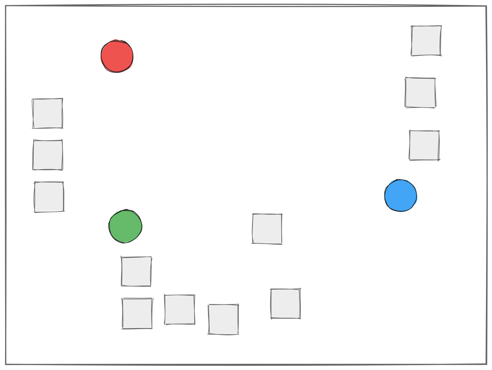
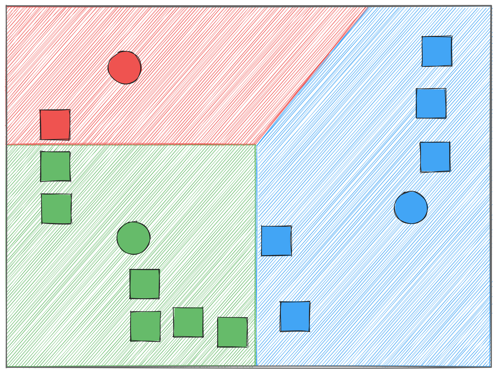
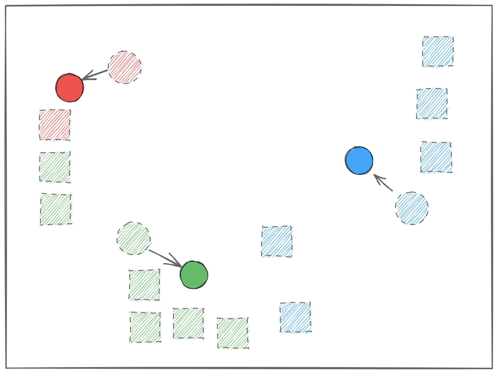
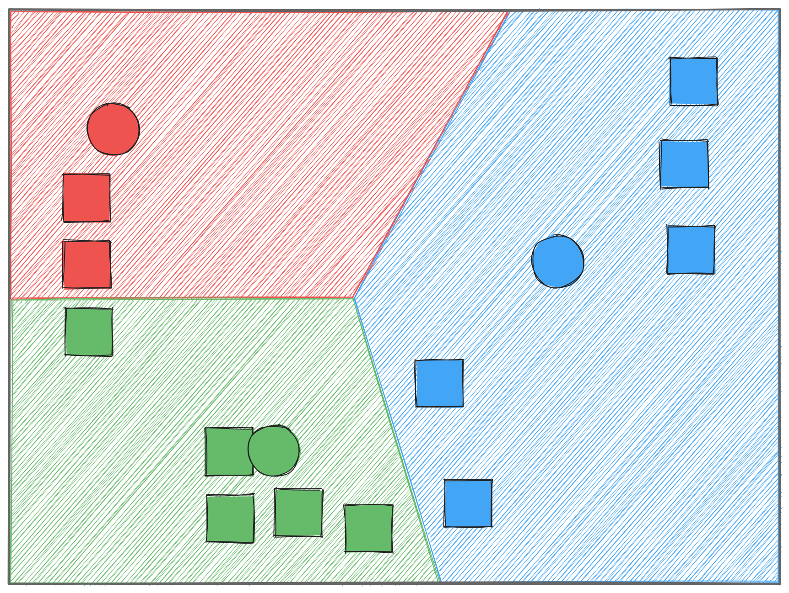

[](https://colab.research.google.com/github/saforem2/intro-hpc-bootcamp/blob/main/docs/00-intro-AI-HPC/7-statistical-learning/index.ipynb) [](https://github.com/saforem2/intro-hpc-bootcamp/blob/main/docs/00-intro-AI-HPC/7-statistical-learning/README.md)

```{python}
# This page uses the `bootcamp` helper package. On Colab (or any fresh
# environment) install it + its dependencies; locally this is a no-op.
try:
    import bootcamp  # noqa: F401
except ImportError:
    %pip install -q "git+https://github.com/saforem2/intro-hpc-bootcamp"
```

```{python}
%load_ext autoreload
%autoreload 2
import matplotlib_inline.backend_inline
matplotlib_inline.backend_inline.set_matplotlib_formats('retina', 'svg', 'png')
import os
os.environ["TRUECOLOR"] = "1"
import matplotlib as mpl
# mpl.rcParams['figure.dpi'] = 400
```

## Learning to Cluster Data

If we have data with distinct groupings, the objective is to devise a method
for labeling our data by its group in an automated way.

We will demonstrate this, first, on a toy dataset that we _design_ to have a
lower inherent dimensionality, then we move to a higher dimensional dataset.

[](https://colab.research.google.com/github/saforem2/intro-hpc-bootcamp/blob/main/docs/00-intro-AI-HPC/7-statistical-learning/index.ipynb)

### Toy Dataset (2D Blobs)

Define 3 blobs on a 2D plane:

```{python}
import time
import os
import sklearn
from sklearn import datasets
import numpy as np
import pandas as pd

from sklearn.preprocessing import (
    StandardScaler,
    MinMaxScaler,
    RobustScaler
)
from sklearn.cluster import KMeans
import matplotlib.pyplot as plt
import ambivalent
plt.style.use(ambivalent.STYLES["ambivalent"])

from matplotlib.colors import ListedColormap
from bootcamp.plots import (scatter, COLORS, scatter_plotly,
                            plot_kmeans_points_plotly, plot_kmeans_obj_plotly,
                            plot_hists_plotly)
from bootcamp.plotly_theme import apply_theme
apply_theme()   # house style for the interactive plotly charts on this page
import plotly.graph_objects as go
from plotly.subplots import make_subplots

# set random seed for reproducibility
SEED = 42
DFIGSIZE = plt.rcParamsDefault['figure.figsize']
```

```{python}
n_samples = 1000  # 1000 2D data points
n_features = 2  # 2D data
n_clusters = 3  # 3 unique blobs

# https://scikit-learn.org/stable/modules/generated/sklearn.datasets.make_blobs.html
# -- Returns --------------------------------------------------------
# x (n_samples, n_features): The generated samples.
# y (n_samples,): Int labels for cluster membership of each sample.
# -------------------------------------------------------------------
cmap = ListedColormap(list(COLORS.values()))
x, y = datasets.make_blobs(
    n_samples=n_samples,
    n_features=n_features,
    centers=n_clusters,
    random_state=42
)
scatter_plotly(x, y, xlabel="x0", ylabel="x1",
               title="Synthetic blobs, colored by true cluster").show()
```

```{python}
# Normalize features
# https://scikit-learn.org/stable/modules/generated/sklearn.preprocessing.StandardScaler.html
x_sc = StandardScaler().fit_transform(x)
```

```{python}
#| code-fold: true
#| code-summary: "Show the plotting code"
# Original (left) vs. standardized (right) — note the axis scales change,
# but the cluster structure is unchanged.
_cats = ["#2196F3", "#EF5350", "#4CAF50", "#FFA726", "#AE81FF", "#ffeb3b"]
fig = make_subplots(rows=1, cols=2, subplot_titles=("Original", "Normalized"))
for i, lab in enumerate(np.unique(y)):
    for col, data in ((1, x), (2, x_sc)):
        m = y == lab
        fig.add_scatter(x=data[m, 0], y=data[m, 1], mode="markers",
                        marker=dict(size=5, opacity=0.7, color=_cats[i % len(_cats)]),
                        name=f"cluster {lab}", legendgroup=str(lab),
                        showlegend=(col == 1), row=1, col=col)
fig.update_layout(height=380, margin=dict(t=40))
fig.show()
```

## K-means Clustering

K-means clustering aims to partition n observations into k clusters in which
each observation belongs to the cluster with the nearest mean, serving as a
prototype of the cluster.
This results in a partitioning of the data space into Voronoi cells.

1. Pick random starting centroids from data
   - $k$ initial "means" (in this case, $k=3$) are randomly generated within
     the data domain (shown in color)
2. Calculate distance to each centroid
   - $k$ clusters are created by associating  every observation with the
     nearest mean.
     The partitions here represent the Voroni diagram generated by the means
   - Find nearest cluster for each point
3. Calculate new centroids
   - The **centroid** of each of the $k$ clusters becomes the new mean
4. Steps 2 and 3 are repeated until convergence has been reached


::: {#fig-kmeans}

::: {.flex-container}







:::

Illustration of the K-means algorithm steps
:::

### Step 1: Pick random starting centroids from data

- $k$ initial "means" (in this case, $k=3$) are randomly generated within
  the data domain (shown in color)

:::{#fig-kmeans-step1 style="width:40%"}


:::

```{python}
def initialize_centroids(
        x: np.ndarray,
        n_clusters: int,
        seed: int = 123
) -> np.ndarray:
    """Initialize centroids.
    
    Inputs:
      - x (np.ndarray): Data of shape (num_points, num_features)
      - n_clusters (int): Number of clusters to use
      - seed (int): Random seed.
        
    Outputs:
      - centroids (np.ndarray): initial centroids spread across the data
        with shape: (num_clusters, num_features).

    We use **k-means++** initialization: pick the first centroid at random, then
    pick each next one with probability proportional to its squared distance from
    the nearest existing centroid. This spreads the starting centroids out (one
    per cluster, roughly), which avoids the bad local minima you get when two
    random centroids land in the same blob.
    """
    rng = np.random.default_rng(seed)
    centroids = [x[rng.integers(len(x))]]           # first centroid: random point
    for _ in range(1, n_clusters):
        d2 = np.min([((x - c) ** 2).sum(axis=1) for c in centroids], axis=0)
        probs = d2 / d2.sum()                        # farther points → more likely
        centroids.append(x[rng.choice(len(x), p=probs)])
    return np.array(centroids)
```

### Step 2a: Calculate distance to each centroid

- Calculate distance to each centroid
  - $k$ clusters are created by associating every observation with the
    nearest mean.
    The partitions here represent the Voroni diagram generated by the means.
  - Find nearest cluster for each point

::: {#fig-kmeans-step2a style="width:40%;"}


:::

```{python}
def compute_distance(
        x: np.ndarray,
        centroids: np.ndarray,
        n_clusters: int
) -> np.ndarray:
    """Compute distance.

    Inputs:
      - x (np.ndarray): Input data of shape
        (num_points, num_features)
      - centroids (np.ndarray): Cluster centroids  with shape 
        (num_clusters, num_features)
      - n_clusters (int): Number of clusters being used.

    Outputs:
      - distance (np.ndarray): Distance of each point 
        to each centroid with shape 
        (num_points, num_clusters)
    """
    # distance vector
    distance = np.zeros((x.shape[0], n_clusters))
    # loop over each centroid
    for k in range(n_clusters):
        # calculate distance for each point from centroid
        kcentroid_distance = x - centroids[k, :]
        # apply normalization for stability
        row_norm = np.linalg.norm(kcentroid_distance, axis=1)
        # return distance squared
        distance[:, k] = np.square(row_norm) 

    return distance
```

### Step 2b: Find nearest cluster for each point

```{python}
def find_closest_centroid(
        distance: np.ndarray
) -> np.ndarray:
    """Find closest centroid.

    Inputs:
      - distance (np.ndarray): Distance of each point to each centroid with shape
        (num_points, num_clusters)

    Outputs:
      - nearest_centroid_indices (np.ndarray): Index of nearest centroid with shape
        (num_points,)
    """
    nearest_centroid_indices = np.argmin(distance, axis=1)
    return nearest_centroid_indices

```

### Step 3: Calculate new centroids

3. Calculate new centroids
   - The **centroid** of each of the $k$ clusters becomes the new mean

::: {#fig-kmeans-step3 style="width:40%;"}

:::

```{python}
def compute_centroids(
        x: np.ndarray,
        nearest_centroid_indices: np.ndarray,
        n_clusters: int
) -> np.ndarray:
    """Compute centroids.
    
    Inputs:
      - x (np.ndarray): Input data of shape
        (num_points, num_features)
      - nearest_centroid_indices: Index of nearest centroid of shape
        (num_points,)
      - n_clusters (int): Number of clusters being used
      
    Outputs:
      - centroids (np.ndarray): Cluster centroids with shape
        (num_clusters, num_features)
    """
    # new centroids vector
    centroids = np.zeros((n_clusters, x.shape[1]))
    # loop over each centroids
    for k in range(n_clusters):
        # calculate the mean of all points assigned to this centroid
        centroids[k, :] = np.mean(
            x[nearest_centroid_indices == k, :],
            axis=0
        )
    return centroids
```

### Step 4: Repeat until convergence

4. Repeat steps 2 and 3 until convergence has been reached

::: {#fig-kmeans-step4 style="width:40%;"}


:::

```{python}
from __future__ import absolute_import, annotations, division, print_function

from typing import Optional
import seaborn as sns
import IPython.display as ipydis

from bootcamp.plots import plot_kmeans_points

def apply_kmeans(
    x: np.ndarray,
    n_clusters: int,
    iterations: int = 100,
    seed: int = 123,
    cmap: Optional[str] = None,
    init: str = "kmeans++",
) -> tuple[np.ndarray, np.ndarray, list]:
    """Run k-means and return (centroids, cluster_id, history).

    `history` is a list of (centroids, cluster_id) snapshots — one per frame,
    starting with the INITIAL state — so an animation shows the centroids
    actually drifting into place and points recoloring as they're reassigned.

    `init` chooses the starting centroids:
      - "kmeans++" (default): the smart init taught above — spreads centroids one
        per blob, so on well-separated data it converges in a step or two.
      - "random": pick `n_clusters` random data points. Deliberately "dumb" — it
        can drop two seeds in one blob, so it takes several visible iterations to
        untangle. We use this for the animation precisely BECAUSE it converges
        slowly enough to watch.
    """
    if init == "random":
        rng = np.random.default_rng(seed)
        centroids = x[rng.choice(len(x), size=n_clusters, replace=False)].copy()
    else:
        centroids = initialize_centroids(x, n_clusters=n_clusters, seed=seed)

    # frame 0 = the INITIAL assignment, BEFORE any centroid moves, so the very
    # first thing you see is the (bad) starting guess.
    cluster_id = find_closest_centroid(compute_distance(x, centroids, n_clusters))
    history = [(centroids.copy(), cluster_id.copy())]

    # ┏━━━━━━━━━━━━━━━━━━━━━━━━━━━━━━━━━━━━━━━━━━━━━━━━━━━━━━━━━━━━┓
    # ┃ -- Iteratively improve centroid location ----------------- ┃
    # ┃ 1. Compute the distance from entries in x to each centroid ┃
    # ┃ 2. Return the closest cluster (0, 1, ..., n_clusters-1)    ┃
    # ┃ 3. Calculate the mean position of each labeled cluster     ┃
    # ┗━━━━━━━━━━━━━━━━━━━━━━━━━━━━━━━━━━━━━━━━━━━━━━━━━━━━━━━━━━━━┛
    for i in range(iterations):
        old_centroids = centroids
        distance = compute_distance(x, old_centroids, n_clusters)
        cluster_id = find_closest_centroid(distance)
        centroids = compute_centroids(x, cluster_id, n_clusters)

        # record this iteration's (moved) centroids + fresh assignment
        history.append((centroids.copy(), cluster_id.copy()))
        print(f"Iteration: {i}")

        # if the centroids stopped moving, we've converged
        if np.all(old_centroids == centroids):
            print(f"No change in centroids! Exiting!")
            break

    return centroids, cluster_id, history
```

## Run Example

```{python}
from bootcamp.plots import COLORS

cmap = ListedColormap(list(COLORS.values()))

n_samples = 500  # 500 2D data points
n_features = 2  # 2D data
n_clusters_true = 3  # unique blobs
n_clusters_guess = 3
SEED = 456
iterations = 50

# https://scikit-learn.org/stable/modules/generated/sklearn.datasets.make_blobs.html
# cluster_std=1.6 lets the blobs overlap a bit, so points near the borders get
# reassigned as the centroids move — that's what makes the animation worth watching.
x, y = datasets.make_blobs(
    n_samples=n_samples,
    n_features=n_features,
    centers=n_clusters_true,
    cluster_std=1.6,
    random_state=SEED,
)

x_sc = StandardScaler().fit_transform(x)

# init="random" (not k-means++) on purpose: it starts from a bad guess and takes
# several iterations to untangle, so you can actually SEE the centroids converge.
# (In practice you'd use the k-means++ init taught above — it's faster.)
centroids, cluster_id, history = apply_kmeans(
    x_sc,
    n_clusters_guess,
    iterations,
    seed=0,
    cmap=cmap,
    init="random",
)
```

Watch the algorithm converge from a deliberately bad random start (two of the
three centroids land in the same blob). Each frame is one iteration: points
recolor as they're reassigned to the nearest centroid (★), and the centroids
drift into place until nothing changes. Drag the slider or hit ▶:

```{python}
#| code-fold: true
#| code-summary: "Show the plotting code"
_cats = ["#2196F3", "#EF5350", "#4CAF50", "#FFA726", "#AE81FF",
         "#ffeb3b", "#EC407A", "#009688", "#795548", "#607D8B"]

def kmeans_frame(cents, cid):
    traces = []
    for i in range(n_clusters_guess):
        m = cid == i
        traces.append(go.Scatter(x=x_sc[m, 0], y=x_sc[m, 1], mode="markers",
                                 marker=dict(size=5, opacity=0.5, color=_cats[i % len(_cats)])))
    traces.append(go.Scatter(x=cents[:, 0], y=cents[:, 1], mode="markers",
                             marker=dict(symbol="star", size=16, color="#111",
                                         line=dict(width=1, color="#fff"))))
    return traces

frames = [go.Frame(name=str(i), data=kmeans_frame(c, cid),
                   layout=go.Layout(title=f"iteration {i}"))
          for i, (c, cid) in enumerate(history)]
fig = go.Figure(data=kmeans_frame(*history[0]), frames=frames)
fig.update_layout(
    title="iteration 0", height=460, showlegend=False,
    yaxis=dict(scaleanchor="x", scaleratio=1),
    updatemenus=[dict(type="buttons", showactive=False, x=0, y=-0.08, xanchor="left",
        buttons=[dict(label="▶ Play", method="animate",
                      args=[None, dict(frame=dict(duration=900, redraw=True),
                                       transition=dict(duration=350, easing="cubic-in-out"),
                                       fromcurrent=True)])])],
    sliders=[dict(active=0, x=0.1, len=0.9, y=-0.02, currentvalue=dict(prefix="iteration "),
        steps=[dict(method="animate", label=str(i),
                    args=[[str(i)], dict(mode="immediate", frame=dict(duration=0, redraw=True))])
               for i in range(len(history))])],
)
fig.show()
```


## K-Means on a Breast Cancer Dataset

Now we use more realistic data that cannot be easily plotted on a 2D grid.
This dataset has 30 features (columns) for 569 patients (rows).
In addition, there is a _target_ feature that indicates if the cancer was
_malignant_ (0) or _benign_ (1).
In the ideal case, our 30 features would provide easy deliniation between these
two classes.

Let's extract our data into $x$ and our truth labels into $y$

```{python}
import pandas as pd


def load_cancer_data() -> dict:
    """Return cancer dataset (unscaled)."""
    from sklearn import datasets

    data = datasets.load_breast_cancer()
    return data


def sort_cancer_data(data: dict) -> tuple[pd.DataFrame, pd.Series]:
    # Get features and target
    x = pd.DataFrame(
        data["data"],
        columns=data["feature_names"],
    )
    x = x[sorted(x.columns)]
    y = data["target"]
    return x, y
```

```{python}
data = load_cancer_data()
x, y = sort_cancer_data(data)
```

```{python}
print(data.keys())
print("data size:", len(data["data"]))
print("number of features:", len(data["feature_names"]))
print(data["feature_names"])
```

```{python}
# wrap data in pandas DataFrame
# y = data['target'] # value: 0 = 'Malignant' 1 = 'Benign'
x = data["data"]
y = data["target"]
print(f"(malignant, benign): {np.bincount(y)}")
print(f"x.shape: {x.shape}")
print(f"y.shape: {y.shape}")
```

```{python}
# normalize
x_sc = StandardScaler().fit_transform(x)
```

Plot histogram of number of true class labels (malignant/benign) and number of k-means cluster labels.

This gives an indication of how well we did in clustering our data, but is not a "correctness" or "accuracy" metric.

::: {.callout-note}

Keep in mind, k-means is not a classifier.

Cluster label 0 given from k-means, does not correspond to cluster label 0 in the truth.
:::

```{python}
from bootcamp.plots import plot_hists

# for seed in range(10):
CSEED = 42
kmeans = KMeans(n_clusters=2, random_state=CSEED)
# fit the data
kfit = kmeans.fit(x_sc)
cluster_ids = kmeans.labels_
print(
    f"seed: {CSEED}\nNumber of samples in each cluster: {np.bincount(kmeans.labels_)}"
)
k_means_bins = np.bincount(cluster_ids)
y_bins = np.bincount(y)
plot_hists_plotly(k_means_bins, y_bins, xlabels=["Malignant", "Benign"]).show()
```

This plot shows the normalized inertia as we vary the number `n_clusters` used
in our k-means fit to the breast cancer data.
This value essentially indicates the mean distance of a point to the cluster
centroids.
Obviously more clusters result in data points being nearer to a centroid.

If our dataset easily split into 2 clusters, we would see a step function
behavior going from 1 to 2, then only very minor improvements above 2.
What we see here tells us our data does not easily cluster.

```{python}
_, fig = plot_kmeans_obj_plotly(x_sc, nclusters=10)
fig.show()
```

For example, if we return to our blob data with 2 clusters, it become clear.

```{python}
n_samples = 300  # 300 2D data points
n_features = 2  # 2D data
n_clusters = 2  # unique blobs
seed = 456
iterations = 25
x, y = datasets.make_blobs(
    n_samples=n_samples, n_features=n_features, centers=n_clusters, random_state=seed
)
_, fig = plot_kmeans_obj_plotly(x, nclusters=10)
fig.show()
```

## [Self-organizing maps](https://en.wikipedia.org/wiki/Self-organizing_map)

Self Organizing Maps (SOM) were proposed and became widespread in the 1980s, by a Finnish professor named Teuvo Kohonen and are also called 'Kohonen maps'.

Why reach for this instead of k-means? Where k-means gives you $k$ flat,
independent clusters, a SOM arranges its clusters on a fixed 2D grid of neurons
and keeps *neighboring* neurons similar -- so the result doubles as a
low-dimensional map you can actually look at.

The idea behind a SOM is that you’re mapping high-dimensional vectors onto a
smaller dimensional (typically 2D) space.
Vectors that are close in the high-dimensional space also end up being mapped
to nodes that are close in 2D space thus preserving the "topology" of the
original data.

Training a SOM needs a handful of small helpers. We build them up one at a time
here, then wire them together in the training loop below.

First, the **best matching unit** (BMU): given an input vector, find the neuron
whose weights are closest to it. This is the SOM's analogue of "find the nearest
centroid" from k-means.

```{python}
# finding best matching unit
def find_bmu(t, net, n):
    """
    Find the best matching unit for a given vector, t, in the SOM
    Returns: a (bmu, bmu_idx) tuple where bmu is the high-dimensional BMU
             and bmu_idx is the index of this vector in the SOM
    """
    bmu_idx = np.array([0, 0])
    # set the initial minimum distance to a huge number
    # min_dist = #np.iinfo(np.int).max
    min_dist = np.inf
    # calculate the high-dimensional distance between each neuron and the input
    for x in range(net.shape[0]):
        for y in range(net.shape[1]):
            w = net[x, y, :].reshape(n, 1)
            # don't bother with actual Euclidean distance, to avoid expensive sqrt operation
            sq_dist = np.sum((w - t) ** 2)
            if sq_dist < min_dist:
                min_dist = sq_dist
                bmu_idx = np.array([x, y])
    # get vector corresponding to bmu_idx
    bmu = net[bmu_idx[0], bmu_idx[1], :].reshape(n, 1)
    # return the (bmu, bmu_idx) tuple
    return (bmu, bmu_idx)
```

As training proceeds we shrink the neighbourhood **radius**, so the map moves
from coarse, global organization early on to fine, local tuning later:

```{python}
# Decaying radius of influence
def decay_radius(initial_radius, i, time_constant):
    return initial_radius * np.exp(-i / time_constant)
```

...and likewise decay the **learning rate**, so early updates are large and
later ones are gentle:

```{python}
# Decaying learning rate
def decay_learning_rate(initial_learning_rate, i, n_iterations):
    return initial_learning_rate * np.exp(-i / n_iterations)
```

Within the current radius, a neuron's **influence** falls off with its distance
from the BMU (a Gaussian bump), so the closest neurons move the most:

```{python}
# Influence in 2D space
def calculate_influence(distance, radius):
    return np.exp(-distance / (2.0 * (radius**2)))
```

Finally, **update the weights**: pull the BMU and its neighbours toward the
input vector, scaled by the learning rate and each neuron's influence:

```{python}
# Update weights
def update_weights(net, bmu_idx, r, l):
    wlen = net.shape[2]
    for x in range(net.shape[0]):
        for y in range(net.shape[1]):
            w = net[x, y, :].reshape(wlen, 1)
            # get the 2-D distance (again, not the actual Euclidean distance)
            w_dist = np.sum((np.array([x, y]) - bmu_idx) ** 2)
            # if the distance is within the current neighbourhood radius
            if w_dist <= r**2:
                # calculate the degree of influence (based on the 2-D distance)
                influence = calculate_influence(w_dist, r)
                # now update the neuron's weight using the formula:
                # new w = old w + (learning rate * influence * delta)
                # where delta = input vector (t) - old w
                new_w = w + (l * influence * (t - w))
                # commit the new weight
                net[x, y, :] = new_w.reshape(1, wlen)
    return net
```

### Generating "Color" data and normalizing

```{python}
raw_data = np.random.randint(0, 255, (10000, 3))  # JPEG like data
# raw_data = np.random.uniform(size=(500, 3))
data = StandardScaler().fit_transform(raw_data)  # Normalized
```

### Defining SOM 

Defining network size, number of iterations and learning rate

```{python}
network_dimensions = np.array([50, 50])
n_iterations = 2500
init_learning_rate = 0.075
```

Establish size variables based on data

```{python}
m = data.shape[0]
n = data.shape[1]
```

Weight matrix (i.e. the SOM) needs to be one n-dimensional vector for each
neuron in the SOM

```{python}
net = np.random.random(
    (network_dimensions[0], network_dimensions[1], n)
)  # 50x50 = 2500 neurons, each with a 3D vector
```

Initial neighbourhood radius and decay parameter

```{python}
init_radius = max(network_dimensions[0], network_dimensions[1]) / 2.0
time_constant = n_iterations / np.log(init_radius)
```

### Initial state of SOM color network

```{python}
plt.rcParams["image.cmap"] = "rainbow"
fig, ax = plt.subplots(figsize=(4, 4))
image = ax.matshow(net)
# _ = fig.colorbar(image)
_ = plt.show()
```

### Training SOM

```{python}
def normalize(x: np.ndarray) -> np.ndarray:
    return (x - np.min(x)) / (np.max(x) - np.min(x))


init_learning_rate = 0.1
images, snapshots = [], []          # RGB snapshots + the iteration index of each
for iteration in range(n_iterations):
    # select a training example at random - shape of 1x3
    t = data[np.random.randint(0, m), :].reshape(np.array([n, 1]))
    # find its Best Matching Unit
    bmu, bmu_idx = find_bmu(t, net, n)  # Gives the row, column of the best neuron
    # decay the SOM parameters
    r = decay_radius(init_radius, iteration, time_constant)
    l = decay_learning_rate(init_learning_rate, iteration, n_iterations)
    # Update SOM weights
    net = update_weights(net, bmu_idx, r, l)
    # snapshot the map every 100 iterations, for the animation below
    if iteration % 100 == 0:
        images.append(normalize(net))
        snapshots.append(iteration)
# capture the final, fully-trained map as the last frame so the animation's end
# matches the "Final SOM" shown afterward
images.append(normalize(net))
snapshots.append(n_iterations)
print(f"collected {len(images)} snapshots over {n_iterations} iterations")
```

### Visualization of trained colormap SOM

Rather than a static grid of snapshots, let's animate the map organizing itself.
Drag the slider (or hit ▶) to watch neighboring neurons settle into smoothly
varying colors as training proceeds:

```{python}
#| code-fold: true
#| code-summary: "Show the plotting code"
# each snapshot is a normalized (H, W, 3) RGB map; go.Image wants 0-255 uint8
def to_rgb(img):
    return (255 * img).astype("uint8")

frames = [go.Frame(name=str(it), data=[go.Image(z=to_rgb(img))],
                   layout=go.Layout(title=f"iteration {it}"))
          for img, it in zip(images, snapshots)]
fig = go.Figure(data=[go.Image(z=to_rgb(images[0]))], frames=frames)
fig.update_layout(
    title=f"iteration {snapshots[0]}", height=480, width=480,
    margin=dict(l=0, r=0, t=40, b=0),
    xaxis=dict(showticklabels=False), yaxis=dict(showticklabels=False),
    updatemenus=[dict(type="buttons", showactive=False, x=0, y=-0.05, xanchor="left",
        buttons=[dict(label="▶ Play", method="animate",
                      args=[None, dict(frame=dict(duration=150, redraw=True), fromcurrent=True)])])],
    sliders=[dict(active=0, x=0.1, len=0.9, y=0.0, currentvalue=dict(prefix="iteration "),
        steps=[dict(method="animate", label=str(it),
                    args=[[str(it)], dict(mode="immediate", frame=dict(duration=0, redraw=True))])
               for it in snapshots])],
)
fig.show()
```

This is the same map as the final frame of the animation above (rendered the same
way, so the orientation matches):

```{python}
#| code-fold: true
#| code-summary: "Show the plotting code"
fig = go.Figure(go.Image(z=to_rgb(normalize(net))))
fig.update_layout(title="Final SOM", height=460, width=460,
                  margin=dict(l=0, r=0, t=40, b=0),
                  xaxis=dict(showticklabels=False), yaxis=dict(showticklabels=False))
fig.show()
```


### SOM on Cancer data

```{python}
# Load data
data = datasets.load_breast_cancer()
# Get features and target
X = data["data"]  # pd.DataFrame(data['data'], columns=data['feature_names'])
Y = data["target"]
print(X.shape, Y.shape)
```

```{python}
network_dimensions = np.array([10, 10])
n_iterations = 2000
init_learning_rate = 0.01
# establish size variables based on data
n_points = X.shape[0]  # number of points
n_features = X.shape[1]  # 30 features per point

# weight matrix (i.e. the SOM) needs to be one n-dimensional vector for each neuron in the SOM
net = np.random.random((network_dimensions[0], network_dimensions[1], n_features))

# initial neighbourhood radius
init_radius = max(network_dimensions[0], network_dimensions[1]) / 2
# radius decay parameter
time_constant = n_iterations / np.log(init_radius)
```

```{python}
# convert the network to something we can visualize
net_vis = np.zeros(
    shape=(net.shape[0], net.shape[1], 3),
    dtype=np.float32,
)  # Array for SOM color map visualization

for sample in range(n_points):
    t = X[sample, :].reshape(np.array([n_features, 1]))
    # find its Best Matching Unit for this data point
    bmu, bmu_idx = find_bmu(t, net, n_features)
    # set that unit to the label of this data point
    net_vis[bmu_idx[0], bmu_idx[1], 0] = Y[sample]  # Red if benign


fig, ax = plt.subplots()
im = ax.matshow(normalize(net_vis))
# _ = plt.colorbar(im1, ax=ax1)
plt.show()
```

### Training SOM on Cancer data

```{python}
for iteration in range(n_iterations):
    # select a training example at random - shape of 1x3
    t = X[np.random.randint(0, n_points), :].reshape(np.array([n_features, 1]))
    # find its Best Matching Unit
    bmu, bmu_idx = find_bmu(t, net, n_features)
    # decay the SOM parameters
    r = decay_radius(init_radius, iteration, time_constant)
    l = decay_learning_rate(init_learning_rate, iteration, n_iterations)
    # Update SOM weights
    net = update_weights(net, bmu_idx, r, l)

    if iteration % 50 == 0:
        ipydis.clear_output("wait")
        net_vis = np.zeros(
            shape=(np.shape(net)[0], np.shape(net)[1], 3), dtype="double"
        )  # Array for SOM color map visualization
        for sample in range(n_points):
            t = X[sample, :].reshape(np.array([n_features, 1]))
            # find its Best Matching Unit
            bmu, bmu_idx = find_bmu(t, net, n_features)
            net_vis[bmu_idx[0], bmu_idx[1], 0] = Y[sample]  # Red if benign

        fig, ax = plt.subplots(figsize=(3, 3))
        _ = ax.set_title(f"Iteration: {iteration}")
        _ = ax.imshow(normalize(net_vis), cmap="rainbow")
        _ = plt.show()
        time.sleep(0.25)
```

### Visualization of trained SOM


```{python}
net_vis = np.zeros(
    shape=(net.shape[0], net.shape[1], 3), dtype="double"
)  # Array for SOM color map visualization

for sample in range(n_points):
    t = X[sample, :].reshape(np.array([n_features, 1]))
    # find its Best Matching Unit
    bmu, bmu_idx = find_bmu(t, net, n_features)
    net_vis[bmu_idx[0], bmu_idx[1], 0] = Y[sample]  # Red if benign

_ = plt.imshow(normalize(net_vis))
_ = plt.show()
```

## Keep learning

1. <lagunita.stanford.edu/courses/HumanitiesSciences/StatLearning/Winter2016/course/>
2. <www.coursera.org/learn/ml-clustering-and-retrieval/>
3. <www.coursera.org/learn/machine-learning/home/week/8>
