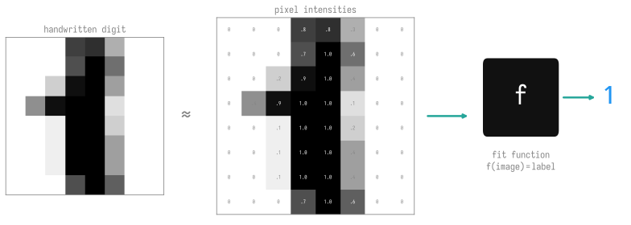

<!--
Author: Marieme Ngom (mngom@anl.gov), combining and adapting materials evolved
over time by Bethany Lusch, Asad Khan, Prasanna Balaprakash, Taylor Childers,
Corey Adams, Kyle Felker, and Tanwi Mallick 
-->

This tutorial covers the basics of neural networks (aka "deep learning"), which
is a technique within machine learning that tends to outperform other
techniques when dealing with a large amount of data.

::: {.callout-note title="📋 Before you start" collapse="false"}
This section assumes the [0] [Python](../../00-intro-AI-HPC/3-python/index.qmd)
and [data](../../00-intro-AI-HPC/4-data/index.qmd) primers, and every cell here
runs on a plain laptop or [Colab](https://colab.research.google.com/) — no GPU
needed.
:::

- 🎯 **Goals**:
  - Introduce deep learning fundamentals through hands-on activities
  - Provide the necessary background for the rest of the project

- 📖 **Definitions**:
  - _Artificial intelligence_ (AI) is a set of approaches to solving complex problems by imitating the brain's ability to learn. 
  - _Machine learning_ (ML) is the field of study that gives computers the ability to learn without being explicitly programmed (i.e. learning patterns instead of writing down rules.) Arguably, machine learning is now a subfield of AI. 

- 🤔 **Recap**:
  Last week, we learned about using linear regression to predict the sale price of a house. We fit a function to the dataset:
  - Input: above ground square feet
  - Output: sale price
  - Function type: linear
  - Loss function: mean squared error
  - Optimization algorithm: stochastic gradient descent

  This week, we'll work on a "classification" problem, which means that we have
  a category label for each data point, and we fit a function that can
  categorize inputs. 

## From a line to a neuron

A neural network is built out of **neurons**, and a single neuron is a small
extension of the linear regression you just saw. Last week's model computed
$w \cdot x + b$; a neuron does the same weighted sum and then passes it through a
nonlinear **activation function** $\sigma$:

$$ y = \sigma(w \cdot x + b) $$

That one nonlinearity is what lets stacks of neurons fit curves and categories
instead of just straight lines. Let's build one with nothing but `numpy` and
poke at it:

```{python}
# On Colab (or any fresh environment) install the `bootcamp` helper for the
# house plot style; locally this is a no-op.
try:
    import bootcamp  # noqa: F401
except ImportError:
    %pip install -q "git+https://github.com/saforem2/intro-hpc-bootcamp"

from bootcamp.plotly_theme import style_mpl, COLORS
style_mpl()   # ambivalent look (transparent bg + grey text) + Iosevka font
```

```{python}
import numpy as np

# Three activation functions we'll meet again and again
def relu(z):     return np.maximum(0.0, z)
def sigmoid(z):  return 1.0 / (1.0 + np.exp(-z))
def tanh(z):     return np.tanh(z)

def neuron(x, w, b, activation):
    """A single neuron: weighted sum of inputs, then a nonlinearity."""
    z = np.dot(w, x) + b          # the same w·x + b as linear regression
    return activation(z)

x = np.array([1.0, 2.0, 3.0])     # a 3-feature input
w = np.array([0.2, -0.6, 0.1])    # one weight per feature
b = 0.3                           # bias

for name, act in [("relu", relu), ("sigmoid", sigmoid), ("tanh", tanh)]:
    print(f"{name:>8}: y = {neuron(x, w, b, act):.4f}")
```

The **same** weighted sum feeds every activation, but each one squashes it
differently. Change a weight and the output moves:

```{python}
w_big = np.array([2.0, -0.6, 0.1])   # bump the first weight up
print(f"original w -> sigmoid = {neuron(x, w,     b, sigmoid):.4f}")
print(f"larger w   -> sigmoid = {neuron(x, w_big, b, sigmoid):.4f}")
```

Here is what those three activations actually look like — this is the "shape"
each neuron can bend the data into:

```{python}
#| label: fig-activations
#| fig-cap: "Three common activation functions."
import matplotlib.pyplot as plt

z = np.linspace(-5, 5, 200)
fig, ax = plt.subplots(figsize=(6.4, 4.0))
ax.plot(z, relu(z),    label="ReLU",    color=COLORS["blue"],  lw=2)
ax.plot(z, sigmoid(z), label="sigmoid", color=COLORS["red"],   lw=2)
ax.plot(z, tanh(z),    label="tanh",    color=COLORS["green"], lw=2)
ax.axhline(0, color=COLORS["grey"], lw=0.8, alpha=0.5)
ax.axvline(0, color=COLORS["grey"], lw=0.8, alpha=0.5)
ax.set_xlabel("z = w·x + b")
ax.set_ylabel("σ(z)")
ax.legend()
plt.show()
```

::: {.callout-note title="Exercise — feel the activation" collapse="false"}
Using the `neuron` function above, keep `x`, `w`, and `b` the same but compare
`relu` and `sigmoid`. For this input the pre-activation sum $z = w \cdot x + b$
is **negative** — predict what each activation returns *before* running it, then
check.

::: {.callout-tip title="💡 Solution" collapse="true"}
```{python}
z = np.dot(w, x) + b
print(f"z = {z:.4f}  (negative)")
print(f"relu(z)    = {neuron(x, w, b, relu):.4f}")     # clipped to exactly 0
print(f"sigmoid(z) = {neuron(x, w, b, sigmoid):.4f}")  # squashed toward 0, but > 0
```
ReLU zeroes out any negative input, so it returns exactly `0.0`. Sigmoid maps
every input into `(0, 1)`, so a negative `z` gives a small positive number
(below `0.5`) rather than zero.
:::
:::

The [MNIST dataset](http://yann.lecun.com/exdb/mnist/) contains thousands of
examples of handwritten numbers, with each digit labeled 0-9.

::: {#fig-mnist-example}



A digit is just a grid of pixel intensities; the task is to fit a function
$f(\text{image}) = \text{label}$.
:::

We'll start with the MNIST problem in this notebook:

[📓 Fitting MNIST with a multi-layer perceptron (MLP)](../1-mnist/index.qmd)

Next week, we'll learn about other types of neural networks.

::: {.callout-tip title="🧠 Check your understanding" collapse="false"}
Test yourself — think it through, then reveal the answer.

**Q1.** How does machine learning differ from traditional programming?

:::: {.callout-note title="Show answer" collapse="true"}
In traditional programming you write explicit rules. In machine learning you
show the computer many examples and it **learns the patterns** (the rules) on its
own from the data.
::::

**Q2.** Last week's house-price task predicted a continuous number (a price). The MNIST task predicts one of ten digit labels (0–9). What are these two kinds of problem called?

:::: {.callout-note title="Show answer" collapse="true"}
Predicting a continuous number is **regression**; predicting a category label is
**classification**. MNIST is a classification problem.
::::

**Q3.** In the house-price example the pieces were: input, output, function type, loss (MSE), optimizer (SGD). Which of these must change for MNIST, and why?

:::: {.callout-note title="Show answer" collapse="true"}
The **output/function** (it must produce a class instead of a number) and the
**loss** (cross-entropy instead of MSE, since we're scoring category predictions).
The overall recipe — fit a function by minimizing a loss with an optimizer —
stays the same.
::::

:::

## __References:__

- Here are some recommendations for further reading:
  - [tensorflow.org tutorials](https://www.tensorflow.org/tutorials)
  - [keras.io tutorials](https://keras.io/examples/)
  - [CS231n: Convolutional Neural Networks for Visual Recognition](http://cs231n.stanford.edu/)
  - [Deep Learning Specialization, Andrew Ng](https://www.coursera.org/specializations/deep-learning?utm_source=deeplearningai&utm_medium=institutions&utm_campaign=WebsiteCoursesDLSTopButton)
  - [PyTorch Challenge, Udacity](https://www.udacity.com/facebook-pytorch-scholarship)
  - [Deep Learning with Python](https://www.amazon.com/Deep-Learning-Python-Francois-Chollet/dp/1617294438)
  - [Keras Blog](https://blog.keras.io/)
  - [Hands-on ML book](https://www.oreilly.com/library/view/hands-on-machine-learning/9781492032632/) with [notebooks](https://github.com/ageron/handson-ml2).

