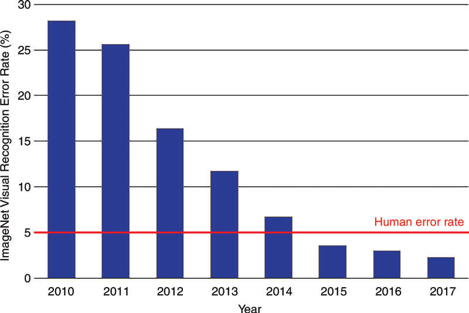
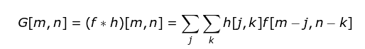
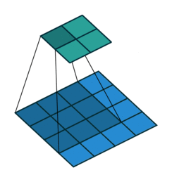
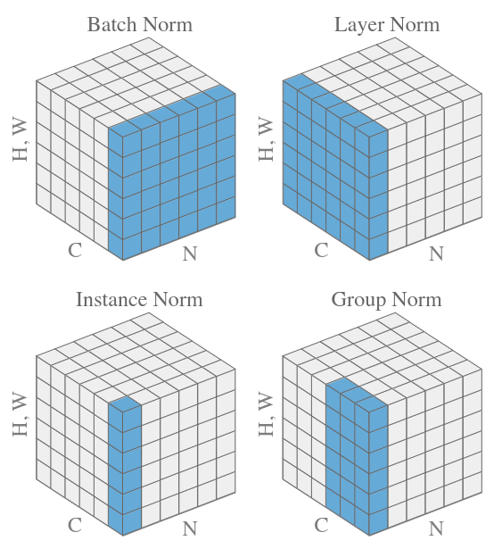
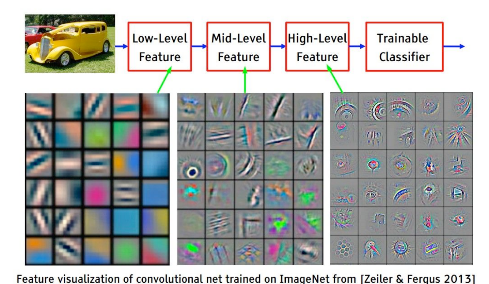
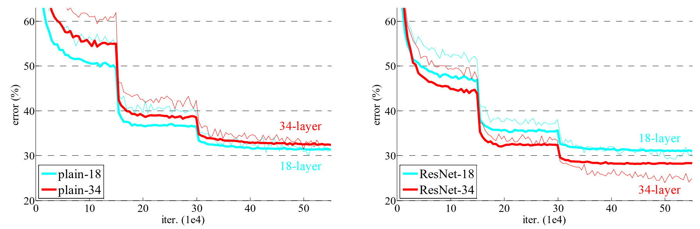

## Getting Started

[](https://colab.research.google.com/github/saforem2/intro-hpc-bootcamp/blob/main/content/01-neural-networks/2-conv-nets/index.ipynb) [](https://github.com/saforem2/intro-hpc-bootcamp/blob/main/docs/01-neural-networks/2-conv-nets/README.md)

Up until transformers, convolutions were *the* state of the art in computer
vision.

In many ways and applications they still are!

Large Language Models, which are what we'll focus on the rest of the series after this lecture, are really good at ordered, *tokenized data.  But there is lots of data that isn't _implicitly_ ordered like `images`, and their more general cousins `graphs`.

Today's lecture focuses on computer vision models, and particularly on convolutional neural networks.  There are a ton of applications you can do with these, and not nearly enough time to get into them.  Check out the extra references file to see some publications to get you started if you want to learn more.

Tip: this notebook is much faster on the GPU!

## Convolutional Networks: A brief historical context

<!--

-->

The [ImageNet](https://www.image-net.org/) challenge was *the* driver of the deep
learning revolution in computer vision. When **AlexNet** (a deep CNN) won in 2012,
error rates fell off a cliff, and by 2015 models had **surpassed human-level**
accuracy. Today the benchmark is essentially solved (top-5 error ~1%), and the
frontier has moved on to harder tasks.[^image-net-historical]

```{python}
# This page uses the `bootcamp` helper package and `ezpz`. On Colab (or any
# fresh environment) install them; locally this is a no-op. `ezpz` is an optional
# extra (not a core `bootcamp` dependency), so we install it explicitly; it pulls
# in `ambivalent`/`seaborn` transitively.
try:
    import bootcamp  # noqa: F401
    import ezpz  # noqa: F401
except ImportError:
    %pip install -q "git+https://github.com/saforem2/ezpz" "git+https://github.com/saforem2/intro-hpc-bootcamp"
```

```{python}
%load_ext autoreload
%autoreload 2
import matplotlib_inline.backend_inline
matplotlib_inline.backend_inline.set_matplotlib_formats('retina', 'svg', 'png')
import os
os.environ["TRUECOLOR"] = "1"
# ezpz reads this at import time: drop the `module:line:function` suffix from
# every log line so the notebook shows clean `[timestamp][LEVEL] message`.
os.environ["EZPZ_LOG_SHOW_PATH"] = "0"
import matplotlib as mpl
# mpl.rcParams['figure.dpi'] = 400
```

```{python}
import logging

import ezpz
import numpy as np
import matplotlib.pyplot as plt
import seaborn as sns
from rich import print

# One ezpz logger for the whole page: training/validation progress goes through
# this (clean `[timestamp][I] ...` lines) instead of bare print(); the pedagogical
# `print(tensor.shape)`-style calls stay as print() since a plain value reads
# better than a timestamped log line when you're inspecting a shape.
logger = ezpz.get_logger(__name__)

sns.set_context("notebook")
# sns.set(rc={"figure.dpi": 400, "savefig.dpi": 400})
plt.rcParams["figure.figsize"] = [6.4, 4.8]
plt.rcParams["figure.facecolor"] = "none"

# house look (transparent + grey + Iosevka) for every figure on this page,
# plus the grid-diagram helpers used for the padding/pooling/channel figures.
# `style_mpl()` applies the `ambivalent` style through a guarded wrapper — don't
# `import ambivalent` / `plt.style.use(...)` directly, because ambivalent copies
# a style file into matplotlib's config dir at import time and hard-fails with a
# PermissionError wherever that file is read-only (e.g. shared HPC installs).
from bootcamp.plotly_theme import style_mpl, COLORS
from bootcamp.plots import draw_grid, new_grid_axes
style_mpl()
```

```{python}
#| label: fig-imagenet
#| fig-cap: "ImageNet top-5 error over time. Deep CNNs (from AlexNet in 2012) drove error below the ~5% human level by 2015; the benchmark is now effectively solved (~1%)."
import plotly.graph_objects as go
from bootcamp.plotly_theme import apply_theme, COLORS
apply_theme()

# ImageNet top-5 classification error (%), winning entry each year
years = [2010, 2011, 2012, 2013, 2014, 2015, 2016, 2017, 2020, 2021]
error = [28.2, 25.8, 16.4, 11.7, 6.7, 3.6, 3.0, 2.3, 1.3, 1.0]
human = 5.1                       # Russakovsky et al. human top-5 error

# color the pre-deep-learning bars grey, deep-learning era in house blue,
# and the years that beat humans in green
def bar_color(y, e):
    if y < 2012:
        return COLORS["grey"]
    return COLORS["green"] if e < human else COLORS["blue"]

fig = go.Figure()
fig.add_bar(x=years, y=error, marker_color=[bar_color(y, e) for y, e in zip(years, error)],
            hovertemplate="%{x}: %{y}% top-5 error<extra></extra>", opacity=0.85)
fig.add_hline(y=human, line=dict(color=COLORS["red"], dash="dash", width=1.5),
              annotation_text="human ≈ 5%", annotation_position="top left",
              annotation_font_color=COLORS["red"])
fig.add_annotation(x=2012, y=16.4, text="AlexNet<br>(deep CNNs)", showarrow=True,
                   arrowhead=2, ax=40, ay=-40, font=dict(color=COLORS["grey"], size=11))
fig.update_layout(height=380, xaxis_title="Year", yaxis_title="Top-5 error (%)",
                  showlegend=False, bargap=0.25)
fig.show()
```

## Convolutional Building Blocks

```{python}
import torch
import torchvision
```

We're going to go through some examples of building blocks for convolutional networks.  To help illustate some of these, let's use an image for examples:

```{python}
#| output: false
import os, urllib.request
from PIL import Image

# The project renders with execute-dir: project (cwd = content/), so reference the
# committed photo by its project-relative path. A few candidates cover local + Colab.
_candidates = [
    "01-neural-networks/2-conv-nets/ALCF-Staff.jpg",   # from project root (render cwd)
    "ALCF-Staff.jpg",                                  # from the page dir (Colab)
    "assets/ALCF-Staff.jpg",
]
_img = next((p for p in _candidates if os.path.exists(p)), None)
if _img is None:                                       # last resort (fresh Colab)
    _img = "ALCF-Staff.jpg"
    urllib.request.urlretrieve(
        "https://raw.githubusercontent.com/saforem2/intro-hpc-bootcamp/"
        "main/content/01-neural-networks/2-conv-nets/ALCF-Staff.jpg", _img)
alcf_image = Image.open(_img)
```

```{python}
from matplotlib import pyplot as plt

fx, fy = plt.rcParamsDefault["figure.figsize"]
figure = plt.figure(figsize=(1.5 * fx, 1.5 * fy))
_ = plt.imshow(alcf_image)
```

### Convolutions

$$
\begin{equation}
G\left[m, n\right] = \left(f \star h\right)\left[m, n\right] = \sum_{j} \sum_{k} h\left[j, k\right] f\left[m - j, n - k\right]
\end{equation}
$$

Convolutions are a restriction of - and a specialization of - dense linear layers.  A convolution of an image produces another image, and each output pixel is a function of only it's local neighborhood of points.  This is called an _inductive bias_ and is a big reason why convolutions work for image data: neighboring pixels are correlated and you can operate on just those pixels at a time.

$G\left[m, n\right] = \left(f \star h\right)\left[m, n\right] = \sum_{j} \sum_{k} h\left[j, k\right] f\left[m - j, n - k\right]$

See examples of convolutions [here](https://github.com/vdumoulin/conv_arithmetic)

<!--

-->



```{python}
# Let's apply a convolution to the ALCF Staff photo:
alcf_tensor = torchvision.transforms.ToTensor()(alcf_image)

# Reshape the tensor to have a batch size of 1:
alcf_tensor = alcf_tensor.reshape((1,) + alcf_tensor.shape)

# Create a random convolution:
# PyTorch conv weight shape is (channels_out, channels_in, kernel_x, kernel_y).
# Here in==out==3 (RGB), so both are 3 — but the order matters once they differ.
conv_random = torch.rand((3, 3, 15, 15))

alcf_rand = torch.nn.functional.conv2d(alcf_tensor, conv_random)
alcf_rand = (1.0 / alcf_rand.max()) * alcf_rand
print(alcf_rand.shape)
alcf_rand = alcf_rand.reshape(alcf_rand.shape[1:])

print(alcf_tensor.shape)

rand_image = alcf_rand.permute((1, 2, 0)).cpu()
fx, fy = plt.rcParamsDefault["figure.figsize"]
figure = plt.figure(figsize=(1.5 * fx, 1.5 * fy))
_ = plt.imshow(rand_image)
```

A *random* kernel just produces noise. But a kernel is only a small grid of
numbers, and the *right* numbers detect real structure. The classic example is
the **Sobel filter**, a hand-designed $3\times3$ kernel that responds to
horizontal (or vertical) brightness gradients, i.e. **edges**:

$$
h_x = \begin{bmatrix} -1 & 0 & +1 \\ -2 & 0 & +2 \\ -1 & 0 & +1 \end{bmatrix}
\qquad
h_y = \begin{bmatrix} -1 & -2 & -1 \\ \phantom{-}0 & \phantom{-}0 & \phantom{-}0 \\ +1 & +2 & +1 \end{bmatrix}
$$

```{python}
import torch.nn.functional as F

# Convert the RGB photo to a single grayscale (luminance) channel: (1, 1, H, W).
rgb = torchvision.transforms.ToTensor()(alcf_image)          # (3, H, W)
gray = (0.299 * rgb[0] + 0.587 * rgb[1] + 0.114 * rgb[2])    # (H, W)
gray = gray.reshape((1, 1) + gray.shape)

# The two Sobel kernels, as fixed (non-learned) conv weights of shape
# (out_channels=1, in_channels=1, 3, 3).
sobel_x = torch.tensor([[-1., 0., 1.],
                        [-2., 0., 2.],
                        [-1., 0., 1.]]).reshape(1, 1, 3, 3)
sobel_y = torch.tensor([[-1., -2., -1.],
                        [ 0.,  0.,  0.],
                        [ 1.,  2.,  1.]]).reshape(1, 1, 3, 3)

# Apply each kernel, then combine into a single gradient-magnitude edge map.
gx = F.conv2d(gray, sobel_x, padding=1)
gy = F.conv2d(gray, sobel_y, padding=1)
edges = torch.sqrt(gx**2 + gy**2)
edges = (edges / edges.max())[0, 0].cpu()   # normalize to [0, 1] for display

fig, ax = plt.subplots(1, 2, figsize=(1.6 * fx, 0.9 * fy))
ax[0].imshow(gray[0, 0].cpu(), cmap="gray"); ax[0].set_title("input (grayscale)")
ax[1].imshow(edges, cmap="gray");            ax[1].set_title("Sobel edge map")
for a in ax:
    a.set_xticks([]); a.set_yticks([])
plt.tight_layout()
```

We *chose* those nine numbers by hand and got an edge detector for free. The key
idea of a CNN is to **stop choosing them by hand**: make the kernel weights
learnable and let gradient descent discover whatever filters minimize the loss:
edge detectors, texture detectors, and eventually much more abstract features in
the deeper layers.

### Normalization

Normalization is the act of transforming the mean and moment of your data to
standard values (usually 0.0 and 1.0).
It's particularly useful in machine learning since it stabilizes training, and
allows higher learning rates.

::: {#fig-batch-norm-1}



Reference: [Normalizations](https://arxiv.org/pdf/1903.10520.pdf)
:::

```{python}
#| label: fig-batch-norm-2
#| fig-cap: "Batch normalization lets a network reach a given accuracy in far fewer training steps (schematic, after Ioffe & Szegedy 2015)."
import plotly.graph_objects as go
steps = np.linspace(0, 30, 200)          # millions of training steps
# schematic accuracy curves: BN variants rise faster than plain Inception
def curve(rate, ceiling=0.74):
    return ceiling * (1 - np.exp(-rate * steps)) + 0.02 * np.exp(-steps)
fig = go.Figure()
series = [("Inception", 0.12, COLORS["grey"]),
          ("BN-Baseline", 0.22, COLORS["red"]),
          ("BN-x5", 0.55, COLORS["purple"]),
          ("BN-x30", 0.9, COLORS["blue"])]
for name, rate, col in series:
    fig.add_scatter(x=steps, y=curve(rate), mode="lines", name=name, line=dict(color=col, width=2))
# marker: steps needed to hit Inception's final accuracy
target = curve(0.12)[-1]
for name, rate, col in series:
    y = curve(rate); hit = steps[np.argmax(y >= target)]
    fig.add_scatter(x=[hit], y=[target], mode="markers", showlegend=False,
                    marker=dict(color=col, size=9, symbol="diamond"))
fig.update_layout(xaxis_title="training steps (millions)", yaxis_title="validation accuracy",
                  height=380, yaxis=dict(range=[0.4, 0.8]),
                  legend=dict(x=0.98, y=0.02, xanchor="right", yanchor="bottom"))
fig.show()
```

::: {.aside}
Schematic reproduction of the classic result from
[Batch Normalization (Ioffe & Szegedy, 2015)](https://arxiv.org/pdf/1502.03167.pdf):
the diamonds mark how few steps each BN variant needs to match plain Inception's
final accuracy.
:::

```{python}
# Let's apply a normalization to the ALCF Staff photo:
alcf_tensor = torchvision.transforms.ToTensor()(alcf_image)
# Reshape the tensor to have a batch size of 1:
alcf_tensor = alcf_tensor.reshape((1,) + alcf_tensor.shape)
# Standardize: subtract the per-channel mean and divide by the per-channel std,
# so each channel ends up with mean 0 and std 1 (exactly the transform described
# above). We reduce over the batch + spatial dims and keep the channel dim.
mean = alcf_tensor.mean(dim=(0, 2, 3), keepdim=True)
std = alcf_tensor.std(dim=(0, 2, 3), keepdim=True)
alcf_norm = (alcf_tensor - mean) / std
print(alcf_tensor.shape)
print(f"per-channel mean: {alcf_norm.mean(dim=(0, 2, 3))}")  # ~[0, 0, 0]
print(f"per-channel std:  {alcf_norm.std(dim=(0, 2, 3))}")   # ~[1, 1, 1]
alcf_norm = alcf_norm.reshape(alcf_norm.shape[1:])
# Standardized values are centered on 0 (and go negative), so rescale to [0, 1]
# just for display — imshow expects floats in that range.
disp = (alcf_norm - alcf_norm.min()) / (alcf_norm.max() - alcf_norm.min())
norm_image = disp.permute((1, 2, 0)).cpu()
fx, fy = plt.rcParamsDefault["figure.figsize"]
figure = plt.figure(figsize=(1.5 * fx, 1.5 * fy))
_ = plt.imshow(norm_image)
```

### Downsampling (And upsampling)

Downsampling is a critical component of convolutional and many vision models.
Because of the local-only nature of convolutional filters, learning large-range
features can be too slow for convergence.
Downsampling of layers can bring information from far away closer, effectively
changing what it means to be "local" as the input to a convolution.

```{python}
#| label: fig-downsampling
#| fig-cap: "Max-pooling keeps the largest value in each window; average-pooling keeps the mean. Both downsample 4×4 → 2×2."
grid = np.array([[29, 15, 28, 184],
                 [0, 100, 70, 38],
                 [12, 12, 7, 2],
                 [12, 12, 45, 6]])
quad = {(0, 0): "#A5D6A7", (0, 1): "#EF9A9A", (1, 0): "#FFCC80", (1, 1): "#90CAF9"}
cols = [[quad[(r // 2, c // 2)] for c in range(4)] for r in range(4)]

def pooled(fn):
    return np.array([[fn(grid[:2, :2]), fn(grid[:2, 2:])],
                     [fn(grid[2:, :2]), fn(grid[2:, 2:])]])
ocols = [["#A5D6A7", "#EF9A9A"], ["#FFCC80", "#90CAF9"]]

fig, axes = plt.subplots(1, 2, figsize=(10, 5))
for ax, (title, fn) in zip(axes, [("Max Pooling", np.max),
                                  ("Average Pooling", lambda a: int(a.mean()))]):
    ax.set_aspect("equal"); ax.axis("off"); ax.set_title(title, color=COLORS["grey"])
    draw_grid(ax, grid.tolist(), cols, origin_xy=(0, 0))
    out = pooled(fn)
    draw_grid(ax, out.tolist(), ocols, origin_xy=(1, -5.2))
    ax.annotate("", xy=(2, -5.0), xytext=(2, -4.2),
                arrowprops=dict(arrowstyle="-|>", color=COLORS["grey"], lw=2))
    ax.text(3.1, -4.6, "2×2\npool", ha="left", va="center", color=COLORS["grey"], fontsize=10)
    ax.set_xlim(-0.3, 5); ax.set_ylim(-7.5, 0.6)
plt.show()
```

```{python}
# Let's apply a normalization to the ALCF Staff photo:
alcf_tensor = torchvision.transforms.ToTensor()(alcf_image)
# Reshape the tensor to have a batch size of 1:
alcf_tensor = alcf_tensor.reshape((1,) + alcf_tensor.shape)
alcf_rand = torch.nn.functional.max_pool2d(alcf_tensor, 2)
alcf_rand = alcf_rand.reshape(alcf_rand.shape[1:])
print(alcf_tensor.shape)
rand_image = alcf_rand.permute((1, 2, 0)).cpu()
fx, fy = plt.rcParamsDefault["figure.figsize"]
figure = plt.figure(figsize=(1.5 * fx, 1.5 * fy))
_ = plt.imshow(rand_image)
```

### More Building Blocks: Padding, Pooling & Channels

A few more concepts that show up in almost every ConvNet:

### Padding

Adds zeros along the corners of the image to preserve the dimensionality of the
input.

```{python}
#| label: fig-conv-padding
#| fig-cap: "Zero-padding wraps the original 6×6 input in a border of zeros, so the output stays 8×8 after convolution."
import numpy as np
from matplotlib.patches import Rectangle

n = 8
vals = [["0" if (r in (0, n-1) or c in (0, n-1)) else "" for c in range(n)] for r in range(n)]
cols = [["#EF9A9A" if (r in (0, n-1) or c in (0, n-1)) else "#FFFFFF00"
         for c in range(n)] for r in range(n)]
fig, ax = new_grid_axes(figsize=(5.2, 5.2))
w, h = draw_grid(ax, vals, cols, fontsize=11)
# red outline around the inner "original 6x6"
ax.add_patch(Rectangle((1, -7), 6, 6, fill=False, edgecolor="#E53935", linewidth=2.5))
ax.text(4, -4, "original 6×6", ha="center", va="center", color="#E53935", fontsize=12)
ax.annotate("zero\npadding", xy=(0.5, -0.5), xytext=(-1.8, 0.2), fontsize=11,
            color=COLORS["grey"], ha="center",
            arrowprops=dict(arrowstyle="-|>", color=COLORS["grey"]))
ax.text(4, -8.5, "final 8×8", ha="center", va="center", color=COLORS["grey"], fontsize=12)
ax.set_xlim(-3, 9); ax.set_ylim(-9.2, 0.5)
plt.show()
```

### What is the output size ?

$$(\mathrm{N} - \mathrm{F} + 2\mathrm{P}) / \mathrm{S} + 1$$

- where
  - $N$ = dimension of the input image. (ex, for an image of `28x28x1`, $N=28$)
  - $F$ = dimension of the filter ($F=3$ for a filter of `3x3`)
  - $S$ = Stride value
  - $P$ = Size of the zero padding used

### Max Pooling

Pooling reduces the dimensionality of the images, with max-pooling being one of the most widely used.

```{python}
#| label: fig-conv-max-pool-1
#| fig-cap: "2×2 max-pooling: each colored 2×2 block of the input is replaced by its maximum, shrinking 4×4 → 2×2."
inp = np.array([[12, 20, 30, 0],
                [8, 12, 2, 0],
                [34, 70, 37, 4],
                [112, 100, 25, 12]])
# color each 2x2 quadrant
quad = {(0, 0): "#EF9A9A", (0, 1): "#FFF59D", (1, 0): "#B39DDB", (1, 1): "#A5D6A7"}
cols = [[quad[(r // 2, c // 2)] for c in range(4)] for r in range(4)]
out = np.array([[inp[:2, :2].max(), inp[:2, 2:].max()],
                [inp[2:, :2].max(), inp[2:, 2:].max()]])
ocols = [["#EF9A9A", "#FFF59D"], ["#B39DDB", "#A5D6A7"]]

fig, ax = new_grid_axes(figsize=(7.5, 4))
draw_grid(ax, inp.tolist(), cols, origin_xy=(0, 0))
draw_grid(ax, out.tolist(), ocols, origin_xy=(7, -1))   # offset to the right
ax.annotate("", xy=(6.8, -2), xytext=(4.3, -2),
            arrowprops=dict(arrowstyle="-|>", color=COLORS["grey"], lw=2))
ax.text(5.5, -1.5, "2×2\nmax-pool", ha="center", va="center", color=COLORS["grey"], fontsize=11)
ax.set_xlim(-0.3, 9.3); ax.set_ylim(-4.3, 0.3)
plt.show()
```

### Multiple Channels

Usually colored images have multiple channels with RGB values. What happens to the filter sizes and activation map dimensions in those cases?

```{python}
#| label: fig-multiple-channels
#| fig-cap: "Each conv layer maps a volume (H×W×channels) to a new volume: 32×32×3 → 26×26×10 → …. The number of filters sets the output depth."
from matplotlib.patches import Polygon

def iso_box(ax, x, y, w, h, d, color):
    """A simple isometric box: front face (w×h) with a depth offset d."""
    dx, dy = d * 0.4, d * 0.4
    front = Polygon([(x, y), (x + w, y), (x + w, y + h), (x, y + h)],
                    closed=True, facecolor=color, edgecolor="#6b5320", lw=1)
    top = Polygon([(x, y + h), (x + w, y + h), (x + w + dx, y + h + dy), (x + dx, y + h + dy)],
                  closed=True, facecolor="#c79a3a", edgecolor="#6b5320", lw=1)
    side = Polygon([(x + w, y), (x + w + dx, y + dy), (x + w + dx, y + h + dy), (x + w, y + h)],
                   closed=True, facecolor="#a87f28", edgecolor="#6b5320", lw=1)
    for p in (top, side, front):
        ax.add_patch(p)

fig, ax = new_grid_axes(figsize=(10, 4.2))
GOLD = "#D4A83C"
iso_box(ax, 0,   0,   2.2, 3.2, 0.5, GOLD)   # 32x32x3
iso_box(ax, 6,   0.3, 2.6, 2.6, 1.6, GOLD)   # 26x26x10
iso_box(ax, 12,  0.9, 1.4, 1.4, 1.0, GOLD)   # ?
# dimension labels
for (lx, ly, t) in [(2.4,1.6,"32"),(1.0,-0.5,"32"),(-0.4,0.1,"3"),
                    (8.8,1.6,"26"),(7.2,-0.2,"26"),(6.4,0.0,"10")]:
    ax.text(lx, ly, t, fontsize=10, color=COLORS["grey"])
ax.text(13.0, 1.8, "?", fontsize=26, color="#222", ha="center", fontweight="bold")
# arrows + filter annotations
for (x0, x1, lines) in [(3.0, 5.8, ["10 filters", "7×7×3", "stride 1"]),
                        (9.2, 11.6, ["6 filters", "5×5×10", "stride 2"])]:
    ax.annotate("", xy=(x1, 1.6), xytext=(x0, 1.6),
                arrowprops=dict(arrowstyle="-|>", color=COLORS["grey"], lw=1.8))
    ax.text((x0 + x1) / 2, 2.9, "\n".join(lines), ha="center", va="top",
            fontsize=9.5, color=COLORS["grey"])
ax.set_xlim(-1, 15); ax.set_ylim(-1, 5)
plt.show()
```

### Visualizing learned features from CNNs

The filters from the initial hidden layers tend to learn low level features like
edges, corners, shapes, colors etc.
Filters from the deeper layers tend to learn high-level features detecting
patterns like wheel, car, etc.

::: {#fig-conv-nets-feature-maps}


:::

### Residual Connections

One issue, quickly encountered when making convolutional networks deeper and
deeper, is the "Vanishing Gradients" problem.  As layers were stacked on top of
each other, the size of updates dimished at the earlier layers of a
convolutional network.
The paper "Deep Residual Learning for Image Recognition" solved this by
introduction "residual connections" as skip layers.

Reference: [Deep Residual Learning for Image Recognition](https://arxiv.org/pdf/1512.03385.pdf)

::: {#fig-residual-layer}

```{mermaid}
flowchart TB
    x(("`x`")) --> w1["`weight layer`"]
    w1 --> r1["`ReLU`"]
    r1 --> w2["`weight layer`"]
    w2 --> add((("`+`")))
    x -->|"`identity (skip)`"| add
    add --> r2["`ReLU`"] --> out(("`f(x) + x`"))
classDef block fill:#CCCCCC02,stroke:#838383,stroke-width:1px,color:#838383
classDef red fill:#ff8181,stroke:#333,stroke-width:1px,color:#000
classDef blue fill:#7DCAFF,stroke:#333,stroke-width:1px,color:#000
classDef yellow fill:#FFFF7F,stroke:#333,stroke-width:1px,color:#000
classDef green fill:#98E6A5,stroke:#333,stroke-width:1px,color:#000
classDef purple fill:#FFCBE6,stroke:#333,stroke-width:1px,color:#000
class x red
class w1,w2 blue
class r1,r2 yellow
class add purple
class out green
```

A residual block: the input `x` is added back to the output of the weight
layers via a **skip connection**, so the block learns `f(x) + x`.
:::


Compare the performance of the models before and after the introduction of these layers:

::: {#fig-resnet-performance}


Resnet Performance vs. Plain network performance
:::

If you have time to read only one paper on computer vision, make it this one!
Resnet was the first model to beat human accuracy on ImageNet and is one of the
most impactful papers in AI ever published.

## Building a ConvNet

In this section we'll build and apply a conv net to the mnist dataset.
The layers here are loosely based off of the ConvNext architecture.
Why? Because we're getting into LLM's soon, and this ConvNet uses LLM features.
ConvNext is an update to the ResNet architecture that outperforms it.

[ConvNext](https://arxiv.org/abs/2201.03545)

The dataset here is [Fashion-MNIST](https://github.com/zalandoresearch/fashion-mnist):
28×28 grayscale images of clothing in 10 classes. It's a drop-in, slightly harder
replacement for MNIST that's still small enough to download and train on a CPU in
seconds (unlike the heavier CIFAR-10 color images).

```{python}
batch_size = 16
from torchvision import transforms

# Fashion-MNIST: 28×28 grayscale images in 10 clothing classes. Small enough to
# download + train quickly on a CPU (CIFAR-10 is 3×32×32 and much heavier).
transform = transforms.Compose(
    [transforms.ToTensor(), transforms.Normalize((0.5,), (0.5,))],
)
training_data = torchvision.datasets.FashionMNIST(
    root="data",
    download=True,
    train=True,
    transform=transform,
)

test_data = torchvision.datasets.FashionMNIST(
    root="data",
    download=True,
    train=False,
    transform=transform,
)

training_data, validation_data = torch.utils.data.random_split(
    training_data, [0.8, 0.2], generator=torch.Generator().manual_seed(55)
)

# The dataloader makes our dataset iterable
train_dataloader = torch.utils.data.DataLoader(
    training_data,
    batch_size=batch_size,
    pin_memory=True,
    shuffle=True,
    num_workers=0,
)
val_dataloader = torch.utils.data.DataLoader(
    validation_data,
    batch_size=batch_size,
    pin_memory=True,
    shuffle=False,
    num_workers=0,
)
classes = (
    "T-shirt",
    "Trouser",
    "Pullover",
    "Dress",
    "Coat",
    "Sandal",
    "Shirt",
    "Sneaker",
    "Bag",
    "Ankle boot",
)
```

```{python}
batch, (X, Y) = next(enumerate(train_dataloader))
plt.imshow(X[0].cpu().squeeze(), cmap="gray")   # 1×28×28 grayscale
plt.show()
```

```{python}
import numpy as np


def imshow(img):
    img = img / 2 + 0.5  # unnormalize
    npimg = img.numpy()
    plt.imshow(np.transpose(npimg, (1, 2, 0)))
    plt.show()


# get some random training images
images, labels = next(iter(train_dataloader))

fx, fy = plt.rcParamsDefault["figure.figsize"]
fig = plt.figure(figsize=(2 * fx, 4 * fy))
# show images
imshow(torchvision.utils.make_grid(images))
# print labels
print("\n" + " ".join(f"{classes[labels[j]]:5s}" for j in range(batch_size)))
```

This code below is important as our models get bigger: this is wrapping the pytorch data loaders to put the data onto the GPU!

```{python}
dev = torch.device("cuda") if torch.cuda.is_available() else torch.device("cpu")


def preprocess(x, y):
    # Fashion-MNIST is *grayscale* 28×28, so 1 channel
    x = x.view(-1, 1, 28, 28)
    #  y = y.to(dtype)
    return (x.to(dev), y.to(dev))


class WrappedDataLoader:
    def __init__(self, dl, func):
        self.dl = dl
        self.func = func

    def __len__(self):
        return len(self.dl)

    def __iter__(self):
        for b in self.dl:
            yield (self.func(*b))


train_dataloader = WrappedDataLoader(train_dataloader, preprocess)
val_dataloader = WrappedDataLoader(val_dataloader, preprocess)
```

```{python}
from typing import Optional

from torch import nn


class Downsampler(nn.Module):
    def __init__(self, in_channels, out_channels, shape, stride=2):
        super(Downsampler, self).__init__()
        self.norm = nn.LayerNorm([in_channels, *shape])
        self.downsample = nn.Conv2d(
            in_channels=in_channels,
            out_channels=out_channels,
            kernel_size=stride,
            stride=stride,
        )

    def forward(self, inputs):
        return self.downsample(self.norm(inputs))


class ConvNextBlock(nn.Module):
    """This block of operations is loosely based on this paper:"""

    def __init__(
        self,
        in_channels,
        shape,
        kernel_size: Optional[None] = None,
    ):
        super(ConvNextBlock, self).__init__()
        # Depthwise, separable convolution with a large number of output filters:
        kernel_size = [7, 7] if kernel_size is None else kernel_size
        self.conv1 = nn.Conv2d(
            in_channels=in_channels,
            out_channels=in_channels,
            groups=in_channels,
            kernel_size=kernel_size,
            padding="same",
        )
        self.norm = nn.LayerNorm([in_channels, *shape])
        # Two more convolutions:
        self.conv2 = nn.Conv2d(
            in_channels=in_channels, out_channels=4 * in_channels, kernel_size=1
        )
        self.conv3 = nn.Conv2d(
            in_channels=4 * in_channels, out_channels=in_channels, kernel_size=1
        )

    def forward(self, inputs):
        x = self.conv1(inputs)
        # The normalization layer:
        x = self.norm(x)
        x = self.conv2(x)
        # The non-linear activation layer:
        x = torch.nn.functional.gelu(x)
        x = self.conv3(x)
        # This makes it a residual network:
        return x + inputs


class Classifier(nn.Module):
    def __init__(
        self,
        n_initial_filters,
        n_stages,
        blocks_per_stage,
        kernel_size: Optional[None] = None,
    ):
        super(Classifier, self).__init__()
        # This is a downsampling convolution that will produce patches of output.
        # This is similar to what vision transformers do to tokenize the images.
        self.stem = nn.Conv2d(
            in_channels=1, out_channels=n_initial_filters, kernel_size=1, stride=1
        )
        current_shape = [28, 28]
        self.norm1 = nn.LayerNorm([n_initial_filters, *current_shape])
        # self.norm1 = WrappedLayerNorm()
        current_n_filters = n_initial_filters
        self.layers = nn.Sequential()
        for i, n_blocks in enumerate(range(n_stages)):
            # Add a convnext block series:
            for _ in range(blocks_per_stage):
                self.layers.append(
                    ConvNextBlock(
                        in_channels=current_n_filters,
                        shape=current_shape,
                        kernel_size=kernel_size,
                    )
                )
            # Add a downsampling layer:
            if i != n_stages - 1:
                # Skip downsampling if it's the last layer!
                self.layers.append(
                    Downsampler(
                        in_channels=current_n_filters,
                        out_channels=2 * current_n_filters,
                        shape=current_shape,
                    )
                )
                # Double the number of filters:
                current_n_filters = 2 * current_n_filters
                # Cut the shape in half:
                current_shape = [cs // 2 for cs in current_shape]
        self.head = nn.Sequential(
            nn.Flatten(),
            nn.LayerNorm(current_n_filters),
            nn.Linear(current_n_filters, 10),
        )
        # self.norm2 = nn.InstanceNorm2d(current_n_filters)
        # # This brings it down to one channel / class
        # self.bottleneck = nn.Conv2d(in_channels=current_n_filters, out_channels=10,
        #                                   kernel_size=1, stride=1)

    def forward(self, x):
        x = self.stem(x)
        # Apply a normalization after the initial patching:
        x = self.norm1(x)
        # Apply the main chunk of the network:
        x = self.layers(x)
        # Normalize and readout:
        x = nn.functional.avg_pool2d(x, x.shape[2:])
        x = self.head(x)
        return x

        # x = self.norm2(x)
        # x = self.bottleneck(x)

        # # Average pooling of the remaining spatial dimensions (and reshape) makes this label-like:
        # return nn.functional.avg_pool2d(x, kernel_size=x.shape[-2:]).reshape((-1,10))
```

```{python}
#| scrolled: true
from torchinfo import summary

model = Classifier(32, 4, 2, kernel_size=(2, 2))
model.to(device=dev)
print(f"\n{summary(model, input_size=(batch_size, 1, 28, 28))}")
```

```{python}
def evaluate(dataloader, model, loss_fn, val_bar):
    # Set the model to evaluation mode - some NN pieces behave differently during training
    # Unnecessary in this situation but added for best practices
    model.eval()
    size = len(dataloader)
    num_batches = len(dataloader)
    loss, correct = 0, 0

    # We can save computation and memory by not calculating gradients here - we aren't optimizing
    with torch.no_grad():
        # loop over all of the batches
        for x, y in dataloader:
            t0 = time.perf_counter()
            pred = model(x.to(DTYPE))
            t1 = time.perf_counter()
            loss += loss_fn(pred, y).item()
            # how many are correct in this batch? Tracking for accuracy
            correct += (pred.argmax(1) == y).type(torch.float).sum().item()
            t3 = time.perf_counter()
            val_bar.update()

    loss /= num_batches
    correct /= size * batch_size

    accuracy = 100 * correct
    return accuracy, loss
```

```{python}
import time

from torch import nn

# float32 on CPU — CPUs have no native bfloat16 matmul, so bf16 is emulated and
# runs 10-50× slower. On a GPU you'd use torch.bfloat16 here instead.
DEVICE = ezpz.get_torch_device_type()
DTYPE = torch.bfloat16 if DEVICE in ("cuda", "xpu") else torch.float32

loss_fn = nn.CrossEntropyLoss()
optimizer = torch.optim.AdamW(model.parameters(), lr=2.5e-4)
```

```{python}
def eval_step(x, y):
    with torch.no_grad():
        t0 = time.perf_counter()
        pred = model(x.to(DTYPE))
        t1 = time.perf_counter()
        loss = loss_fn(pred, y).item()
        correct = (pred.argmax(1) == y).type(torch.float).sum().item()
        t2 = time.perf_counter()
    return {
        "loss": loss,
        "acc": correct / y.shape[0],
        "dtf": t1 - t0,
        "dtm": t2 - t1,
    }
```

```{python}
def train_step(x, y):
    t0 = time.perf_counter()
    # Forward pass
    with torch.autocast(dtype=DTYPE, device_type=DEVICE):
        pred = model(x.to(DTYPE))
    loss = loss_fn(pred, y)
    t1 = time.perf_counter()

    # Backward pass
    loss.backward()
    t2 = time.perf_counter()

    # Update weights
    optimizer.step()
    t3 = time.perf_counter()

    # Reset gradients
    optimizer.zero_grad()
    t4 = time.perf_counter()

    return loss.item(), {
        "dtf": t1 - t0,
        "dtb": t2 - t1,
        "dtu": t3 - t2,
        "dtz": t4 - t3,
    }
```

```{python}
def train_one_epoch(
    dataloader, model, loss_fn, optimizer, progress_bar, history: ezpz.History | None
):
    model.train()
    t0 = time.perf_counter()
    batch_metrics = {}
    for batch, (X, y) in enumerate(dataloader):
        loss, metrics = train_step(X, y)
        progress_bar.update()
        metrics = {"bidx": batch, "loss": loss, **metrics}
        batch_metrics[batch] = metrics
        if history is not None:
            logger.info(history.update(metrics))
    t1 = time.perf_counter()
    batch_metrics |= {"dt_batch": t1 - t0}
    # if history is not None:
    #     _ = history.update({"dt_batch": t1 - t0})
    return batch_metrics
```

```{python}
#| scrolled: true
_ = model.to(DTYPE)
```

```{python}
_x, _y = next(iter(val_dataloader))
print(f"{eval_step(_x.to(DTYPE), _y)}")
```

```{python}
print(f"{_x.shape=}, {_y.shape=}")
_pred = model(_x.to(DTYPE))
_loss = loss_fn(_pred, _y).item()
_correct = (_pred.argmax(1) == _y).type(torch.float).sum().item()
print(
    {
        # "pred": _pred,
        "loss": _loss,
        "pred.argmax(1)": _pred.argmax(1),
        "pred.argmax(1) == y": (_pred.argmax(1) == _y),
        "correct": _correct,
        "acc": _correct / _y.shape[0],
    }
)
```

## Run Training (with validation checkpoints)

We train in a single loop, but **every `VAL_EVERY` steps we pause and measure the
model on the held-out validation set**. Recording train and validation loss on the
*same* iteration axis is what lets you see **overfitting**: the train loss keeps
falling, but once the model starts memorizing rather than generalizing, the
validation loss flattens and turns back up.

```{python}
#| scrolled: true
import time

import ezpz
from tqdm.auto import tqdm, trange

# Scale the run to the hardware: a long-enough run on a GPU to actually show
# overfitting (train loss keeps dropping while val loss turns back up), and a
# short quick run on a CPU build. This page was rendered on a Polaris A100.
TRAIN_ITERS = 3000 if DEVICE in ("cuda", "xpu") else 100
PRINT_EVERY = max(1, TRAIN_ITERS // 30)
VAL_EVERY = max(1, TRAIN_ITERS // 30)   # ~30 validation checkpoints across the run
VAL_BATCHES = 20 if DEVICE in ("cuda", "xpu") else 5  # val batches averaged per checkpoint


def quick_eval(n_batches):
    """Average loss + accuracy over a few validation batches (running mean)."""
    model.eval()
    seen, correct, loss_sum = 0, 0, 0.0
    with torch.no_grad():
        for bidx, (x, y) in enumerate(val_dataloader):
            if bidx >= n_batches:
                break
            pred = model(x.to(DTYPE))
            loss_sum += loss_fn(pred, y).item() * y.shape[0]
            correct += (pred.argmax(1) == y).to(torch.float).sum().item()
            seen += y.shape[0]
    model.train()
    return loss_sum / max(seen, 1), correct / max(seen, 1)


history = ezpz.History()          # per-step training metrics
val_history = ezpz.History()      # validation metrics, one point per checkpoint
model.train()
train_it = iter(train_dataloader)   # create the iterator ONCE (don't rebuild per step)
for i in trange(TRAIN_ITERS, desc="Training"):
    t0 = time.perf_counter()
    try:
        x, y = next(train_it)
    except StopIteration:           # restart if we run out of batches
        train_it = iter(train_dataloader)
        x, y = next(train_it)
    t1 = time.perf_counter()
    loss, dt = train_step(x, y)
    summary = history.update(
        {
            "train/iter": i,
            "train/loss": loss,
            "train/dtd": t1 - t0,
            **{f"train/{k}": v for k, v in dt.items()},
        },
    ).replace("/", ".")
    if i % PRINT_EVERY == 0:
        logger.info(summary)

    # --- periodic validation checkpoint, recorded at the current train iter ---
    if i % VAL_EVERY == 0:
        val_loss, val_acc = quick_eval(VAL_BATCHES)
        logger.info(val_history.update(
            {"val/iter": i, "val/loss": val_loss, "val/acc": val_acc}
        ).replace("/", "."))
```

## Plot Metrics

The per-step metrics live in each `History`'s `.data` (a dict of lists), so we
plot them ourselves in the house style.

### Training vs. validation loss

The headline plot: **training loss** (every step) with the **validation loss**
checkpoints overlaid on the same iteration axis. As long as the two fall
together the model is genuinely learning; if the validation curve bottoms out and
starts rising while training loss keeps dropping, that's **overfitting**.

```{python}
#| code-fold: true
#| code-summary: "Show the plotting code"
import plotly.graph_objects as go
from plotly.subplots import make_subplots
from bootcamp.plotly_theme import apply_theme, COLORS
apply_theme()

td, vd = history.data, val_history.data
fig = go.Figure()
fig.add_scatter(y=td["train/loss"], x=td.get("train/iter"), mode="lines",
                name="train loss", line=dict(color=COLORS["blue"], width=1),
                opacity=0.7)
fig.add_scatter(y=vd["val/loss"], x=vd.get("val/iter"), mode="lines+markers",
                name="val loss", line=dict(color=COLORS["red"], width=2),
                marker=dict(size=6))
fig.update_layout(height=360, margin=dict(t=40),
                  xaxis_title="training iteration", yaxis_title="loss",
                  legend=dict(x=0.99, y=0.99, xanchor="right", yanchor="top"))
fig.show()
```

### Validation accuracy & step timing

Validation accuracy over the same checkpoints (should climb, then plateau), plus
the per-step training throughput for reference.

```{python}
#| code-fold: true
#| code-summary: "Show the plotting code"
timing_keys = [k for k in ("train/dtf", "train/dtb") if k in td]
fig = make_subplots(rows=1, cols=1 + len(timing_keys),
                    subplot_titles=["val accuracy"] + [k.split("/")[-1] for k in timing_keys])
fig.add_scatter(y=vd["val/acc"], x=vd.get("val/iter"), mode="lines+markers",
                line=dict(color=COLORS["green"]), showlegend=False, row=1, col=1)
for j, k in enumerate(timing_keys):
    fig.add_scatter(y=td[k], x=td.get("train/iter"), mode="lines",
                    line=dict(color=COLORS["orange" if j == 0 else "purple"]),
                    showlegend=False, row=1, col=j + 2)
fig.update_layout(height=320, margin=dict(t=40))
fig.show()
```

---

## Homework 1

In this notebook, we've learned about some basic convolutional networks and
trained one on Fashion-MNIST images.

`TRAIN_ITERS` scales with the hardware. On a **CPU build** it's only 100 steps
(~1600 samples), far less than one pass over the ~48k training images, so the
model still *underfits* and you won't see overfitting. On a **GPU** (this page was
rendered on a Polaris A100) it runs 3000 steps, long enough that you can watch the
**training loss keep dropping while the validation loss flattens and turns back
up**. That growing gap *is* overfitting.

As an exercise, push it further (or train for several full epochs using the
`train_one_epoch` loop below) and see how much the curves diverge. Then try the
standard remedies: **data augmentation, weight decay, and dropout**.

Meanwhile, your homework (part 1) for this week is to try to train the model
again but with a different architecture.
Change one or more of the following:
- The number of convolutions between downsampling
- The number of filters in each layer
- The initial "patchify" layer
- Another hyper-parameter of your choosing


And compare your final validation accuracy to the accuracy shown here.
Can you beat the validation accuracy shown?

For full credit on the homework, you need to show (via text, or make a plot)
the training and validation data sets' performance (loss and accuracy) for all
the epochs you train.  You also need to explain, in several sentences, what you
changed in the network and why you think it makes a difference.

### Training for Multiple Epochs

```python
epochs = 1
train_history = ezpz.History()
for j in range(epochs):
    with tqdm(
        total=len(train_dataloader), position=0, leave=True, desc=f"Train Epoch {j}"
    ) as train_bar:
        bmetrics = train_one_epoch(
            train_dataloader,
            model,
            loss_fn,
            optimizer,
            train_bar,
            history=train_history,
        )

    # checking on the training & validation loss & accuracy
    # for training data - only once every 5 epochs (takes a while)
    if j % 5 == 0:
        with tqdm(
            total=len(train_dataloader),
            position=0,
            leave=True,
            desc=f"Validate (train) Epoch {j}",
        ) as train_eval:
            acc, loss = evaluate(train_dataloader, model, loss_fn, train_eval)
            logger.info(f"Epoch {j}: training loss: {loss:.3f}, accuracy: {acc:.3f}")

    with tqdm(
        total=len(val_dataloader), position=0, leave=True, desc=f"Validate Epoch {j}"
    ) as val_bar:
        acc_val, loss_val = evaluate(val_dataloader, model, loss_fn, val_bar)
        logger.info(
            f"Epoch {j}: validation loss: {loss_val:.3f}, accuracy: {acc_val:.3f}"
        )
```


## Advanced Architectures

The ConvNet you built above is the foundation. Real-world models stack these building blocks into deeper, more specialized architectures. Here are three influential ones.

### ResNet

Deeper and deeper networks that stack convolutions end up with smaller and
smaller gradients in early layers.
ResNets use additional skip connections where
the output layer is `f(x) + x` instead of `f(w x + b)` or `f(x)`.
This avoids vanishing gradient problem and results in smoother loss functions.
Refer to the [ResNet paper](https://arxiv.org/pdf/1512.03385.pdf) and
[ResNet loss visualization paper](https://arxiv.org/pdf/1712.09913.pdf)
for more information.

::: {#fig-resnet}

```{mermaid}
flowchart TB
    i(("`input`"))
    subgraph b1["`Res block 1`"]
        direction LR
        c1["`conv`"] --> a1((("`+`")))
    end
    subgraph b2["`Res block 2`"]
        direction LR
        c2["`conv`"] --> a2((("`+`")))
    end
    subgraph b3["`Res block 3`"]
        direction LR
        c3["`conv`"] --> a3((("`+`")))
    end
    o(("`output`"))
    i --> c1
    i -. "`skip`" .-> a1
    a1 --> c2
    a1 -. "`skip`" .-> a2
    a2 --> c3
    a2 -. "`skip`" .-> a3
    a3 --> o
classDef block fill:#CCCCCC02,stroke:#838383,stroke-width:1px,color:#838383
classDef red fill:#ff8181,stroke:#333,stroke-width:1px,color:#000
classDef blue fill:#7DCAFF,stroke:#333,stroke-width:1px,color:#000
classDef green fill:#98E6A5,stroke:#333,stroke-width:1px,color:#000
classDef purple fill:#FFCBE6,stroke:#333,stroke-width:1px,color:#000
class b1,b2,b3 block
class i red
class c1,c2,c3 blue
class a1,a2,a3 purple
class o green
```

ResNet stacks residual blocks; each block's skip connection lets gradients flow
directly to earlier layers.
:::

### U-Nets

U-NET is a convolution based neural network architecture originally developed for
biomedical image segmentation tasks.
It has an encoder-decoder architecture with skip connections in between them.

::: {#fig-u-nets}

```{mermaid}
flowchart TB
    inp(("`input`")) --> e1["`Enc 1`"]
    e1 --> e2["`Enc 2`"]
    e2 --> e3["`Enc 3`"]
    e3 --> b["`bottleneck`"]
    b --> d3["`Dec 3`"]
    d3 --> d2["`Dec 2`"]
    d2 --> d1["`Dec 1`"]
    d1 --> outp(("`segmentation<br/>map`"))
    e1 -.->|"`skip`"| d1
    e2 -.->|"`skip`"| d2
    e3 -.->|"`skip`"| d3
classDef block fill:#CCCCCC02,stroke:#838383,stroke-width:1px,color:#838383
classDef red fill:#ff8181,stroke:#333,stroke-width:1px,color:#000
classDef blue fill:#7DCAFF,stroke:#333,stroke-width:1px,color:#000
classDef yellow fill:#FFFF7F,stroke:#333,stroke-width:1px,color:#000
classDef green fill:#98E6A5,stroke:#333,stroke-width:1px,color:#000
classDef purple fill:#FFCBE6,stroke:#333,stroke-width:1px,color:#000
class inp red
class e1,e2,e3 blue
class b purple
class d3,d2,d1 yellow
class outp green
```

U-Net's encoder–decoder ("U") shape with **skip connections** copying
encoder features across to the matching decoder stage.
:::

### ViTs

You'll learn about language models today, which use "transformer" models.
There has been some success applying transformers to images ("vision
transformers").
To make images sequential, they are split into patches and flattened.
Then apply linear embeddings and positional embeddings and feed it to a
encoder-based transformer model.

::: {#fig-vits}


Image credit:
[Google Blog](https://ai.googleblog.com/2020/12/transformers-for-image-recognition-at.html)
:::

