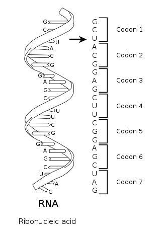
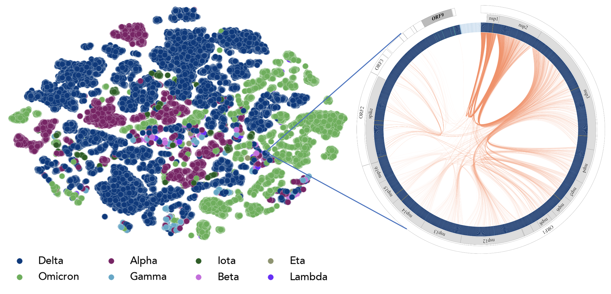
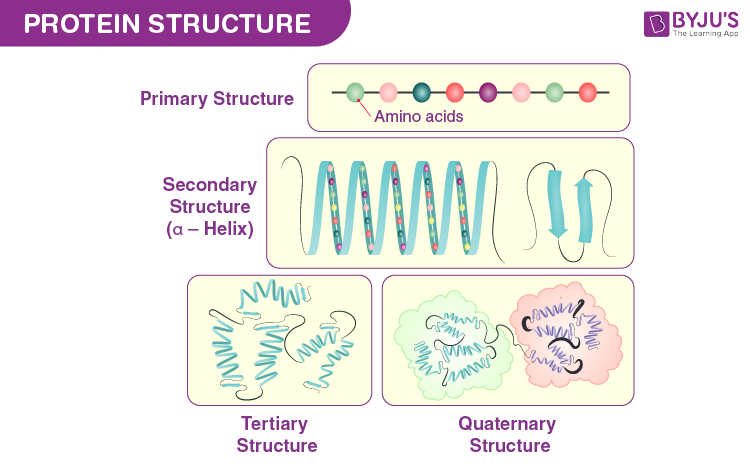
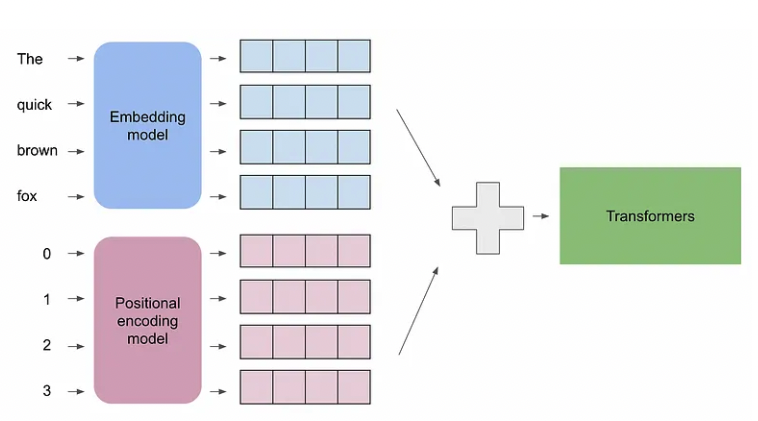
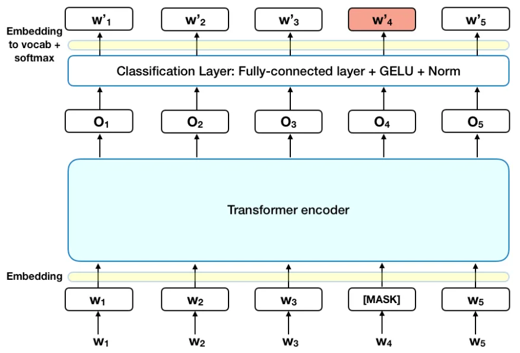
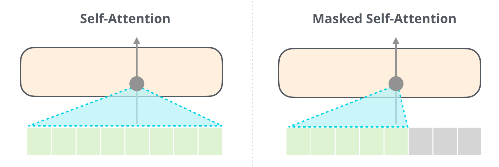

::: {.callout-note title="Authors" collapse="false"}
Content by Archit Vasan, including materials on LLMs by Varuni Sastri and Carlo
Graziani at Argonne, and discussion/editorial work by Taylor Childers, Bethany
Lusch, and Venkat Vishwanath (Argonne). Modified by Huihuo Zheng (Aug 1, 2025).
:::

[](https://colab.research.google.com/github/saforem2/intro-hpc-bootcamp/blob/main/docs/02-llms/0-intro-to-llms/index.ipynb) [](https://github.com/saforem2/intro-hpc-bootcamp/blob/main/content/02-llms/0-intro-to-llms/index.qmd)

Although the term *"language model"* comes from Natural Language Processing, the
same machinery applies to a surprisingly broad range of **scientific** problems.
This session builds up the core ideas of sequential-data modeling and the key
architectural element behind modern LLMs: the **Transformer**.

::: {.callout-tip title="🎯 Learning objectives" collapse="false"}
By the end of this session you will be able to:

1. Explain what **sequential data** is and why it shows up across science.
2. Trace the **evolution** of language models from RNNs to Transformers.
3. Describe **tokenization** and **embeddings** — how text becomes numbers.
4. Explain the **attention mechanism** and the anatomy of a Transformer block.
5. Understand the **training objective** (cross-entropy) and **perplexity**.
6. Build a **mini-LLM from scratch** and recognize the major Transformer families.
7. Run a **pretrained model** end-to-end with 🤗 HuggingFace.
:::

> Inspired by Jay Alammar's superb
> [The Illustrated Transformer](https://jalammar.github.io/illustrated-transformer/)
> and [The Illustrated GPT-2](https://jalammar.github.io/illustrated-gpt2/) —
> highly recommended companion reading.

## 🧬 Why Sequences? Motivation from Science

Before the math, the motivation. A **sequence** is an ordered list whose
elements depend on what came before (and sometimes after). Language is the
obvious example — but so is much of science.

::: {#fig-seq-applications .column-page}

```{mermaid}
flowchart LR
    subgraph IN["`Sequential data`"]
        direction TB
        d0("`DNA / RNA`")
        d1("`Proteins`")
        d2("`SMILES / molecules`")
        d3("`Text`")
        d4("`Time series`")
    end
    M["`Sequence
    model`"]
    subgraph OUT["`Tasks`"]
        direction TB
        o0("`Generation`")
        o1("`Translation`")
        o2("`Property prediction`")
        o3("`Error detection`")
    end
    d0 --> M
    d1 --> M
    d2 --> M
    d3 --> M
    d4 --> M
    M --> o0
    M --> o1
    M --> o2
    M --> o3
classDef block fill:#CCCCCC02,stroke:#838383,stroke-width:1px,color:#838383
classDef red fill:#ff8181,stroke:#333,stroke-width:1px,color:#000
classDef green fill:#98E6A5,stroke:#333,stroke-width:1px,color:#000
classDef blue fill:#7DCAFF,stroke:#333,stroke-width:1px,color:#000
classDef purple fill:#FFCBE6,stroke:#333,stroke-width:1px,color:#000
class IN,OUT block
class d0,d1,d2,d3,d4 blue
class M purple
class o0,o1,o2,o3 green
```

One model family, many modalities. The same sequence-modeling tools power text
generation *and* scientific discovery.
:::

### Scientific examples

**Nucleic-acid & genomic data.** DNA/RNA sequences predict protein translation,
mutations, and gene expression.

::: {#fig-rna-sequences}


RNA codon structure.
:::

[GenSLM](https://www.biorxiv.org/content/10.1101/2022.10.10.511571v1), a genomic
language model developed at Argonne, modeled the evolution of SARS-CoV-2 —
capturing viral variant dynamics *without* expensive wet-lab experiments.

::: {#fig-genslm}


GenSLM. Image credit: Zvyagin et al. 2022, bioRxiv.
:::

**Protein sequences** predict folding structure, protein–protein interactions,
binding properties, and function.

::: {#fig-protein-sequences}


Protein sequences.
:::

Other active areas include **biomedical text**, **SMILES strings** (molecules),
**weather prediction**, and **coupling to simulations** such as molecular
dynamics.

### Formalizing sequence modeling

Mathematically, a sequence is an ordered list of **tokens**:

$$T = [t_1, t_2, t_3, \ldots, t_N]$$

The central object is the probability of a token given its context. An
autoregressive language model factorizes the joint probability of the whole
sequence into a product of next-token predictions:

$$P(T) = \prod_{i=1}^{N} P(t_i \mid t_1, t_2, \ldots, t_{i-1})$$

Learning these conditional distributions is what lets a model **generate**
(sample the next token), **translate** (map one sequence to another),
**predict properties** (condition on the whole sequence), and **spot errors**
(flag low-probability tokens).

## 📜 A Brief History of Language Models

::: {#fig-lm-history .column-body-outset}

```{mermaid}
flowchart LR
    RNN("`RNNs
    (memory via
    hidden state)`")
    LSTM("`LSTM / GRU
    (longer memory)`")
    TF("`Transformer
    2017
    'Attention is
    All You Need'`")
    LLM("`LLMs
    GPT · BERT · Llama
    DeepSeek · …`")
    RNN --> LSTM --> TF --> LLM
classDef block fill:#CCCCCC02,stroke:#838383,stroke-width:1px,color:#838383
classDef red fill:#ff8181,stroke:#333,stroke-width:1px,color:#000
classDef yellow fill:#FFFF7F,stroke:#333,stroke-width:1px,color:#000
classDef green fill:#98E6A5,stroke:#333,stroke-width:1px,color:#000
classDef blue fill:#7DCAFF,stroke:#333,stroke-width:1px,color:#000
class RNN red
class LSTM yellow
class TF blue
class LLM green
```

The road to modern LLMs.
:::

### Recurrent Neural Networks (RNNs)

RNNs were the traditional tool for temporal dependencies. The hidden state from
the previous step is fed back into the network, giving it a "memory" of past
inputs — ideal for short sequences in NLP and time-series prediction.

::: {#fig-rnn}

```{mermaid}
flowchart LR
    x1(("`x₁`")) --> h1["`h₁`"]
    x2(("`x₂`")) --> h2["`h₂`"]
    x3(("`x₃`")) --> h3["`h₃`"]
    xt(("`xₜ`")) --> ht["`hₜ`"]
    h1 -->|"`hidden state`"| h2 -->|"`hidden state`"| h3 -->|"`…`"| ht
    h1 --> y1(("`y₁`"))
    h2 --> y2(("`y₂`"))
    h3 --> y3(("`y₃`"))
    ht --> yt(("`yₜ`"))
classDef block fill:#CCCCCC02,stroke:#838383,stroke-width:1px,color:#838383
classDef red fill:#ff8181,stroke:#333,stroke-width:1px,color:#000
classDef blue fill:#7DCAFF,stroke:#333,stroke-width:1px,color:#000
classDef green fill:#98E6A5,stroke:#333,stroke-width:1px,color:#000
class x1,x2,x3,xt red
class h1,h2,h3,ht blue
class y1,y2,y3,yt green
```

An RNN unrolled over time: the hidden state $h_t$ is passed from each step to
the next, giving the network a "memory" of past inputs.
:::

But RNNs have two crippling limitations:

- **Slow to train.** Each step depends on the previous hidden state, so
  computation is inherently **sequential** — it can't be parallelized across the
  sequence.
- **Poor with long sequences.** Vanishing/exploding gradients limit how far back
  an RNN can "see." LSTMs and GRUs mitigate this but don't fully solve it.

### Transformers

The 2017 paper [*Attention Is All You
Need*](https://arxiv.org/abs/1706.03762) replaced recurrence with the
**attention mechanism**, which processes all positions **in parallel** and
directly models long-range dependencies. This unlocked the scale that defines
today's "large" language models.

Since 2017 the field has moved fast. A rough chronology of landmark models:

::: {#fig-transformers-chrono .column-page}

```{mermaid}
gantt
    title A Chronology of Transformers and LLMs
    dateFormat YYYY
    axisFormat %Y

    section Foundations
    Transformer — Attention Is All You Need   :milestone, m1, 2017, 0d
    RNN / LSTM / GRU era                       :done,      f1, 2014, 2017-06-01

    section Encoders
    BERT                                       :milestone, e1, 2018, 0d
    RoBERTa / ALBERT / DistilBERT              :active,     e2, 2019, 2020-01-01

    section Decoders (GPT line)
    GPT                                        :milestone, d1, 2018, 0d
    GPT-2                                       :milestone, d2, 2019, 0d
    GPT-3 (175B)                               :milestone, d3, 2020, 0d
    InstructGPT / RLHF / ChatGPT               :milestone, d4, 2022, 0d
    GPT-4                                       :milestone, d5, 2023, 0d

    section Open weights
    LLaMA / Llama 2                            :milestone, o1, 2023, 0d
    Mistral / Mixtral (MoE)                    :active,     o2, 2023-09-01, 2024-06-01
    Llama 3                                     :milestone, o3, 2024, 0d

    section Reasoning & MoE
    DeepSeek-V3                                :milestone, r1, 2024-12-01, 0d
    DeepSeek-R1 / reasoning models             :milestone, r2, 2025, 0d
```

A (non-exhaustive) timeline of landmark Transformer models. From a single 2017
architecture to today's frontier reasoning and Mixture-of-Experts systems.
:::

::: {#fig-transformer-arch}

```{mermaid}
flowchart TB
    subgraph ENC["`Encoder  ×N`"]
        direction TB
        ei("`Input<br/>embedding + PE`") --> ea["`Multi-Head<br/>Self-Attention`"]
        ea --> ean(["`Add & Norm`"])
        ean --> eff["`Feed-Forward`"]
        eff --> eann(["`Add & Norm`"])
    end
    subgraph DEC["`Decoder  ×N`"]
        direction TB
        di("`Output<br/>embedding + PE`") --> da["`Masked Multi-Head<br/>Self-Attention`"]
        da --> dan(["`Add & Norm`"])
        dan --> dca["`Multi-Head<br/>Cross-Attention`"]
        dca --> dcan(["`Add & Norm`"])
        dcan --> dff["`Feed-Forward`"]
        dff --> dann(["`Add & Norm`"])
    end
    eann -->|"`K, V`"| dca
    dann --> lin["`Linear`"] --> sm["`Softmax`"] --> out(("`output<br/>probabilities`"))
classDef block fill:#CCCCCC02,stroke:#838383,stroke-width:1px,color:#838383
classDef red fill:#ff8181,stroke:#333,stroke-width:1px,color:#000
classDef blue fill:#7DCAFF,stroke:#333,stroke-width:1px,color:#000
classDef yellow fill:#FFFF7F,stroke:#333,stroke-width:1px,color:#000
classDef purple fill:#FFCBE6,stroke:#333,stroke-width:1px,color:#000
classDef green fill:#98E6A5,stroke:#333,stroke-width:1px,color:#000
class ENC,DEC block
class ei,di red
class ea,da,dca blue
class eff,dff yellow
class ean,eann,dan,dcan,dann purple
class lin,sm blue
class out green
```

The full encoder–decoder Transformer architecture (Vaswani et al., 2017): a
stack of `N` encoder layers (right) whose keys and values feed cross-attention
in a stack of `N` decoder layers (left), ending in a linear + softmax
projection to output probabilities.
:::

## ⚡ LLMs in Action: The Black Box First

Before we open it up, let's *use* an LLM. We'll rely on
[🤗 `transformers`](https://huggingface.co/docs/transformers), which packages
pretrained models, tokenizers, and pipelines.

::: {.callout-warning title="⚠️ A note on generated content" collapse="false"}
LLMs are only as good as their training data. The pretrained models we use were
trained on wide samples of internet text that were **not** strictly filtered, so
generated output may occasionally be dark, biased, or nonsensical. It does not
reflect our values and is shown for demonstration only.
:::

```{python}
#| eval: false
# One-time setup (Colab / fresh env). Skip if these are already installed.
%pip install transformers torch pandas rich \
    umap-learn plotly scikit-learn nltk bertviz
```

```{python}
%load_ext autoreload
%autoreload 2
%matplotlib inline
# svg for HTML, high-res png for PDF
import matplotlib_inline.backend_inline
matplotlib_inline.backend_inline.set_matplotlib_formats('retina', 'svg', 'png')
import matplotlib as mpl
from rich import print
```

Generating text is three lines with a `pipeline`:

```{python}
#| scrolled: true
from transformers import pipeline

input_text = "I got an A+ in my final exam; I am very"
generator = pipeline("text-generation", model="openai-community/gpt2")
# do_sample=True: draw from the probability distribution (so the 5 completions
# actually differ). Without it the pipeline decodes greedily, and asking for
# num_return_sequences > 1 from a single greedy path raises a ValueError.
print(
    [
        i["generated_text"]
        for i in generator(input_text, max_length=20,
                           num_return_sequences=5, do_sample=True)
    ]
)
```

That's the whole black box: **text in, text out**. The rest of this session is
about what happens *inside*.

## 🔬 Opening the Black Box

Two components turn a prompt into generated text:

::: {#fig-blackbox .column-body-outset}

```{mermaid}
flowchart LR
    P("`Prompt
    (text)`")
    T["`1 · Tokenizer`"]
    M["`2 · Model
    (Transformer)`"]
    O("`Generated
    text`")
    P --> T --> M --> O
    M -.->|"`next token`"| M
classDef block fill:#CCCCCC02,stroke:#838383,stroke-width:1px,color:#838383
classDef red fill:#ff8181,stroke:#333,stroke-width:1px,color:#000
classDef blue fill:#7DCAFF,stroke:#333,stroke-width:1px,color:#000
classDef green fill:#98E6A5,stroke:#333,stroke-width:1px,color:#000
class P red
class T,M blue
class O green
```

The two black boxes: a **tokenizer** and the **model** itself.
:::

### 1 · Tokenization

Computers operate on numbers, not characters. **Tokenization** splits text into
units (tokens) and maps each to an integer ID.

::: {#fig-tokenization-pipeline .column-page}

```{mermaid}
flowchart LR
    A("`'I am very'`")
    B("`tokens
    ['I', ' am', ' very']`")
    C("`ids
    [40, 716, 845]`")
    D("`embeddings
    (vectors)`")
    A -->|"`tokenize`"| B
    B -->|"`convert_tokens_to_ids`"| C
    C -->|"`embedding table`"| D
classDef block fill:#CCCCCC02,stroke:#838383,stroke-width:1px,color:#838383
classDef red fill:#ff8181,stroke:#333,stroke-width:1px,color:#000
classDef yellow fill:#FFFF7F,stroke:#333,stroke-width:1px,color:#000
classDef blue fill:#7DCAFF,stroke:#333,stroke-width:1px,color:#000
classDef green fill:#98E6A5,stroke:#333,stroke-width:1px,color:#000
class A red
class B yellow
class C blue
class D green
```

From raw text to model-ready vectors.
:::

GPT-2 uses **Byte-Pair Encoding (BPE)**, a subword scheme that balances
vocabulary size against sequence length. Let's inspect a tokenizer:

```{python}
from transformers import AutoTokenizer


def tokenization_summary(tokenizer, sequence):
    # Peek at a slice of the vocabulary
    print("Subset of tokenizer.vocab:")
    for i, (token, index) in enumerate(tokenizer.vocab.items()):
        print(f"{token}: {index}")
        if i >= 9:
            break

    print("Vocab size of the tokenizer =", len(tokenizer.vocab))
    print("------------------------------------------")

    # .tokenize -> subword tokens
    tokens = tokenizer.tokenize(sequence)
    print("Tokens :", tokens)
    print("------------------------------------------")

    # .encode -> integer ids (adds special tokens where applicable)
    print("tokenized sequence :", tokenizer.encode(sequence))

    # .decode -> back to text
    ids = tokenizer.convert_tokens_to_ids(tokens)
    print("Decode sequence :", tokenizer.decode(ids))


tokenizer_1 = AutoTokenizer.from_pretrained("gpt2")  # Byte-Pair Encoding (BPE)
sequence = "I got an A+ in my final exam; I am very"
tokenization_summary(tokenizer_1, sequence)
```

### 2 · Token Embeddings

Each token ID is mapped to a vector in a moderate-dimensional space. The key
idea: **similar or related tokens land near each other**, and the model can
*learn* this geometry during training.

The embedding dimension is high (e.g. 768–1024) but much smaller than the
vocabulary (30k–500k). Unlike static word vectors, Transformers **adjust their
embeddings during training**.

We can *see* this structure by projecting BERT embeddings down to 3-D with PCA:

```{python}
#| scrolled: true
import nltk
import numpy as np
import pandas as pd
import plotly.express as px
from nltk.corpus import stopwords
from sklearn.decomposition import PCA
from transformers import BertModel, BertTokenizer

nltk.download("stopwords")
import torch

model_name = "bert-base-uncased"
tokenizer = BertTokenizer.from_pretrained(model_name)
model = BertModel.from_pretrained(model_name)

# Three distinct semantic groups (animals / colors / food) so the clusters are
# visible once we project down to 3-D.
text = (
    "The dog cat horse and rabbit ran while the red blue green and yellow "
    "paint dried near the pizza bread cheese and apple on the table"
)

# Tokenize and get BERT embeddings
tokens = tokenizer(text, return_tensors="pt", padding=True, truncation=True)
with torch.no_grad():
    outputs = model(**tokens)
    embeddings = outputs.last_hidden_state.squeeze(0).numpy()  # (num_tokens, 768)

# Keep content words only: drop [CLS]/[SEP], subword pieces (##), and stopwords.
# We track the kept *indices* so each embedding stays matched to its own label
# (slicing embeddings[:N] would mislabel every point).
labels = tokenizer.convert_ids_to_tokens(tokens.input_ids[0].tolist())
stop_words = set(stopwords.words("english"))
keep = [
    i
    for i, label in enumerate(labels)
    if not (label.startswith("[") and label.endswith("]"))
    and "##" not in label
    and label.lower() not in stop_words
]
filtered_labels = [labels[i] for i in keep]
filtered_embeddings = embeddings[keep]

# PCA -> 3-D
embeddings_pca = PCA(n_components=3).fit_transform(filtered_embeddings)
df_pca = pd.DataFrame(
    {
        "x": embeddings_pca[:, 0],
        "y": embeddings_pca[:, 1],
        "z": embeddings_pca[:, 2],
        "label": filtered_labels,
    }
)

fig_pca = px.scatter_3d(
    df_pca, x="x", y="y", z="z", text="label",
    title="PCA 3-D Visualization of Token Embeddings",
    labels={"x": "Dim 1", "y": "Dim 2", "z": "Dim 3"},
    hover_name="label",
)
fig_pca.update_traces(marker=dict(size=5), textfont=dict(size=8))
fig_pca.show()
```

Notice how the words settle into three neighborhoods — animals
(*dog, cat, horse, rabbit*), colors (*red, blue, green, yellow*), and food
(*pizza, bread, cheese, apple*) — even though BERT was never told these
categories. It learned them purely from how the words are used.

## 🧱 Inside a Transformer

The model we'll dissect is a **GPT** — a *Generative Pre-trained Transformer*.
The name is the three-sentence summary of the whole architecture:

- **Generative** — it *generates* text, one token at a time.
- **Pre-trained** — it is *trained* on a huge corpus (typically trillions of
  tokens scraped from the internet) before you ever use it.
- **Transformer** — it is a *decoder-only* Transformer neural network.

At its most basic, a GPT is a function from a sequence of integer tokens to a
grid of scores — one row per input position, one column per vocabulary entry:

```python
def gpt(inputs: list[int]) -> list[list[float]]:
    # inputs.shape  = [seq_len]              (a tokenized prompt)
    # output.shape  = [seq_len, vocab_size]  (next-token scores at each position)
    output = model(inputs)
    return output
```

The last row of that output — the scores after the *final* input token — is the
distribution we sample from to pick the next word. Do that repeatedly, feeding
each new token back in, and you have text generation.

Now the model itself. We'll dissect **GPT-2**, a concrete *Transformer decoder*.
Let's look at its structure:

```{python}
from transformers import GPT2LMHeadModel

model = GPT2LMHeadModel.from_pretrained("gpt2")
print(model)
```

Decoder-only models like GPT are **auto-regressive**: at each step, the
attention layers can only see tokens *before* the current position, and the
model is trained to predict the next token. This makes them ideal for text
generation (GPT, GPT-2, CTRL, Transformer-XL, …).

A Transformer decoder is a stack of identical **blocks**, each with two
sub-layers: **masked self-attention** and a **feed-forward network**, wrapped in
residual connections and layer normalization.

::: {#fig-decoder-block}

```{mermaid}
flowchart TB
    IN("`token + positional
    embeddings`")
    subgraph BLK["`Decoder block  ×N`"]
        direction TB
        SA["`Masked
        Self-Attention`"]
        AN1(["`Add & Norm`"])
        FF["`Feed-Forward
        Network`"]
        AN2(["`Add & Norm`"])
        SA --> AN1 --> FF --> AN2
    end
    LIN["`Linear`"]
    SM["`Softmax`"]
    OUT("`next-token
    probabilities`")
    IN --> SA
    AN2 --> LIN --> SM --> OUT
classDef block fill:#CCCCCC02,stroke:#838383,stroke-width:1px,color:#838383
classDef red fill:#ff8181,stroke:#333,stroke-width:1px,color:#000
classDef yellow fill:#FFFF7F,stroke:#333,stroke-width:1px,color:#000
classDef green fill:#98E6A5,stroke:#333,stroke-width:1px,color:#000
classDef blue fill:#7DCAFF,stroke:#333,stroke-width:1px,color:#000
classDef purple fill:#FFCBE6,stroke:#333,stroke-width:1px,color:#000
class BLK block
class IN red
class SA blue
class FF yellow
class AN1,AN2 purple
class LIN,SM blue
class OUT green
```

The anatomy of a decoder block. The stack repeats `N` times before the final
projection to vocabulary logits.
:::

We'll set some hyperparameters we'll reuse throughout:

```{python}
import torch
import torch.nn as nn
from torch.nn import functional as F

torch.manual_seed(1337)

# hyperparameters
batch_size = 16    # independent sequences processed in parallel
block_size = 32    # maximum context length
max_iters = 5000
eval_interval = 100
learning_rate = 1e-3
device = "cuda" if torch.cuda.is_available() else "cpu"
eval_iters = 200
n_embd = 64
n_head = 4         # -> head_size = 16
n_layer = 4
dropout = 0.0
```

### Attention: the core idea

Consider the sentence:

> "The animal didn't cross the street because **it** was too tired."

We intuitively know "it" refers to "animal." **Self-attention** is how a
Transformer learns these relationships: as it processes each token, it looks at
*other* positions for context.

Rather than a static diagram, let's look at **real attention weights** from a
pretrained BERT for this exact sentence. Each row is a token *attending*; the
colored cells show how much it attends to each other token.

BERT has 12 layers × 12 heads, and they *specialize*: some heads track syntax,
some track position, and a few learn **coreference** — linking a pronoun to what
it refers to. In those heads, the **"it"** row lights up strongly on
**"animal"** (try `layer 3 · head 10` below, where it's ~0.83). Averaged over all
12 heads the signal washes out — specialization lives in *individual* heads, not
the average. Use the dropdown to compare a few:

```{python}
#| label: fig-attention-viz
#| fig-cap: "Real BERT self-attention — each row shows what a token attends to. Switch heads with the dropdown."
#| code-fold: true
#| code-summary: "Show the attention-extraction + plotting code"
import torch
import plotly.graph_objects as go
from transformers import AutoTokenizer, AutoModel, utils as hf_utils
from bootcamp.plotly_theme import apply_theme
apply_theme()
hf_utils.logging.set_verbosity_error()

sent = "The animal didn't cross the street because it was too tired"
_tok = AutoTokenizer.from_pretrained("bert-base-uncased")
_mdl = AutoModel.from_pretrained("bert-base-uncased",
                                 attn_implementation="eager", output_attentions=True).eval()
_enc = _tok(sent, return_tensors="pt")
with torch.no_grad():
    _att = _mdl(**_enc).attentions          # n_layers × [1, heads, seq, seq]
_toks = _tok.convert_ids_to_tokens(_enc["input_ids"][0])

# Curated views: a handful of heads that learned coreference (the `it` row
# attends to `animal`), plus the head-average for contrast. (layer, head) or
# (layer, None) for the mean over that layer's heads.
_views = [
    ("layer 3 · head 10", 3, 10),
    ("layer 8 · head 10", 8, 10),
    ("layer 10 · head 6", 10, 6),
    ("layer 9 · head 0",  9, 0),
    ("mean over all 12 heads (layer 9)", 9, None),
]
def _view(layer, head):
    a = _att[layer][0]                      # [heads, seq, seq]
    return (a.mean(0) if head is None else a[head]).numpy()

fig = go.Figure()
for i, (_, L, H) in enumerate(_views):
    M = _view(L, H)
    fig.add_heatmap(z=M[::-1], x=_toks, y=_toks[::-1], colorscale="Blues",
                    zmin=0, zmax=1, visible=(i == 0), showscale=True,
                    hovertemplate="%{y} → %{x}: %{z:.2f}<extra></extra>")
fig.update_layout(
    # No title — the "view:" dropdown label + the figure caption already say what
    # this is, and a title here just collides with the menu. Extra top margin
    # leaves clear room for the dropdown above the plot.
    height=560, width=600, margin=dict(t=70),
    xaxis=dict(title="attended-to token", tickangle=-45),
    yaxis=dict(title="attending token"),
    annotations=[dict(text="view:", showarrow=False, x=0.0, xref="paper",
                      y=1.13, yref="paper", xanchor="left", yanchor="middle",
                      font=dict(color="#838383"))],
    updatemenus=[dict(
        active=0, x=0.07, y=1.20, xanchor="left", yanchor="top",
        bgcolor="#ffffff", bordercolor="#bdbdbd", borderwidth=1,
        font=dict(color="#333333"),
        buttons=[dict(label=name, method="update",
                      args=[{"visible": [j == i for j in range(len(_views))]}])
                 for i, (name, _, _) in enumerate(_views)])],
)
fig.show()
```

::: {.aside}
Static-diagram credit for the original illustration: [Jay Alammar](https://jalammar.github.io/illustrated-transformer/). A richer per-head view (via `bertviz`) appears later in this section.
:::

Attention uses three learned projections of each token:

- **Query (Q)** — what this token is *looking for*
- **Key (K)** — what each token *offers* (matched against queries)
- **Value (V)** — the actual content to aggregate

Jay Alammar's analogy: picking a file from a cabinet using a sticky note. The
note (query) matches a folder label (key); you then read that folder's contents
(value), weighted by how well it matched.

::: {#fig-attention-flow .column-page}

```{mermaid}
flowchart LR
    X("`x
    (token vectors)`")
    Q["`Q = xWq`"]
    K["`K = xWk`"]
    V["`V = xWv`"]
    S["`scores =
    Q·Kᵀ / √dₖ`"]
    A["`weights =
    softmax(scores)`"]
    O("`output =
    weights · V`")
    X --> Q
    X --> K
    X --> V
    Q --> S
    K --> S
    S --> A
    A --> O
    V --> O
classDef block fill:#CCCCCC02,stroke:#838383,stroke-width:1px,color:#838383
classDef red fill:#ff8181,stroke:#333,stroke-width:1px,color:#000
classDef yellow fill:#FFFF7F,stroke:#333,stroke-width:1px,color:#000
classDef green fill:#98E6A5,stroke:#333,stroke-width:1px,color:#000
classDef blue fill:#7DCAFF,stroke:#333,stroke-width:1px,color:#000
class X red
class Q,K,V blue
class S,A yellow
class O green
```

Scaled dot-product attention. The $\sqrt{d_k}$ divisor stabilizes gradients
before the softmax.
:::

The algorithm in words:

1. Compute Q, K, V for each token.
2. Score every token against every other: $\text{scores} = QK^{\top}$.
3. Scale by $\sqrt{d_k}$ and apply softmax → attention weights.
4. Weight the value vectors by these weights and sum.

In code:

```{python}
import torch
import torch.nn as nn
from torch.nn import functional as F

torch.manual_seed(1337)
B, T, C = 4, 8, 32  # batch, time, channels
x = torch.randn(B, T, C)

head_size = 16
key = nn.Linear(C, head_size, bias=False)
query = nn.Linear(C, head_size, bias=False)
value = nn.Linear(C, head_size, bias=False)

k = key(x)       # (B, T, 16)
q = query(x)     # (B, T, 16)
v = value(x)     # (B, T, 16)

wei = q @ k.transpose(-2, -1) * head_size**-0.5  # (B, T, T)
wei = F.softmax(wei, dim=-1)                      # normalize -> distribution
out = wei @ v                                     # (B, T, 16)
print(out[0])
```

### Multi-head attention

In practice we run several attention "heads" in parallel. Each head can focus on
a different kind of relationship (syntax, coreference, …), and their outputs are
concatenated. This gives the model multiple **representation subspaces**.

::: {#fig-multihead}


Multi-head attention. Image credit: [Jay Alammar](https://jalammar.github.io/illustrated-transformer/).
:::

### Attention, visualized interactively

[`bertviz`](https://github.com/jessevig/bertviz) lets us inspect real attention
weights. **Click the different colored blocks** to see which tokens attend to
which.

```{python}
#| scrolled: true
from bertviz import model_view
from transformers import AutoModelForCausalLM, AutoTokenizer, utils

utils.logging.set_verbosity_error()  # suppress standard warnings

model_name = "openai-community/gpt2"
input_text = "The animal didn't cross the street because it was too tired"
model = AutoModelForCausalLM.from_pretrained(model_name, output_attentions=True)
tokenizer = AutoTokenizer.from_pretrained(model_name)

inputs = tokenizer.encode(input_text, return_tensors="pt")
outputs = model(inputs)
attention = outputs[-1]
tokens = tokenizer.convert_ids_to_tokens(inputs[0])
model_view(attention, tokens)
```

### Positional encoding

Attention alone is **order-blind** — it sees a *set* of tokens, not a sequence.
But order matters enormously:

> "The man ate the sandwich." vs. "The sandwich ate the man."

Same words, very different meaning. Transformers restore order by **adding a
positional encoding** vector to each token embedding.

::: {#fig-positional-encoding}


Positional encodings are added to token embeddings. Image credit: [Chen](https://medium.com/@xuer.chen.human/llm-study-notes-positional-encoding-0639a1002ec0).
:::

We can implement a (learned) positional embedding with `nn.Embedding`, sized
`(block_size, n_embd)` — one vector per position:

```{python}
vocab_size = 65
n_embd = 64
block_size = 32

token_embedding_table = nn.Embedding(vocab_size, n_embd)
position_embedding_table = nn.Embedding(block_size, n_embd)
```

Token embedding alone:

```{python}
x = torch.tensor([1, 3, 15, 4, 7, 1, 4, 9])
print(token_embedding_table(x)[0])
```

Token **+** positional embedding (note the offset):

```{python}
x = torch.tensor([1, 3, 15, 4, 7, 1, 4, 9])
print((position_embedding_table(x) + token_embedding_table(x))[0])
```

Both are learned during training to best encode content *and* position.

### Output layer: from vectors back to words

After the decoder stack, each position holds a vector. A final **Linear** layer
projects it to a **logits** vector — one score per vocabulary entry — and
**softmax** turns those scores into probabilities. The highest-probability token
(or a sample from the distribution) becomes the output.

::: {#fig-output-softmax}


Linear + softmax turn the final vector into a next-token distribution. Image
credit: [Jay Alammar](https://jalammar.github.io/illustrated-transformer/).
:::

## 🎯 Training a Language Model

How does the model improve? We compare its predicted next-token distribution to
the ground truth and minimize the difference.

::: {#fig-training-loop .column-page}

```{mermaid}
flowchart LR
    B("`batch
    (x, y)`")
    FWD["`forward
    logits`"]
    L["`cross-entropy
    loss`"]
    BWD["`backward
    (gradients)`"]
    OPT["`optimizer
    step`"]
    B --> FWD --> L --> BWD --> OPT
    OPT -.->|"`repeat`"| B
classDef block fill:#CCCCCC02,stroke:#838383,stroke-width:1px,color:#838383
classDef red fill:#ff8181,stroke:#333,stroke-width:1px,color:#000
classDef yellow fill:#FFFF7F,stroke:#333,stroke-width:1px,color:#000
classDef green fill:#98E6A5,stroke:#333,stroke-width:1px,color:#000
classDef blue fill:#7DCAFF,stroke:#333,stroke-width:1px,color:#000
class B red
class FWD blue
class L yellow
class BWD blue
class OPT green
```

The training loop: predict → score → update, repeated over many batches.
:::

The standard loss is **cross-entropy** between the true distribution $p$ and the
predicted distribution $q$:

$$\mathrm{CE} = -\sum_{x \in X} p(x)\, \log q(x)$$

```{python}
from torch.nn import functional as F

logits = torch.tensor([0.5, 0.1, 0.3])
targets = torch.tensor([1.0, 0.0, 0.0])
loss = F.cross_entropy(logits, targets)
print(loss)
```

A closely related, more interpretable metric is **perplexity** — intuitively,
"how surprised" the model is by new data. Lower is better. It's just the
exponential of the cross-entropy:

$$\text{perplexity} = \exp(\mathrm{CE})$$

```{python}
print(torch.exp(loss))
```

## 🛠️ Build a Mini-LLM from Scratch

Time to assemble everything into a small, working GPT-style model, trained on
the tiny-Shakespeare dataset with a character-level tokenizer.

### Hyperparameters

```{python}
batch_size = 4     # independent sequences in parallel
block_size = 32    # maximum context length
max_iters = 500
eval_interval = 50
learning_rate = 1e-3
device = "cuda" if torch.cuda.is_available() else "cpu"
eval_iters = 200
n_embd = 64
n_head = 4         # head_size = 16
n_layer = 4
dropout = 0.0
```

### Data: tiny-Shakespeare

We use a simple **character-level** tokenizer and a 90/10 train/val split.

```{python}
! [ ! -f "input.txt" ] && wget https://raw.githubusercontent.com/argonne-lcf/ATPESC_MachineLearning/refs/heads/master/02_intro_to_LLMs/dataset/input.txt
```

```{python}
with open("input.txt", "r", encoding="utf-8") as f:
    text = f.read()

# unique characters -> vocabulary
chars = sorted(list(set(text)))
vocab_size = len(chars)
stoi = {ch: i for i, ch in enumerate(chars)}
itos = {i: ch for i, ch in enumerate(chars)}
encode = lambda s: [stoi[c] for c in s]           # string -> list[int]
decode = lambda l: "".join([itos[i] for i in l])  # list[int] -> string

# train / val split
data = torch.tensor(encode(text), dtype=torch.long)
n = int(0.9 * len(data))
train_data = data[:n]
val_data = data[n:]


def get_batch(split):
    data = train_data if split == "train" else val_data
    ix = torch.randint(len(data) - block_size, (batch_size,))
    x = torch.stack([data[i : i + block_size] for i in ix])
    y = torch.stack([data[i + 1 : i + block_size + 1] for i in ix])
    return x.to(device), y.to(device)
```

```{python}
#| scrolled: true
print(text[:1000])
```

### Components: attention head, multi-head, feed-forward

```{python}
class Head(nn.Module):
    """One head of self-attention."""

    def __init__(self, head_size):
        super().__init__()
        self.key = nn.Linear(n_embd, head_size, bias=False)
        self.query = nn.Linear(n_embd, head_size, bias=False)
        self.value = nn.Linear(n_embd, head_size, bias=False)
        self.register_buffer("tril", torch.tril(torch.ones(block_size, block_size)))
        self.dropout = nn.Dropout(dropout)

    def forward(self, x):
        B, T, C = x.shape
        k = self.key(x)    # (B, T, head_size)
        q = self.query(x)  # (B, T, head_size)
        # attention scores ("affinities"), scaled by 1/sqrt(head_size).
        # NOTE: scale by the KEY dimension (k.shape[-1] == head_size), NOT the
        # embedding dim C — inside a multi-head block head_size = n_embd // n_head,
        # so using C here would make the logits too small.
        head_size = k.shape[-1]
        wei = q @ k.transpose(-2, -1) * head_size**-0.5              # (B, T, T)
        wei = wei.masked_fill(self.tril[:T, :T] == 0, float("-inf"))  # causal mask
        wei = F.softmax(wei, dim=-1)
        wei = self.dropout(wei)
        v = self.value(x)  # (B, T, head_size)
        return wei @ v     # (B, T, head_size)


class MultiHeadAttention(nn.Module):
    """Multiple heads of self-attention in parallel."""

    def __init__(self, num_heads, head_size):
        super().__init__()
        self.heads = nn.ModuleList([Head(head_size) for _ in range(num_heads)])
        self.proj = nn.Linear(n_embd, n_embd)
        self.dropout = nn.Dropout(dropout)

    def forward(self, x):
        out = torch.cat([h(x) for h in self.heads], dim=-1)
        return self.dropout(self.proj(out))


class FeedFoward(nn.Module):
    """A linear layer followed by a non-linearity."""

    def __init__(self, n_embd):
        super().__init__()
        self.net = nn.Sequential(
            nn.Linear(n_embd, 4 * n_embd),
            nn.ReLU(),
            nn.Linear(4 * n_embd, n_embd),  # projection back to residual stream
            nn.Dropout(dropout),
        )

    def forward(self, x):
        return self.net(x)
```

### The Transformer block

Each block does **communication** (attention) followed by **computation**
(feed-forward), each with a residual connection and pre-layer-norm:

```{python}
class Block(nn.Module):
    """Transformer block: communication followed by computation."""

    def __init__(self, n_embd, n_head):
        super().__init__()
        head_size = n_embd // n_head
        self.sa = MultiHeadAttention(n_head, head_size)
        self.ffwd = FeedFoward(n_embd)
        self.ln1 = nn.LayerNorm(n_embd)
        self.ln2 = nn.LayerNorm(n_embd)

    def forward(self, x):
        x = x + self.sa(self.ln1(x))    # communication
        x = x + self.ffwd(self.ln2(x))  # computation
        return x
```

### The full model

Token embeddings + positional embeddings → a stack of blocks → final layer-norm
→ linear head to vocabulary logits:

```{python}
class LanguageModel(nn.Module):
    def __init__(self):
        super().__init__()
        self.token_embedding_table = nn.Embedding(vocab_size, n_embd)
        self.position_embedding_table = nn.Embedding(block_size, n_embd)
        self.blocks = nn.Sequential(
            *[Block(n_embd, n_head=n_head) for _ in range(n_layer)]
        )
        self.ln_f = nn.LayerNorm(n_embd)
        self.lm_head = nn.Linear(n_embd, vocab_size)

    def forward(self, idx, targets=None):
        B, T = idx.shape
        tok_emb = self.token_embedding_table(idx)                         # (B,T,C)
        pos_emb = self.position_embedding_table(torch.arange(T, device=device))  # (T,C)
        x = tok_emb + pos_emb          # (B,T,C)
        x = self.blocks(x)             # (B,T,C)
        x = self.ln_f(x)               # (B,T,C)
        logits = self.lm_head(x)       # (B,T,vocab_size)

        if targets is None:
            loss = None
        else:
            B, T, C = logits.shape
            logits = logits.view(B * T, C)
            targets = targets.view(B * T)
            loss = F.cross_entropy(logits, targets)
        return logits, loss

    def generate(self, idx, max_new_tokens):
        for _ in range(max_new_tokens):
            idx_cond = idx[:, -block_size:]        # crop to context window
            logits, _ = self(idx_cond)
            logits = logits[:, -1, :]              # last time step -> (B, C)
            probs = F.softmax(logits, dim=-1)      # (B, C)
            idx_next = torch.multinomial(probs, num_samples=1)  # sample
            idx = torch.cat((idx, idx_next), dim=1)             # append
        return idx
```

## 🤗 Using Pretrained Models with HuggingFace

Building from scratch teaches you *how* Transformers work. In practice, you'll
usually start from a **pretrained** model and adapt it. The
[🤗 `transformers`](https://huggingface.co/docs/transformers) library makes this
a few lines of code. Let's walk a complete **sentiment-classification** pipeline
end-to-end.

::: {#fig-hf-pipeline}

```{mermaid}
flowchart LR
    P("`1 · Prompt
    (input text)`")
    M["`2 · Load pretrained
    model`"]
    T["`3 · Tokenize`"]
    I["`4 · Inference
    (logits)`"]
    O("`5 · Interpret
    (softmax → label)`")
    P --> M --> T --> I --> O
classDef block fill:#CCCCCC02,stroke:#838383,stroke-width:1px,color:#838383
classDef red fill:#ff8181,stroke:#333,stroke-width:1px,color:#000
classDef yellow fill:#FFFF7F,stroke:#333,stroke-width:1px,color:#000
classDef blue fill:#7DCAFF,stroke:#333,stroke-width:1px,color:#000
classDef green fill:#98E6A5,stroke:#333,stroke-width:1px,color:#000
class P red
class M,T blue
class I yellow
class O green
```

The five steps of a HuggingFace inference pipeline.
:::

**Step 1 — Set up a prompt.** A *prompt* is the input provided to the model; its
structure guides the output.

```{python}
input_text = "The panoramic view of the ocean was breathtaking."
```

**Step 2 — Load a pretrained model.** `from_pretrained()` downloads (and caches)
the model weights, config, and tokenizer from the HuggingFace Model Hub. We use
a DistilBERT model fine-tuned for sentiment (SST-2) — a ~270 MB download the
first time, then cached:

```{python}
import torch
import torch.nn.functional as F
from transformers import AutoConfig, AutoModelForSequenceClassification, AutoTokenizer

model_name = "distilbert-base-uncased-finetuned-sst-2-english"
model = AutoModelForSequenceClassification.from_pretrained(model_name)
config = AutoConfig.from_pretrained(model_name)
```

**Step 3 — Tokenize the input.** Load the tokenizer that matches the model and
convert text to input IDs:

```{python}
tokenizer = AutoTokenizer.from_pretrained(model_name)
input_ids = tokenizer(input_text, return_tensors="pt")["input_ids"]
print(input_ids)
```

**Step 4 & 5 — Infer and interpret.** Run the model to get **logits**, convert
them to probabilities with softmax, and map the argmax to a label:

```{python}
outputs = model(input_ids)
logits = outputs.logits

probabilities = F.softmax(logits, dim=-1)
predicted_class = torch.argmax(probabilities, dim=-1).item()
labels = ["NEGATIVE", "POSITIVE"]
print(f"{labels[predicted_class]}  (score={probabilities[0][predicted_class]:.4f})")
```

::: {.callout-tip title="⚡ The one-liner shortcut"}
For quick use, `pipeline()` wraps all five steps into a single call:

```{python}
from transformers import pipeline

classifier = pipeline("sentiment-analysis")
classifier("The panoramic view of the ocean was breathtaking.")
```
:::

### Saving & loading models

A model (pretrained or fine-tuned) can be saved to and loaded from a local
directory (shown, not run here — it would write a model folder to disk):

```{python}
#| eval: false
from transformers import AutoModel, AutoModelForCausalLM

model = AutoModelForCausalLM.from_pretrained("bert-base-uncased")
# ... train or fine-tune ...
model.save_pretrained("my_local_model")           # save
loaded = AutoModel.from_pretrained("my_local_model")  # load back
```

### The Model Hub

The [🤗 Model Hub](https://huggingface.co/docs/hub/en/models-the-hub) hosts
hundreds of thousands of community model checkpoints. You can:

- Download pretrained models with `transformers` (for inference or fine-tuning).
- Filter by task, framework, dataset, language, and more.
- Read each model's **model card** — description, intended use, limitations, and
  often a live inference widget.

## 🎒 Homework

1. **Train the mini-LLM.** Run a training loop for the model above and plot how
   training and validation **perplexity** evolve. This helper will be useful:

   ```{python}
   #| eval: false
   @torch.no_grad()
   def estimate_loss():
       out = {}
       model.eval()
       for split in ["train", "val"]:
           losses = torch.zeros(eval_iters)
           for k in range(eval_iters):
               X, Y = get_batch(split)
               _, loss = model(X, Y)
               losses[k] = loss.item()
           out[split] = losses.mean()
       model.train()
       return out
   ```

2. **Sweep a hyperparameter.** Pick one of `n_embd`, `n_head`, or `n_layer` and
   train with ≥4 different values. Plot perplexity vs. training step for each.

3. **Generate text** from each trained variant. Did some hyperparameters produce
   more coherent output than others?

4. **Explore attention.** Use `bertviz` on a larger model (e.g.
   `meta-llama/Llama-2-7b-chat-hf`) and compare its attention patterns to GPT-2's.

## 🌗 The Transformer Family

Not every Transformer is a decoder. The architecture splits into three families,
depending on which halves are used and how attention is masked:

::: {#fig-transformer-family}

```{mermaid}
flowchart TB
    TF["`Transformer`"]
    E["`Encoder-only
    (bidirectional)`"]
    D["`Decoder-only
    (autoregressive)`"]
    ED["`Encoder–Decoder
    (seq-to-seq)`"]
    E1("`BERT · RoBERTa
    understanding`")
    D1("`GPT · Llama
    generation`")
    ED1("`T5 · BART
    translation, summarization`")
    TF --> E --> E1
    TF --> D --> D1
    TF --> ED --> ED1
classDef block fill:#CCCCCC02,stroke:#838383,stroke-width:1px,color:#838383
classDef red fill:#ff8181,stroke:#333,stroke-width:1px,color:#000
classDef yellow fill:#FFFF7F,stroke:#333,stroke-width:1px,color:#000
classDef green fill:#98E6A5,stroke:#333,stroke-width:1px,color:#000
classDef blue fill:#7DCAFF,stroke:#333,stroke-width:1px,color:#000
classDef purple fill:#FFCBE6,stroke:#333,stroke-width:1px,color:#000
class TF purple
class E,D,ED blue
class E1 red
class D1 green
class ED1 yellow
```

The three Transformer families and representative models.
:::

### Encoder-only (BERT)

Encoder-only models use **bidirectional** attention — every token can see the
whole sentence. This makes them excellent for *understanding* tasks (sentiment
analysis, summarization inputs, disambiguation) but poor at open-ended
generation.

::: {#fig-bert}


BERT reads the entire sequence at once (bidirectional). Image credit: [Towards Data Science](https://towardsdatascience.com/bert-explained-state-of-the-art-language-model-for-nlp-f8b21a9b6270).
:::

BERT is trained with two objectives: **masked language modeling** (predict
hidden words) and **next-sentence prediction**. Its input is built with special
tokens — `[CLS]` at the start and `[SEP]` between/after sentences — plus segment
and positional embeddings.

::: {#fig-bert-input}


BERT input construction. Image credit: [Towards Data Science](https://towardsdatascience.com/bert-explained-state-of-the-art-language-model-for-nlp-f8b21a9b6270).
:::

| | **Encoder-only (BERT)** | **Decoder-only (GPT)** |
|:--|:--|:--|
| Attention | Bidirectional | Masked (causal) |
| Best at | Understanding | Generation |
| Training | Masked LM + NSP | Next-token prediction |
| Examples | BERT, RoBERTa, ALBERT | GPT, Llama, CTRL |

: Encoder-only vs. decoder-only Transformers {.responsive .striped .hover}

### Decoder-only (GPT)

As we saw, decoder-only models use **masked self-attention** so a token attends
only to earlier positions — essential for learning generation without "peeking"
at the answer.

::: {#fig-masked-attention}


Full (bidirectional) vs. masked self-attention. Image credit: [Jay Alammar](https://jalammar.github.io/illustrated-gpt2/).
:::

### Beyond text: Vision & Graph Transformers

The Transformer is modality-agnostic. **Vision Transformers (ViT)** split an
image into patches, embed each patch (plus a positional encoding), and feed the
sequence to a Transformer encoder.

::: {#fig-vit}


Vision Transformer. Image credit: Dosovitskiy et al., [*An Image is Worth 16×16 Words*](https://arxiv.org/abs/2010.11929) (2020).
:::

**Graph Transformers** extend attention to graph-structured data (molecules,
interaction networks).

::: {#fig-graphformer}


A Graph Transformer.
:::

## ✅ Key Takeaways

::: {.callout-tip title="Recap" collapse="false"}
- **Sequences are everywhere** — text, DNA, proteins, molecules, time series.
- **Attention replaced recurrence**, enabling parallel training and long-range
  context — the breakthrough behind LLMs.
- Text becomes numbers via **tokenization** → **embeddings** (learned geometry).
- A Transformer block = **masked self-attention** + **feed-forward**, with
  residuals and layer-norm, repeated `N` times.
- Models are trained to minimize **cross-entropy** (≈ minimize **perplexity**).
- Three families — **encoder-only** (understand), **decoder-only** (generate),
  **encoder–decoder** (translate) — plus vision and graph variants.
:::

## 📚 References & Further Reading

- Vaswani et al., [*Attention Is All You Need*](https://arxiv.org/abs/1706.03762) (2017)
- Jay Alammar, [The Illustrated Transformer](https://jalammar.github.io/illustrated-transformer/)
- Jay Alammar, [The Illustrated GPT-2](https://jalammar.github.io/illustrated-gpt2/)
- Jay Alammar, [Visualizing Neural Machine Translation (seq2seq + attention)](https://jalammar.github.io/visualizing-neural-machine-translation-mechanics-of-seq2seq-models-with-attention/)
- 🤗 [HuggingFace LLM Course](https://huggingface.co/learn/llm-course/chapter1/1)
- [A Gentle Introduction to Positional Encoding](https://machinelearningmastery.com/a-gentle-introduction-to-positional-encoding-in-transformer-models-part-1/)
- Jay Mody, [GPT in 60 Lines of NumPy](https://jaykmody.com/blog/gpt-from-scratch/)
- Andrej Karpathy, [Let's build GPT (nanoGPT)](https://www.youtube.com/watch?v=kCc8FmEb1nY) — the tiny-Shakespeare model above is based on this
