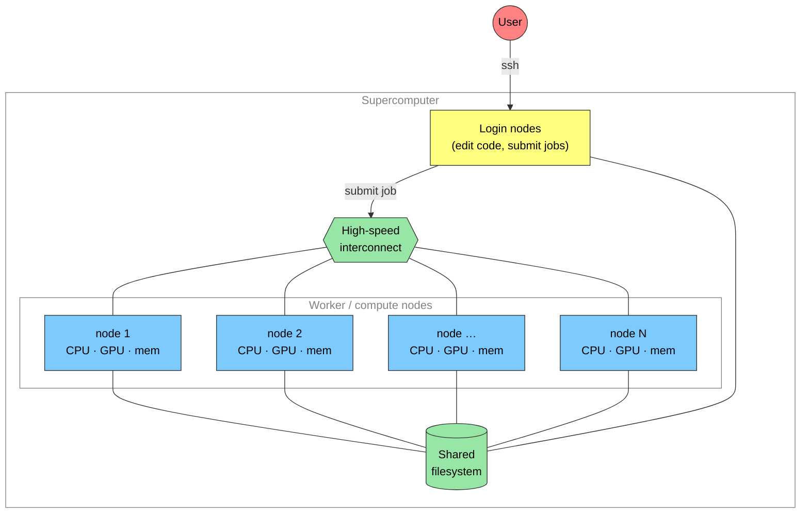

# What is a Supercomputer?
Sam Foreman
2025-08-01

<link rel="preconnect" href="https://fonts.googleapis.com">

- [Overview](#overview)
- [A Compute Node](#a-compute-node)
- [Cluster/HPC Computing Hardware
  Setup](#clusterhpc-computing-hardware-setup)
- [Supercomputers are Big!](#supercomputers-are-big)
- [ALCF Computing System Overview](#alcf-computing-system-overview)
  - [Aurora](#aurora)
  - [Sophia](#sophia)
  - [Polaris](#polaris)
  - [🔭 What’s next](#telescope-whats-next)
- [📓 References](#notebook-references)

## Overview

> [!NOTE]
>
> ### 🧭 No account needed
>
> You do **not** need an HPC account to follow this page — it’s
> conceptual. This page is reading, not hands-on: it explains what a
> supercomputer is and how ALCF’s systems are put together. You’ll set
> up access and run real jobs in later pages.

Argonne hosts DOE supercomputers for use by research scientists in need
of large computational resources. Supercomputers are composed of many
computing *nodes* (1 *node* = 1 physical computer) that are connected by
a high-speed communications network so that groups of nodes can share
information quickly, effectively operating together as a larger
computer.

## A Compute Node

If you look inside your Desktop or Laptop you’ll find these parts:

Figure 1: Typical computer parts

A computing node of a supercomputer is very similar, each has simliar
parts, but it is designed as a single unit that can be inserted and
removed from large closet-sized racks with many others:

Figure 2: Blade

In large supercomputers multiple computer processors (CPUs) and/or
graphics processors (GPUs) are combined into a single node. It has a CPU
on which the local operating system runs. It has local memory for
running software. It may have GPUs for doing intensive calculations.
Each node has a high-speed network connection that allows it to
communicate with other nodes and to a large shared filesystem.

## Cluster/HPC Computing Hardware Setup

Figure 3: Network diagram of a typical supercomputer: users `ssh` to
**login nodes**, which submit **jobs** over a high-speed interconnect to
**worker nodes**; all share a common filesystem.

Large computer systems typically have *worker* nodes and *login* nodes.
*login* nodes are the nodes on which every user arrives when they login
to the system. *login* nodes should not be used for computation, but for
compiling code, writing/editing code, and launching *jobs* on the
system. A *job* is the application that will be launched on the *worker*
nodes of the supercomputer.

## Supercomputers are Big!

These supercomputers occupy a lot of space in the ACLF data center. Here
is our staff (and interns! from summer 2023) in front of Aurora.

Figure 4: ALCF Staff

## ALCF Computing System Overview

### Aurora

> Aurora is a supercomputer at Argonne National Laboratory, housed in
> the Argonne Leadership Computing Facility (ALCF). It is one of the
> first **exascale** supercomputers in the United States — capable of
> more than a **billion billion** ($10^{18}$) calculations per second —
> and is designed to deliver unprecedented performance for scientific
> research and simulations. See
> [Aurora](https://www.alcf.anl.gov/aurora) for more information.

Aurora is fully deployed and open for science. It reached **1.01
exaFLOPS** (sustained, HPL) and has ranked among the top few systems on
the [Top500](https://www.top500.org) since its debut. It is an HPE Cray
EX system:

**Aurora Machine Specs**

- Sustained speed: ~1.0 exaFLOPS (HPL); ~2 exaFLOPS peak
- **10,624** total nodes, each with:
  - 6 Intel Data Center GPU Max (“Ponte Vecchio”) GPUs
  - 2 Intel Xeon CPU Max (“Sapphire Rapids”) CPUs
  - unified CPU+GPU memory
- HPE Slingshot-11 interconnect

> [!NOTE]
>
> ### 🔢 What does ‘exascale’ mean?
>
> An **exaFLOP** is $10^{18}$ floating-point operations per second. If
> every person on Earth (~8 billion) did one calculation per second, it
> would take them over **4 years** to do what Aurora does in **one
> second**.

Here you can see one of the many rows of Aurora *nodes* with their Red &
Blue water cooling conduits visible.

Figure 5: Aurora

In this photo you see a close up of the 16 *nodes* installed
side-by-side:

Figure 6: Aurora

### [Sophia](https://www.alcf.anl.gov/sophia)

Inside Sophia, you’ll see repetition, though NVidia placed these fancy
plates over the hardware so you only see their logo.

However, each plate covers 1 computer *node*.

|          Sophia Racks           |          Sophia Inside          |
|:-------------------------------:|:-------------------------------:|
|  |  |

Sophia is an NVIDIA DGX A100-based system. The DGX A100 comprises eight
NVIDIA A100 GPUs that provide a total of 320 gigabytes of memory for
training AI datasets, as well as high-speed NVIDIA Mellanox ConnectX-6
network interfaces.

**Sophia Machine Specs**

- Speed: 3.9 petaflops
- Each Node has:
  - 8 NVIDIA (A100) GPUs each with 40GB onboard memory
  - 2 AMD EPYC (7742) CPUs
  - 1 TB DDR4 Memory
- 24 Total Nodes installed in 7 Racks

### [Polaris](https://www.alcf.anl.gov/polaris)

The inside of Polaris again shows the *nodes* stacked up in a closet.

Polaris is an NVIDIA A100-based system.

Polaris Machine Specs

- Speed: 44 petaflops
- Each Node has:
  - 4 NVIDIA (A100) GPUs
  - 1 AMD EPYC (Milan) CPUs
- ~560 Total Nodes

### 🔭 What’s next

ALCF’s systems keep evolving toward ever-larger AI + science workloads.
Argonne and NVIDIA have announced next-generation, AI-focused
supercomputers (**Solstice** and **Equinox**) built on NVIDIA’s
Blackwell-generation GPUs, aimed at training and running very large AI
models for science alongside traditional simulation. See the [ALCF
machine overview](https://www.alcf.anl.gov/alcf-resources) for the
current, authoritative lineup and specs.

> [!TIP]
>
> ### 📈 The trend
>
> Notice the trajectory: Sophia (~4 PF) → Polaris (~44 PF) → Aurora
> (~1{,}000{,}000 PF = 1 EF), with the newest systems purpose-built for
> AI. Each generation is many times faster than the last: Polaris is
> roughly **10×** Sophia, and the jump to exascale, AI-era Aurora is
> dramatic — **thousands of ×** over Polaris. This explosive growth in
> compute is exactly what makes training today’s largest models
> possible.

> [!TIP]
>
> ### 🧠 Check your understanding
>
> Test yourself — think it through, then reveal the answer.
>
> **Q1.** What is a “node” in a supercomputer, and how do nodes work
> together?
>
> > [!NOTE]
> >
> > ### Show answer
> >
> > A node is one physical computer (its own CPU(s), memory, often
> > GPUs). Many nodes are joined by a high-speed network so groups of
> > them can share data quickly and act together as one much larger
> > computer.
>
> **Q2.** You `ssh` into a supercomputer. Are you on a login node or a
> compute node — and where does your training job actually run?
>
> > [!NOTE]
> >
> > ### Show answer
> >
> > You land on a **login node** (for editing code and submitting jobs).
> > The heavy work runs on **compute nodes**, which you reach by
> > submitting a job to the scheduler (see [Shared
> > Resources](../1-shared-resources/index.qmd)).
>
> **Q3.** Why do the AI-focused nodes (e.g. Polaris) pair a CPU with
> several GPUs?
>
> > [!NOTE]
> >
> > ### Show answer
> >
> > The CPU runs the OS and orchestrates work; the GPUs do the massively
> > parallel arithmetic (matrix multiplies) that dominates AI training,
> > which they do far faster than a CPU.

## 📓 References

- [Awesome
  HPC](https://github.com/trevor-vincent/awesome-high-performance-computing)
- [ALCF User Guides](https://docs.alcf.anl.gov)
