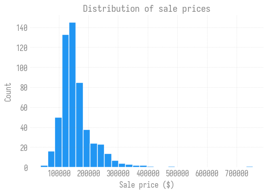
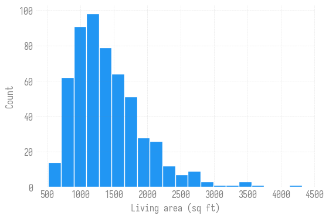

# Working with Data in Python
Sam Foreman
2025-08-06

<link rel="preconnect" href="https://fonts.googleapis.com">

- [🔢 NumPy: arrays and vectorized
  math](#1234-numpy-arrays-and-vectorized-math)
- [🐼 pandas: tables of real
  data](#panda_face-pandas-tables-of-real-data)
- [📈 Matplotlib: seeing the
  data](#chart_with_upwards_trend-matplotlib-seeing-the-data)
- [Exercises](#exercises)
- [🔑 Key takeaways](#key-key-takeaways)

[](https://colab.research.google.com/github/saforem2/intro-hpc-bootcamp/blob/main/docs/00-intro-AI-HPC/4-data/index.ipynb)
[](https://github.com/saforem2/intro-hpc-bootcamp/blob/main/content/00-intro-AI-HPC/4-data/index.qmd)

> [!TIP]
>
> ### 🎯 What you’ll learn
>
> Data is the fuel of machine learning, and three libraries do almost
> all the heavy lifting in scientific Python:
>
> - **NumPy** — fast, vectorized numerical arrays (the foundation
>   everything else builds on)
> - **pandas** — labeled, spreadsheet-like tables (`DataFrame`s) for
>   real datasets
> - **Matplotlib** — plots to actually *see* your data
>
> This page is hands-on: run each cell and tinker. It follows directly
> from [**Using Python**](../3-python/index.qmd) and sets you up for
> [**Linear Regression**](../6-linear-regression/index.qmd).

> [!NOTE]
>
> ### 🧭 No account needed
>
> This page runs anywhere — a laptop or [Google
> Colab](https://colab.research.google.com/github/saforem2/intro-hpc-bootcamp/blob/main/docs/00-intro-AI-HPC/4-data/index.ipynb)
> (hit the badge above), no HPC account required. It assumes the
> [**Python primer**](../3-python/index.qmd) (page 00.3); everything
> else you need is installed by the setup cell below.

``` python
# This page uses the `bootcamp` helper package. On Colab (or any fresh
# environment) install it + its dependencies; locally this is a no-op.
try:
    import bootcamp  # noqa: F401
except ImportError:
    %pip install -q "git+https://github.com/saforem2/intro-hpc-bootcamp"
```

## 🔢 NumPy: arrays and vectorized math

A NumPy **array** looks like a list, but math on it happens
*element-wise* and *fast* — no Python loop:

``` python
import numpy as np

a = np.array([1, 2, 3, 4, 5])
print("array:      ", a)
print("times 10:   ", a * 10)        # vectorized — applies to every element
print("squared:    ", a ** 2)
print("sum / mean: ", a.sum(), a.mean())
```

    array:       [1 2 3 4 5]
    times 10:    [10 20 30 40 50]
    squared:     [ 1  4  9 16 25]
    sum / mean:  15 3.0

Arrays have a **shape** and can be multi-dimensional (a matrix is just a
2-D array). This is exactly how images, batches, and weight matrices are
stored:

``` python
M = np.arange(12).reshape(3, 4)   # 3 rows, 4 columns
print(M)
print("shape:", M.shape)
print("column means:", M.mean(axis=0))   # average down each column
print("row sums:    ", M.sum(axis=1))     # sum across each row
```

    [[ 0  1  2  3]
     [ 4  5  6  7]
     [ 8  9 10 11]]
    shape: (3, 4)
    column means: [4. 5. 6. 7.]
    row sums:     [ 6 22 38]

**Broadcasting** lets arrays of different shapes combine — here we
standardize each column (subtract its mean, divide by its std) in one
line:

``` python
col_mean = M.mean(axis=0)
col_std = M.std(axis=0)
standardized = (M - col_mean) / col_std
print(np.round(standardized, 2))
```

    [[-1.22 -1.22 -1.22 -1.22]
     [ 0.    0.    0.    0.  ]
     [ 1.22  1.22  1.22  1.22]]

> [!NOTE]
>
> ### 🎲 Reproducible randomness
>
> Random data is everywhere in ML. Seed the generator so results are
> repeatable:
>
> ``` python
> rng = np.random.default_rng(seed=42)
> samples = rng.normal(loc=0.0, scale=1.0, size=5)
> print(np.round(samples, 3))
> ```
>
>     [ 0.305 -1.04   0.75   0.941 -1.951]

## 🐼 pandas: tables of real data

NumPy is great for pure numbers, but real datasets have **named
columns** and mixed types. That’s `pandas`. Let’s load a real dataset —
house sale prices vs. living area:

``` python
import pandas as pd

# download the dataset if it isn't already here (works locally and on Colab)
import os, urllib.request
url = ("https://raw.githubusercontent.com/argonne-lcf/ai-science-training-series/"
       "master/old/2024-Spring/01_intro_AI_on_Supercomputer/slimmed_realestate_data.csv")
if not os.path.exists("slimmed_realestate_data.csv"):
    urllib.request.urlretrieve(url, "slimmed_realestate_data.csv")

df = pd.read_csv("slimmed_realestate_data.csv", index_col=0)
df.head()
```

<div>
<style scoped>
    .dataframe tbody tr th:only-of-type {
        vertical-align: middle;
    }
&#10;    .dataframe tbody tr th {
        vertical-align: top;
    }
&#10;    .dataframe thead th {
        text-align: right;
    }
</style>

|     | SalePrice | GrLivArea |
|-----|-----------|-----------|
| 1   | 181500    | 1262      |
| 7   | 200000    | 2090      |
| 9   | 118000    | 1077      |
| 12  | 144000    | 912       |
| 15  | 132000    | 854       |

</div>

A few things you’ll do with almost every dataset — inspect its shape,
summarize it, and select columns:

``` python
print("shape (rows, cols):", df.shape)
print("columns:", list(df.columns))
df.describe()
```

    shape (rows, cols): (551, 2)
    columns: ['SalePrice', 'GrLivArea']

<div>
<style scoped>
    .dataframe tbody tr th:only-of-type {
        vertical-align: middle;
    }
&#10;    .dataframe tbody tr th {
        vertical-align: top;
    }
&#10;    .dataframe thead th {
        text-align: right;
    }
</style>

|       | SalePrice     | GrLivArea   |
|-------|---------------|-------------|
| count | 551.000000    | 551.000000  |
| mean  | 158216.281307 | 1407.969147 |
| std   | 59968.759480  | 524.559473  |
| min   | 37900.000000  | 520.000000  |
| 25%   | 124900.000000 | 1040.000000 |
| 50%   | 144500.000000 | 1309.000000 |
| 75%   | 176250.000000 | 1664.500000 |
| max   | 755000.000000 | 4316.000000 |

</div>

``` python
# select a single column (a pandas Series) and compute on it
prices = df["SalePrice"]
print(f"cheapest:  ${prices.min():,.0f}")
print(f"priciest:  ${prices.max():,.0f}")
print(f"average:   ${prices.mean():,.0f}")

# filter rows with a boolean condition
big_expensive = df[(df["GrLivArea"] > 2000) & (df["SalePrice"] > 250_000)]
print(f"\nlarge & expensive homes: {len(big_expensive)} of {len(df)}")
```

    cheapest:  $37,900
    priciest:  $755,000
    average:   $158,216

    large & expensive homes: 28 of 551

## 📈 Matplotlib: seeing the data

Numbers in a table only tell you so much — plot them. A **scatter plot**
reveals the relationship between living area and price:

``` python
import matplotlib.pyplot as plt
from bootcamp.plotly_theme import style_mpl
style_mpl()                     # ambivalent look (transparent + grey) + Iosevka

fig, ax = plt.subplots(figsize=(6.4, 4.2))
ax.scatter(df["GrLivArea"], df["SalePrice"], s=12, alpha=0.5)
ax.set_xlabel("Living area (sq ft)")
ax.set_ylabel("Sale price ($)")
ax.set_title("House price vs. living area")
ax.grid(True, alpha=0.3)
plt.show()
```



The upward trend is exactly what a **linear regression** model learns to
fit — which is the [next example](../6-linear-regression/index.qmd). A
**histogram** shows the *distribution* of a single variable:

``` python
fig, ax = plt.subplots(figsize=(6.4, 4.2))
ax.hist(df["SalePrice"], bins=30, edgecolor="white")
ax.set_xlabel("Sale price ($)")
ax.set_ylabel("Count")
ax.set_title("Distribution of sale prices")
plt.show()
```


## Exercises

Attempt each before revealing the solution.

> [!NOTE]
>
> ### Exercise 1 — NumPy
>
> Create a NumPy array of the integers 1 through 10, then print the mean
> of only the **even** numbers. (Hint: boolean indexing,
> `a[a % 2 == 0]`.)
>
> > [!TIP]
> >
> > ### 💡 Solution
> >
> > ``` python
> > a = np.arange(1, 11)
> > print(a[a % 2 == 0].mean())   # (2+4+6+8+10)/5 = 6.0
> > ```
> >
> >     6.0

> [!NOTE]
>
> ### Exercise 2 — pandas
>
> Add a new column `PricePerSqFt` to `df` equal to
> `SalePrice / GrLivArea`, then print its average.
>
> > [!TIP]
> >
> > ### 💡 Solution
> >
> > ``` python
> > df["PricePerSqFt"] = df["SalePrice"] / df["GrLivArea"]
> > print(f"avg price/sqft: ${df['PricePerSqFt'].mean():,.2f}")
> > ```
> >
> >     avg price/sqft: $116.13

> [!NOTE]
>
> ### Exercise 3 — plotting
>
> Make a histogram of `GrLivArea` with 20 bins. What’s the most common
> range of house sizes?
>
> > [!TIP]
> >
> > ### 💡 Solution
> >
> > ``` python
> > fig, ax = plt.subplots(figsize=(6.4, 4.2))
> > ax.hist(df["GrLivArea"], bins=20, edgecolor="white")
> > ax.set_xlabel("Living area (sq ft)"); ax.set_ylabel("Count")
> > plt.show()
> > ```
> >
> > 

## 🔑 Key takeaways

- **NumPy** arrays do fast, vectorized, element-wise math (`a * 10`,
  `M.mean(axis=0)`).
- **Broadcasting** combines arrays of different shapes without loops.
- **pandas** `DataFrame`s hold labeled tables — `read_csv`, `.head()`,
  `.describe()`, column selection, boolean filtering.
- **Matplotlib** turns arrays/columns into scatter plots and histograms.

> [!TIP]
>
> ### 📓 Go deeper
>
> - [NumPy: the absolute basics for
>   beginners](https://numpy.org/doc/stable/user/absolute_beginners.html)
> - [pandas: 10 minutes to
>   pandas](https://pandas.pydata.org/docs/user_guide/10min.html)
> - [Python Data Science
>   Handbook](https://jakevdp.github.io/PythonDataScienceHandbook/index.html)
> - [MachineLearningStatistics · Visualization
>   notebook](https://github.com/dkirkby/MachineLearningStatistics/blob/3aa7385e1fd0b1572013bdf1f1c823806b744b2d/notebooks/Visualization.ipynb)

➡️ **Next:** [Linear Regression](../6-linear-regression/index.qmd) —
train your first model on exactly this dataset.
