# 🗣️ Language Models (LMs)
Sam Foreman
2025-08-05

<link rel="preconnect" href="https://fonts.googleapis.com">

- [🧬 Why Sequences? Motivation from
  Science](#dna-why-sequences-motivation-from-science)
  - [Scientific examples](#scientific-examples)
  - [Formalizing sequence modeling](#formalizing-sequence-modeling)
- [📜 A Brief History of Language
  Models](#scroll-a-brief-history-of-language-models)
  - [Recurrent Neural Networks (RNNs)](#recurrent-neural-networks-rnns)
  - [Transformers](#transformers)
- [⚡ LLMs in Action: The Black Box
  First](#zap-llms-in-action-the-black-box-first)
- [🔬 Opening the Black Box](#microscope-opening-the-black-box)
  - [1 · Tokenization](#1--tokenization)
  - [2 · Token Embeddings](#2--token-embeddings)
- [🧱 Inside a Transformer](#bricks-inside-a-transformer)
  - [Attention: the core idea](#attention-the-core-idea)
  - [Multi-head attention](#multi-head-attention)
  - [Attention, visualized
    interactively](#attention-visualized-interactively)
  - [Positional encoding](#positional-encoding)
  - [Output layer: from vectors back to
    words](#output-layer-from-vectors-back-to-words)
- [🎯 Training a Language Model](#dart-training-a-language-model)
- [🛠️ Build a Mini-LLM from
  Scratch](#hammer_and_wrench-build-a-mini-llm-from-scratch)
  - [Hyperparameters](#hyperparameters)
  - [Data: tiny-Shakespeare](#data-tiny-shakespeare)
  - [Components: attention head, multi-head,
    feed-forward](#components-attention-head-multi-head-feed-forward)
  - [The Transformer block](#the-transformer-block)
  - [The full model](#the-full-model)
- [🤗 Using Pretrained Models with
  HuggingFace](#hugs-using-pretrained-models-with-huggingface)
  - [Saving & loading models](#saving--loading-models)
  - [The Model Hub](#the-model-hub)
- [🎒 Homework](#school_satchel-homework)
- [🌗 The Transformer Family](#last_quarter_moon-the-transformer-family)
  - [Encoder-only (BERT)](#encoder-only-bert)
  - [Decoder-only (GPT)](#decoder-only-gpt)
  - [Beyond text: Vision & Graph
    Transformers](#beyond-text-vision--graph-transformers)
- [✅ Key Takeaways](#white_check_mark-key-takeaways)
- [📚 References & Further Reading](#books-references--further-reading)

> [!NOTE]
>
> ### Authors
>
> Content by Archit Vasan, including materials on LLMs by Varuni Sastri
> and Carlo Graziani at Argonne, and discussion/editorial work by Taylor
> Childers, Bethany Lusch, and Venkat Vishwanath (Argonne). Modified by
> Huihuo Zheng (Aug 1, 2025).

[](https://colab.research.google.com/github/saforem2/intro-hpc-bootcamp/blob/main/docs/02-llms/0-intro-to-llms/index.ipynb)
[](https://github.com/saforem2/intro-hpc-bootcamp/blob/main/content/02-llms/0-intro-to-llms/index.qmd)

Although the term *“language model”* comes from Natural Language
Processing, the same machinery applies to a surprisingly broad range of
**scientific** problems. This session builds up the core ideas of
sequential-data modeling and the key architectural element behind modern
LLMs: the **Transformer**.

> [!TIP]
>
> ### 🎯 Learning objectives
>
> By the end of this session you will be able to:
>
> 1.  Explain what **sequential data** is and why it shows up across
>     science.
> 2.  Trace the **evolution** of language models from RNNs to
>     Transformers.
> 3.  Describe **tokenization** and **embeddings** — how text becomes
>     numbers.
> 4.  Explain the **attention mechanism** and the anatomy of a
>     Transformer block.
> 5.  Understand the **training objective** (cross-entropy) and
>     **perplexity**.
> 6.  Build a **mini-LLM from scratch** and recognize the major
>     Transformer families.
> 7.  Run a **pretrained model** end-to-end with 🤗 HuggingFace.

> Inspired by Jay Alammar’s superb [The Illustrated
> Transformer](https://jalammar.github.io/illustrated-transformer/) and
> [The Illustrated GPT-2](https://jalammar.github.io/illustrated-gpt2/)
> — highly recommended companion reading.

## 🧬 Why Sequences? Motivation from Science

Before the math, the motivation. A **sequence** is an ordered list whose
elements depend on what came before (and sometimes after). Language is
the obvious example — but so is much of science.

<div id="fig-seq-applications">

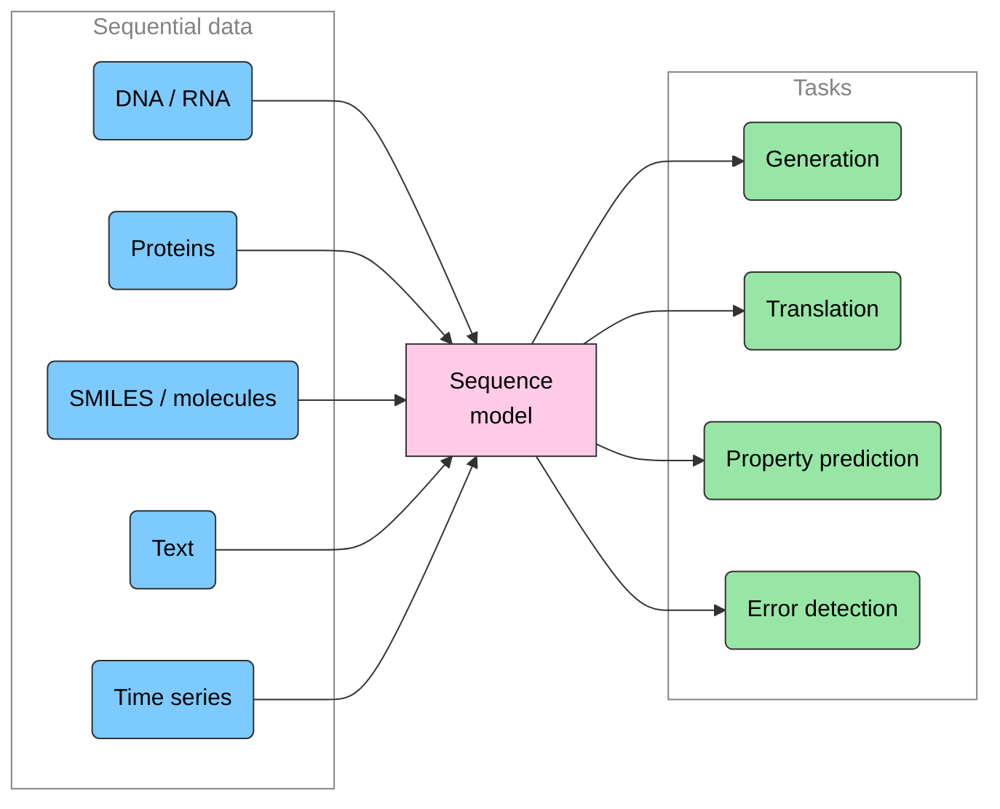

Figure 1: One model family, many modalities. The same sequence-modeling
tools power text generation *and* scientific discovery.

</div>

### Scientific examples

**Nucleic-acid & genomic data.** DNA/RNA sequences predict protein
translation, mutations, and gene expression.

<div id="fig-rna-sequences">


Figure 2: RNA codon structure.

</div>

[GenSLM](https://www.biorxiv.org/content/10.1101/2022.10.10.511571v1), a
genomic language model developed at Argonne, modeled the evolution of
SARS-CoV-2 — capturing viral variant dynamics *without* expensive
wet-lab experiments.

<div id="fig-genslm">


Figure 3: GenSLM. Image credit: Zvyagin et al. 2022, bioRxiv.

</div>

**Protein sequences** predict folding structure, protein–protein
interactions, binding properties, and function.

<div id="fig-protein-sequences">


Figure 4: Protein sequences.

</div>

Other active areas include **biomedical text**, **SMILES strings**
(molecules), **weather prediction**, and **coupling to simulations**
such as molecular dynamics.

### Formalizing sequence modeling

Mathematically, a sequence is an ordered list of **tokens**:

$$T = [t_1, t_2, t_3, \ldots, t_N]$$

The central object is the probability of a token given its context. An
autoregressive language model factorizes the joint probability of the
whole sequence into a product of next-token predictions:

$$P(T) = \prod_{i=1}^{N} P(t_i \mid t_1, t_2, \ldots, t_{i-1})$$

Learning these conditional distributions is what lets a model
**generate** (sample the next token), **translate** (map one sequence to
another), **predict properties** (condition on the whole sequence), and
**spot errors** (flag low-probability tokens).

## 📜 A Brief History of Language Models

<div id="fig-lm-history">

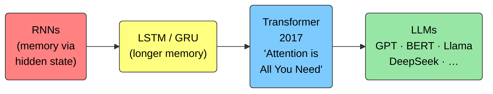

Figure 5: The road to modern LLMs.

</div>

### Recurrent Neural Networks (RNNs)

RNNs were the traditional tool for temporal dependencies. The hidden
state from the previous step is fed back into the network, giving it a
“memory” of past inputs — ideal for short sequences in NLP and
time-series prediction.

<div id="fig-rnn">

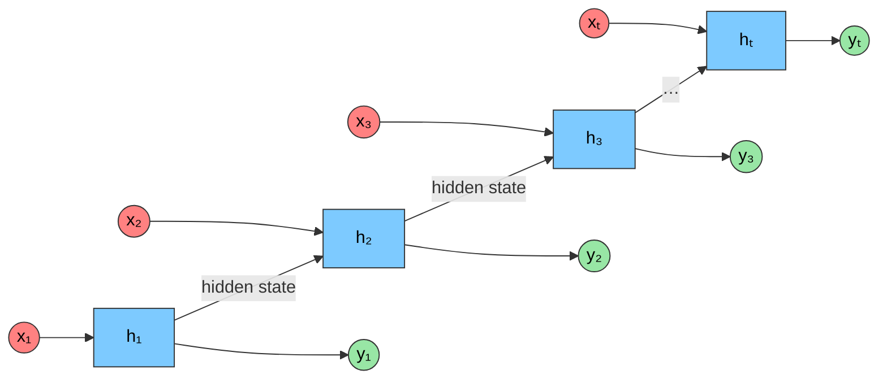

Figure 6: An RNN unrolled over time: the hidden state $h_t$ is passed
from each step to the next, giving the network a “memory” of past
inputs.

</div>

But RNNs have two crippling limitations:

- **Slow to train.** Each step depends on the previous hidden state, so
  computation is inherently **sequential** — it can’t be parallelized
  across the sequence.
- **Poor with long sequences.** Vanishing/exploding gradients limit how
  far back an RNN can “see.” LSTMs and GRUs mitigate this but don’t
  fully solve it.

### Transformers

The 2017 paper [*Attention Is All You
Need*](https://arxiv.org/abs/1706.03762) replaced recurrence with the
**attention mechanism**, which processes all positions **in parallel**
and directly models long-range dependencies. This unlocked the scale
that defines today’s “large” language models.

Since 2017 the field has moved fast. A rough chronology of landmark
models:

<div id="fig-transformers-chrono">

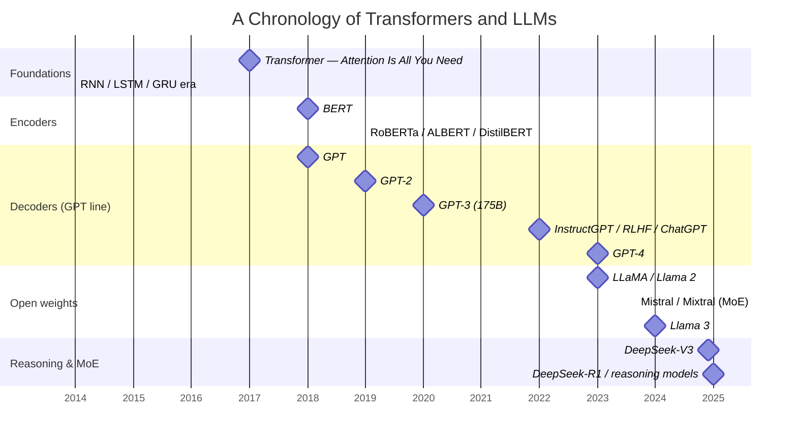

Figure 7: A (non-exhaustive) timeline of landmark Transformer models.
From a single 2017 architecture to today’s frontier reasoning and
Mixture-of-Experts systems.

</div>

<div id="fig-transformer-arch">

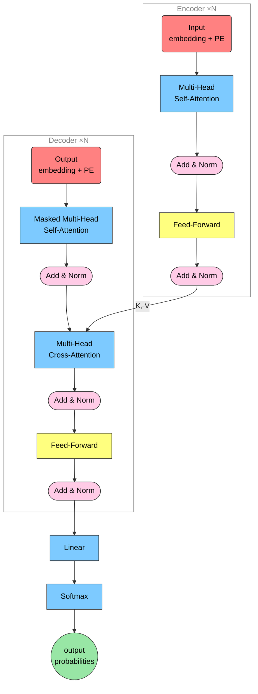

Figure 8: The full encoder–decoder Transformer architecture (Vaswani et
al., 2017): a stack of `N` encoder layers (left) whose keys and values
feed cross-attention in a stack of `N` decoder layers (right), ending in
a linear + softmax projection to output probabilities.

</div>

## ⚡ LLMs in Action: The Black Box First

Before we open it up, let’s *use* an LLM. We’ll rely on [🤗
`transformers`](https://huggingface.co/docs/transformers), which
packages pretrained models, tokenizers, and pipelines.

> [!WARNING]
>
> ### ⚠️ A note on generated content
>
> LLMs are only as good as their training data. The pretrained models we
> use were trained on wide samples of internet text that were **not**
> strictly filtered, so generated output may occasionally be dark,
> biased, or nonsensical. It does not reflect our values and is shown
> for demonstration only.

``` python
# One-time setup (Colab / fresh env). Skip if these are already installed.
%pip install transformers torch pandas rich \
    umap-learn plotly scikit-learn nltk bertviz
```

``` python
%load_ext autoreload
%autoreload 2
%matplotlib inline
# svg for HTML, high-res png for PDF
import matplotlib_inline.backend_inline
matplotlib_inline.backend_inline.set_matplotlib_formats('retina', 'svg', 'png')
import matplotlib as mpl
from rich import print
```

Generating text is three lines with a `pipeline`:

``` python
from transformers import pipeline

input_text = "I got an A+ in my final exam; I am very"
generator = pipeline("text-generation", model="openai-community/gpt2")
print(
    [
        i["generated_text"]
        for i in generator(input_text, max_length=20, num_return_sequences=5)
    ]
)
```

    Device set to use mps:0
    Truncation was not explicitly activated but `max_length` is provided a specific value, please use `truncation=True` to explicitly truncate examples to max length. Defaulting to 'longest_first' truncation strategy. If you encode pairs of sequences (GLUE-style) with the tokenizer you can select this strategy more precisely by providing a specific strategy to `truncation`.
    Setting `pad_token_id` to `eos_token_id`:50256 for open-end generation.
    Both `max_new_tokens` (=256) and `max_length`(=20) seem to have been set. `max_new_tokens` will take precedence. Please refer to the documentation for more information. (https://huggingface.co/docs/transformers/main/en/main_classes/text_generation)

<pre style="white-space:pre;overflow-x:auto;line-height:normal;font-family:Menlo,'DejaVu Sans Mono',consolas,'Courier New',monospace"><span style="font-weight: bold">[</span>
    <span style="color: #008000; text-decoration-color: #008000">'I got an A+ in my final exam; I am very happy with my performance in the exam."\n\nKieran Johnson, an </span>
<span style="color: #008000; text-decoration-color: #008000">associate professor of psychology at the University of Maryland, Baltimore County, says he isn\'t surprised by the </span>
<span style="color: #008000; text-decoration-color: #008000">findings.\n\n"We have a lot of students with very high IQs but, of course, they don\'t have the ability to make it </span>
<span style="color: #008000; text-decoration-color: #008000">to the top or win the lottery," Johnson says. "So I think the results are really important."\n\nSixty-four percent </span>
<span style="color: #008000; text-decoration-color: #008000">of Baltimore\'s college graduates were born to parents that had IQs between one and three, according to the U.S. </span>
<span style="color: #008000; text-decoration-color: #008000">Intelligence and Technology Research Institute.\n\nBut Johnson says that "in the case of high IQ graduates, there </span>
<span style="color: #008000; text-decoration-color: #008000">are not as many opportunities as there used to be" for those with lower IQs.\n\nFor example, he says, he says, that</span>
<span style="color: #008000; text-decoration-color: #008000">his students who got "a B or better" in college have more opportunities for success at the federal and state level </span>
<span style="color: #008000; text-decoration-color: #008000">than students with a B.\n\nJohnson says that the results are not surprising, since more than half of the college </span>
<span style="color: #008000; text-decoration-color: #008000">graduates who were born to parents with IQs between one and three are now at the top of their class.\n\n"I think we</span>
<span style="color: #008000; text-decoration-color: #008000">are seeing a new trend in the high-IQ'</span>,
    <span style="color: #008000; text-decoration-color: #008000">"I got an A+ in my final exam; I am very happy to report that I am in the top 100% of the teachers in the </span>
<span style="color: #008000; text-decoration-color: #008000">country. I am also in a position to make sure that I do not miss any opportunities from my time with the country. I</span>
<span style="color: #008000; text-decoration-color: #008000">am looking forward to getting back to the gym next year!\n\nWhat's next for you?\n\nI hope to move to a location </span>
<span style="color: #008000; text-decoration-color: #008000">with good training facilities, where I can continue my training, keep up with the latest news and information, and </span>
<span style="color: #008000; text-decoration-color: #008000">continue to improve my performance. I look forward to continuing my work and will continue to support my family and</span>
<span style="color: #008000; text-decoration-color: #008000">friends with the support of both my coach and my family.\n\nThank you for your time!"</span>,
    <span style="color: #008000; text-decoration-color: #008000">"I got an A+ in my final exam; I am very lucky to be able to get this. A-: There's a lot of work to be done. </span>
<span style="color: #008000; text-decoration-color: #008000">But, in general I think, as a class, we're getting better, better at doing things. So, I feel like there's a good </span>
<span style="color: #008000; text-decoration-color: #008000">chance that we'll be as good as we can be at what we're doing. And you can see, we're doing a lot of things that we</span>
<span style="color: #008000; text-decoration-color: #008000">did in class. I think we're doing a lot of things that we'll be doing in college.\n\nHow much of that work does it </span>
<span style="color: #008000; text-decoration-color: #008000">take to get a degree?\n\nA: It's all about what we're doing, but it's all about making the right decisions. I think</span>
<span style="color: #008000; text-decoration-color: #008000">we're getting better at making decisions because we're making good decisions. We're doing good things, but we're </span>
<span style="color: #008000; text-decoration-color: #008000">doing some pretty bad things. Sometimes it's a good idea to take a chance and do something very bad, or it's a bad </span>
<span style="color: #008000; text-decoration-color: #008000">idea to do something very good. I think we've done a lot of good things.\n\nWhat's something you'd like to see </span>
<span style="color: #008000; text-decoration-color: #008000">students do?\n\nA: I think it's very important. I think students, especially in the humanities, should be able to </span>
<span style="color: #008000; text-decoration-color: #008000">do a lot of stuff and make a"</span>,
    <span style="color: #008000; text-decoration-color: #008000">'I got an A+ in my final exam; I am very proud of that."\n\nShelton has been at the forefront of social media </span>
<span style="color: #008000; text-decoration-color: #008000">this week as she launched her campaign to help support transgender students.\n\nThe campaign, launched on social </span>
<span style="color: #008000; text-decoration-color: #008000">media by Sassy, has been largely successful and the campaign has already raised more than $100,000 in just its </span>
<span style="color: #008000; text-decoration-color: #008000">first day.\n\n"I\'m thankful for the support that so many of our supporters have given me. I\'m also very grateful </span>
<span style="color: #008000; text-decoration-color: #008000">for people who have helped me in the community," she said.\n\n"I\'ve seen so many positive things in my life that </span>
<span style="color: #008000; text-decoration-color: #008000">have made me more comfortable in my new body - including my boyfriend."\n\n"I\'m a transgender person. I feel </span>
<span style="color: #008000; text-decoration-color: #008000">comfortable being a woman and I feel comfortable being a boy - but I\'m also a man."\n\nSassy has been active in </span>
<span style="color: #008000; text-decoration-color: #008000">the community around her and she\'s been taking on some of the biggest challenges she\'s faced since she was </span>
<span style="color: #008000; text-decoration-color: #008000">15.\n\n"Being a transgender woman means having a lot of opportunities to speak out about the issues that are being </span>
<span style="color: #008000; text-decoration-color: #008000">discussed daily.\n\n"There is a lot of awareness around the transgender community. I just wanted to raise awareness</span>
<span style="color: #008000; text-decoration-color: #008000">of this issue and to make sure that those issues aren\'t ignored by the media.\n\n"'</span>,
    <span style="color: #008000; text-decoration-color: #008000">"I got an A+ in my final exam; I am very excited about this one.\n\nSo I have to say that I can't wait to get </span>
<span style="color: #008000; text-decoration-color: #008000">out there and compete against other kids.\n\nYou can check out my other projects here:\n\nIf you want to stay </span>
<span style="color: #008000; text-decoration-color: #008000">up-to-date on all things in comics, check out my previous projects here:"</span>
<span style="font-weight: bold">]</span>
</pre>

That’s the whole black box: **text in, text out**. The rest of this
session is about what happens *inside*.

## 🔬 Opening the Black Box

Two components turn a prompt into generated text:

<div id="fig-blackbox">

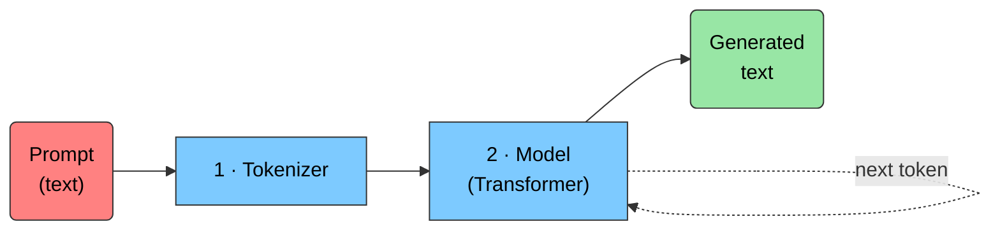

Figure 9: The two black boxes: a **tokenizer** and the **model** itself.

</div>

### 1 · Tokenization

Computers operate on numbers, not characters. **Tokenization** splits
text into units (tokens) and maps each to an integer ID.

<div id="fig-tokenization-pipeline">

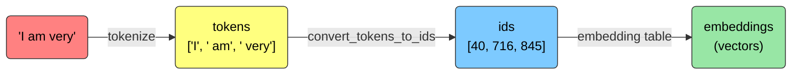

Figure 10: From raw text to model-ready vectors.

</div>

GPT-2 uses **Byte-Pair Encoding (BPE)**, a subword scheme that balances
vocabulary size against sequence length. Let’s inspect a tokenizer:

``` python
from transformers import AutoTokenizer


def tokenization_summary(tokenizer, sequence):
    # Peek at a slice of the vocabulary
    print("Subset of tokenizer.vocab:")
    for i, (token, index) in enumerate(tokenizer.vocab.items()):
        print(f"{token}: {index}")
        if i >= 9:
            break

    print("Vocab size of the tokenizer =", len(tokenizer.vocab))
    print("------------------------------------------")

    # .tokenize -> subword tokens
    tokens = tokenizer.tokenize(sequence)
    print("Tokens :", tokens)
    print("------------------------------------------")

    # .encode -> integer ids (adds special tokens where applicable)
    print("tokenized sequence :", tokenizer.encode(sequence))

    # .decode -> back to text
    ids = tokenizer.convert_tokens_to_ids(tokens)
    print("Decode sequence :", tokenizer.decode(ids))


tokenizer_1 = AutoTokenizer.from_pretrained("gpt2")  # Byte-Pair Encoding (BPE)
sequence = "I got an A+ in my final exam; I am very"
tokenization_summary(tokenizer_1, sequence)
```

<pre style="white-space:pre;overflow-x:auto;line-height:normal;font-family:Menlo,'DejaVu Sans Mono',consolas,'Courier New',monospace">Subset of tokenizer.vocab:
</pre>

<pre style="white-space:pre;overflow-x:auto;line-height:normal;font-family:Menlo,'DejaVu Sans Mono',consolas,'Courier New',monospace">ĠEnc: <span style="color: #008080; text-decoration-color: #008080; font-weight: bold">14711</span>
</pre>

<pre style="white-space:pre;overflow-x:auto;line-height:normal;font-family:Menlo,'DejaVu Sans Mono',consolas,'Courier New',monospace">Ġconsume: <span style="color: #008080; text-decoration-color: #008080; font-weight: bold">15000</span>
</pre>

<pre style="white-space:pre;overflow-x:auto;line-height:normal;font-family:Menlo,'DejaVu Sans Mono',consolas,'Courier New',monospace">Ġabl: <span style="color: #008080; text-decoration-color: #008080; font-weight: bold">46624</span>
</pre>

<pre style="white-space:pre;overflow-x:auto;line-height:normal;font-family:Menlo,'DejaVu Sans Mono',consolas,'Courier New',monospace">gob: <span style="color: #008080; text-decoration-color: #008080; font-weight: bold">44270</span>
</pre>

<pre style="white-space:pre;overflow-x:auto;line-height:normal;font-family:Menlo,'DejaVu Sans Mono',consolas,'Courier New',monospace">Ġbulbs: <span style="color: #008080; text-decoration-color: #008080; font-weight: bold">34122</span>
</pre>

<pre style="white-space:pre;overflow-x:auto;line-height:normal;font-family:Menlo,'DejaVu Sans Mono',consolas,'Courier New',monospace">Ġoption: <span style="color: #008080; text-decoration-color: #008080; font-weight: bold">3038</span>
</pre>

<pre style="white-space:pre;overflow-x:auto;line-height:normal;font-family:Menlo,'DejaVu Sans Mono',consolas,'Courier New',monospace">istar: <span style="color: #008080; text-decoration-color: #008080; font-weight: bold">47229</span>
</pre>

<pre style="white-space:pre;overflow-x:auto;line-height:normal;font-family:Menlo,'DejaVu Sans Mono',consolas,'Courier New',monospace">F: <span style="color: #008080; text-decoration-color: #008080; font-weight: bold">37</span>
</pre>

<pre style="white-space:pre;overflow-x:auto;line-height:normal;font-family:Menlo,'DejaVu Sans Mono',consolas,'Courier New',monospace">Ġembassy: <span style="color: #008080; text-decoration-color: #008080; font-weight: bold">18613</span>
</pre>

<pre style="white-space:pre;overflow-x:auto;line-height:normal;font-family:Menlo,'DejaVu Sans Mono',consolas,'Courier New',monospace">ĠTerminator: <span style="color: #008080; text-decoration-color: #008080; font-weight: bold">41830</span>
</pre>

<pre style="white-space:pre;overflow-x:auto;line-height:normal;font-family:Menlo,'DejaVu Sans Mono',consolas,'Courier New',monospace">Vocab size of the tokenizer = <span style="color: #008080; text-decoration-color: #008080; font-weight: bold">50257</span>
</pre>

<pre style="white-space:pre;overflow-x:auto;line-height:normal;font-family:Menlo,'DejaVu Sans Mono',consolas,'Courier New',monospace">------------------------------------------
</pre>

<pre style="white-space:pre;overflow-x:auto;line-height:normal;font-family:Menlo,'DejaVu Sans Mono',consolas,'Courier New',monospace">Tokens :
<span style="font-weight: bold">[</span><span style="color: #008000; text-decoration-color: #008000">'I'</span>, <span style="color: #008000; text-decoration-color: #008000">'Ġgot'</span>, <span style="color: #008000; text-decoration-color: #008000">'Ġan'</span>, <span style="color: #008000; text-decoration-color: #008000">'ĠA'</span>, <span style="color: #008000; text-decoration-color: #008000">'+'</span>, <span style="color: #008000; text-decoration-color: #008000">'Ġin'</span>, <span style="color: #008000; text-decoration-color: #008000">'Ġmy'</span>, <span style="color: #008000; text-decoration-color: #008000">'Ġfinal'</span>, <span style="color: #008000; text-decoration-color: #008000">'Ġexam'</span>, <span style="color: #008000; text-decoration-color: #008000">';'</span>, <span style="color: #008000; text-decoration-color: #008000">'ĠI'</span>, <span style="color: #008000; text-decoration-color: #008000">'Ġam'</span>, <span style="color: #008000; text-decoration-color: #008000">'Ġvery'</span><span style="font-weight: bold">]</span>
</pre>

<pre style="white-space:pre;overflow-x:auto;line-height:normal;font-family:Menlo,'DejaVu Sans Mono',consolas,'Courier New',monospace">------------------------------------------
</pre>

<pre style="white-space:pre;overflow-x:auto;line-height:normal;font-family:Menlo,'DejaVu Sans Mono',consolas,'Courier New',monospace">tokenized sequence :
<span style="font-weight: bold">[</span><span style="color: #008080; text-decoration-color: #008080; font-weight: bold">40</span>, <span style="color: #008080; text-decoration-color: #008080; font-weight: bold">1392</span>, <span style="color: #008080; text-decoration-color: #008080; font-weight: bold">281</span>, <span style="color: #008080; text-decoration-color: #008080; font-weight: bold">317</span>, <span style="color: #008080; text-decoration-color: #008080; font-weight: bold">10</span>, <span style="color: #008080; text-decoration-color: #008080; font-weight: bold">287</span>, <span style="color: #008080; text-decoration-color: #008080; font-weight: bold">616</span>, <span style="color: #008080; text-decoration-color: #008080; font-weight: bold">2457</span>, <span style="color: #008080; text-decoration-color: #008080; font-weight: bold">2814</span>, <span style="color: #008080; text-decoration-color: #008080; font-weight: bold">26</span>, <span style="color: #008080; text-decoration-color: #008080; font-weight: bold">314</span>, <span style="color: #008080; text-decoration-color: #008080; font-weight: bold">716</span>, <span style="color: #008080; text-decoration-color: #008080; font-weight: bold">845</span><span style="font-weight: bold">]</span>
</pre>

<pre style="white-space:pre;overflow-x:auto;line-height:normal;font-family:Menlo,'DejaVu Sans Mono',consolas,'Courier New',monospace">Decode sequence : I got an A+ in my final exam; I am very
</pre>

### 2 · Token Embeddings

Each token ID is mapped to a vector in a moderate-dimensional space. The
key idea: **similar or related tokens land near each other**, and the
model can *learn* this geometry during training.

The embedding dimension is high (e.g. 768–1024) but much smaller than
the vocabulary (30k–500k). Unlike static word vectors, Transformers
**adjust their embeddings during training**.

We can *see* this structure by projecting BERT embeddings down to 3-D
with PCA:

``` python
import nltk
import numpy as np
import pandas as pd
import plotly.express as px
from nltk.corpus import stopwords
from sklearn.decomposition import PCA
from transformers import BertModel, BertTokenizer

nltk.download("stopwords")
import torch

model_name = "bert-base-uncased"
tokenizer = BertTokenizer.from_pretrained(model_name)
model = BertModel.from_pretrained(model_name)

text = (
    "The diligent student diligently studied hard for his upcoming exams "
    "He was incredibly conscientious in his efforts and committed himself "
    "to mastering every subject"
)

# Tokenize and get BERT embeddings
tokens = tokenizer(text, return_tensors="pt", padding=True, truncation=True)
with torch.no_grad():
    outputs = model(**tokens)
    embeddings = outputs.last_hidden_state.squeeze(0).numpy()  # (num_tokens, 768)

# Labels without special/subword tokens
labels = [tokenizer.convert_ids_to_tokens(i) for i in tokens.input_ids[0].tolist()]
filtered_labels = [
    label
    for label in labels
    if not (label.startswith("[") and label.endswith("]")) and "##" not in label
]

# Drop stopwords
stop_words = set(stopwords.words("english"))
filtered_labels = [l for l in filtered_labels if l.lower() not in stop_words]
filtered_embeddings = embeddings[: len(filtered_labels)]

# PCA -> 3-D
embeddings_pca = PCA(n_components=3).fit_transform(filtered_embeddings)
df_pca = pd.DataFrame(
    {
        "x": embeddings_pca[:, 0],
        "y": embeddings_pca[:, 1],
        "z": embeddings_pca[:, 2],
        "label": filtered_labels,
    }
)

fig_pca = px.scatter_3d(
    df_pca, x="x", y="y", z="z", text="label",
    title="PCA 3-D Visualization of Token Embeddings",
    labels={"x": "Dim 1", "y": "Dim 2", "z": "Dim 3"},
    hover_name="label",
)
fig_pca.update_traces(marker=dict(size=5), textfont=dict(size=8))
fig_pca.show()
```

    [nltk_data] Downloading package stopwords to
    [nltk_data]     /Users/samforeman/nltk_data...
    [nltk_data]   Package stopwords is already up-to-date!

        <script type="text/javascript">
        window.PlotlyConfig = {MathJaxConfig: 'local'};
        if (window.MathJax && window.MathJax.Hub && window.MathJax.Hub.Config) {window.MathJax.Hub.Config({SVG: {font: "STIX-Web"}});}
        </script>
        <script type="module">import "https://cdn.plot.ly/plotly-3.0.1.min"</script>
        

<div>            <script src="https://cdnjs.cloudflare.com/ajax/libs/mathjax/2.7.5/MathJax.js?config=TeX-AMS-MML_SVG"></script><script type="text/javascript">if (window.MathJax && window.MathJax.Hub && window.MathJax.Hub.Config) {window.MathJax.Hub.Config({SVG: {font: "STIX-Web"}});}</script>                <script type="text/javascript">window.PlotlyConfig = {MathJaxConfig: 'local'};</script>
        <script charset="utf-8" src="https://cdn.plot.ly/plotly-3.0.1.min.js" integrity="sha256-oy6Be7Eh6eiQFs5M7oXuPxxm9qbJXEtTpfSI93dW16Q=" crossorigin="anonymous"></script>                <div id="012cd750-7e03-45ed-af80-57ceebd4ed59" class="plotly-graph-div" style="height:525px; width:100%;"></div>            <script type="text/javascript">                window.PLOTLYENV=window.PLOTLYENV || {};                                if (document.getElementById("012cd750-7e03-45ed-af80-57ceebd4ed59")) {                    Plotly.newPlot(                        "012cd750-7e03-45ed-af80-57ceebd4ed59",                        [{"hovertemplate":"\u003cb\u003e%{hovertext}\u003c\u002fb\u003e\u003cbr\u003e\u003cbr\u003eDim 1=%{x}\u003cbr\u003eDim 2=%{y}\u003cbr\u003eDim 3=%{z}\u003cbr\u003elabel=%{text}\u003cextra\u003e\u003c\u002fextra\u003e","hovertext":["dil","student","dil","studied","hard","upcoming","exams","incredibly","con","efforts","committed","mastering","every","subject"],"legendgroup":"","marker":{"color":"#636efa","symbol":"circle","size":5},"mode":"markers+text","name":"","scene":"scene","showlegend":false,"text":["dil","student","dil","studied","hard","upcoming","exams","incredibly","con","efforts","committed","mastering","every","subject"],"x":{"dtype":"f4","bdata":"7T4hwVVOgMCydQBBfKLVQCfUc0BqlyLAsYz2QM1+4kAb+bY\u002fmDE\u002fwKc6+b\u002fE9pfAZ5J2wF8CksA="},"y":{"dtype":"f4","bdata":"vLoPwYGP\u002fsDrpIXAiqc3vTGWp7\u002f3NDNAsnCYv7EHxz9xwWa\u002fqmCHQGEtHkCRyJFARq+BQH2nnEA="},"z":{"dtype":"f4","bdata":"P7PqP\u002fmBXj+Q54y\u002fJQgLQfg\u002fdMCv8ri\u002f7jWqwKHTk0DDXGrAf+Fwv8idDsAERSW\u002fnpTtP6QhpT8="},"type":"scatter3d","textfont":{"size":8}}],                        {"template":{"data":{"histogram2dcontour":[{"type":"histogram2dcontour","colorbar":{"outlinewidth":0,"ticks":""},"colorscale":[[0.0,"#0d0887"],[0.1111111111111111,"#46039f"],[0.2222222222222222,"#7201a8"],[0.3333333333333333,"#9c179e"],[0.4444444444444444,"#bd3786"],[0.5555555555555556,"#d8576b"],[0.6666666666666666,"#ed7953"],[0.7777777777777778,"#fb9f3a"],[0.8888888888888888,"#fdca26"],[1.0,"#f0f921"]]}],"choropleth":[{"type":"choropleth","colorbar":{"outlinewidth":0,"ticks":""}}],"histogram2d":[{"type":"histogram2d","colorbar":{"outlinewidth":0,"ticks":""},"colorscale":[[0.0,"#0d0887"],[0.1111111111111111,"#46039f"],[0.2222222222222222,"#7201a8"],[0.3333333333333333,"#9c179e"],[0.4444444444444444,"#bd3786"],[0.5555555555555556,"#d8576b"],[0.6666666666666666,"#ed7953"],[0.7777777777777778,"#fb9f3a"],[0.8888888888888888,"#fdca26"],[1.0,"#f0f921"]]}],"heatmap":[{"type":"heatmap","colorbar":{"outlinewidth":0,"ticks":""},"colorscale":[[0.0,"#0d0887"],[0.1111111111111111,"#46039f"],[0.2222222222222222,"#7201a8"],[0.3333333333333333,"#9c179e"],[0.4444444444444444,"#bd3786"],[0.5555555555555556,"#d8576b"],[0.6666666666666666,"#ed7953"],[0.7777777777777778,"#fb9f3a"],[0.8888888888888888,"#fdca26"],[1.0,"#f0f921"]]}],"contourcarpet":[{"type":"contourcarpet","colorbar":{"outlinewidth":0,"ticks":""}}],"contour":[{"type":"contour","colorbar":{"outlinewidth":0,"ticks":""},"colorscale":[[0.0,"#0d0887"],[0.1111111111111111,"#46039f"],[0.2222222222222222,"#7201a8"],[0.3333333333333333,"#9c179e"],[0.4444444444444444,"#bd3786"],[0.5555555555555556,"#d8576b"],[0.6666666666666666,"#ed7953"],[0.7777777777777778,"#fb9f3a"],[0.8888888888888888,"#fdca26"],[1.0,"#f0f921"]]}],"surface":[{"type":"surface","colorbar":{"outlinewidth":0,"ticks":""},"colorscale":[[0.0,"#0d0887"],[0.1111111111111111,"#46039f"],[0.2222222222222222,"#7201a8"],[0.3333333333333333,"#9c179e"],[0.4444444444444444,"#bd3786"],[0.5555555555555556,"#d8576b"],[0.6666666666666666,"#ed7953"],[0.7777777777777778,"#fb9f3a"],[0.8888888888888888,"#fdca26"],[1.0,"#f0f921"]]}],"mesh3d":[{"type":"mesh3d","colorbar":{"outlinewidth":0,"ticks":""}}],"scatter":[{"fillpattern":{"fillmode":"overlay","size":10,"solidity":0.2},"type":"scatter"}],"parcoords":[{"type":"parcoords","line":{"colorbar":{"outlinewidth":0,"ticks":""}}}],"scatterpolargl":[{"type":"scatterpolargl","marker":{"colorbar":{"outlinewidth":0,"ticks":""}}}],"bar":[{"error_x":{"color":"#2a3f5f"},"error_y":{"color":"#2a3f5f"},"marker":{"line":{"color":"#E5ECF6","width":0.5},"pattern":{"fillmode":"overlay","size":10,"solidity":0.2}},"type":"bar"}],"scattergeo":[{"type":"scattergeo","marker":{"colorbar":{"outlinewidth":0,"ticks":""}}}],"scatterpolar":[{"type":"scatterpolar","marker":{"colorbar":{"outlinewidth":0,"ticks":""}}}],"histogram":[{"marker":{"pattern":{"fillmode":"overlay","size":10,"solidity":0.2}},"type":"histogram"}],"scattergl":[{"type":"scattergl","marker":{"colorbar":{"outlinewidth":0,"ticks":""}}}],"scatter3d":[{"type":"scatter3d","line":{"colorbar":{"outlinewidth":0,"ticks":""}},"marker":{"colorbar":{"outlinewidth":0,"ticks":""}}}],"scattermap":[{"type":"scattermap","marker":{"colorbar":{"outlinewidth":0,"ticks":""}}}],"scattermapbox":[{"type":"scattermapbox","marker":{"colorbar":{"outlinewidth":0,"ticks":""}}}],"scatterternary":[{"type":"scatterternary","marker":{"colorbar":{"outlinewidth":0,"ticks":""}}}],"scattercarpet":[{"type":"scattercarpet","marker":{"colorbar":{"outlinewidth":0,"ticks":""}}}],"carpet":[{"aaxis":{"endlinecolor":"#2a3f5f","gridcolor":"white","linecolor":"white","minorgridcolor":"white","startlinecolor":"#2a3f5f"},"baxis":{"endlinecolor":"#2a3f5f","gridcolor":"white","linecolor":"white","minorgridcolor":"white","startlinecolor":"#2a3f5f"},"type":"carpet"}],"table":[{"cells":{"fill":{"color":"#EBF0F8"},"line":{"color":"white"}},"header":{"fill":{"color":"#C8D4E3"},"line":{"color":"white"}},"type":"table"}],"barpolar":[{"marker":{"line":{"color":"#E5ECF6","width":0.5},"pattern":{"fillmode":"overlay","size":10,"solidity":0.2}},"type":"barpolar"}],"pie":[{"automargin":true,"type":"pie"}]},"layout":{"autotypenumbers":"strict","colorway":["#636efa","#EF553B","#00cc96","#ab63fa","#FFA15A","#19d3f3","#FF6692","#B6E880","#FF97FF","#FECB52"],"font":{"color":"#2a3f5f"},"hovermode":"closest","hoverlabel":{"align":"left"},"paper_bgcolor":"white","plot_bgcolor":"#E5ECF6","polar":{"bgcolor":"#E5ECF6","angularaxis":{"gridcolor":"white","linecolor":"white","ticks":""},"radialaxis":{"gridcolor":"white","linecolor":"white","ticks":""}},"ternary":{"bgcolor":"#E5ECF6","aaxis":{"gridcolor":"white","linecolor":"white","ticks":""},"baxis":{"gridcolor":"white","linecolor":"white","ticks":""},"caxis":{"gridcolor":"white","linecolor":"white","ticks":""}},"coloraxis":{"colorbar":{"outlinewidth":0,"ticks":""}},"colorscale":{"sequential":[[0.0,"#0d0887"],[0.1111111111111111,"#46039f"],[0.2222222222222222,"#7201a8"],[0.3333333333333333,"#9c179e"],[0.4444444444444444,"#bd3786"],[0.5555555555555556,"#d8576b"],[0.6666666666666666,"#ed7953"],[0.7777777777777778,"#fb9f3a"],[0.8888888888888888,"#fdca26"],[1.0,"#f0f921"]],"sequentialminus":[[0.0,"#0d0887"],[0.1111111111111111,"#46039f"],[0.2222222222222222,"#7201a8"],[0.3333333333333333,"#9c179e"],[0.4444444444444444,"#bd3786"],[0.5555555555555556,"#d8576b"],[0.6666666666666666,"#ed7953"],[0.7777777777777778,"#fb9f3a"],[0.8888888888888888,"#fdca26"],[1.0,"#f0f921"]],"diverging":[[0,"#8e0152"],[0.1,"#c51b7d"],[0.2,"#de77ae"],[0.3,"#f1b6da"],[0.4,"#fde0ef"],[0.5,"#f7f7f7"],[0.6,"#e6f5d0"],[0.7,"#b8e186"],[0.8,"#7fbc41"],[0.9,"#4d9221"],[1,"#276419"]]},"xaxis":{"gridcolor":"white","linecolor":"white","ticks":"","title":{"standoff":15},"zerolinecolor":"white","automargin":true,"zerolinewidth":2},"yaxis":{"gridcolor":"white","linecolor":"white","ticks":"","title":{"standoff":15},"zerolinecolor":"white","automargin":true,"zerolinewidth":2},"scene":{"xaxis":{"backgroundcolor":"#E5ECF6","gridcolor":"white","linecolor":"white","showbackground":true,"ticks":"","zerolinecolor":"white","gridwidth":2},"yaxis":{"backgroundcolor":"#E5ECF6","gridcolor":"white","linecolor":"white","showbackground":true,"ticks":"","zerolinecolor":"white","gridwidth":2},"zaxis":{"backgroundcolor":"#E5ECF6","gridcolor":"white","linecolor":"white","showbackground":true,"ticks":"","zerolinecolor":"white","gridwidth":2}},"shapedefaults":{"line":{"color":"#2a3f5f"}},"annotationdefaults":{"arrowcolor":"#2a3f5f","arrowhead":0,"arrowwidth":1},"geo":{"bgcolor":"white","landcolor":"#E5ECF6","subunitcolor":"white","showland":true,"showlakes":true,"lakecolor":"white"},"title":{"x":0.05},"mapbox":{"style":"light"},"margin":{"b":0,"l":0,"r":0,"t":30}}},"scene":{"domain":{"x":[0.0,1.0],"y":[0.0,1.0]},"xaxis":{"title":{"text":"Dim 1"}},"yaxis":{"title":{"text":"Dim 2"}},"zaxis":{"title":{"text":"Dim 3"}}},"legend":{"tracegroupgap":0},"title":{"text":"PCA 3-D Visualization of Token Embeddings"}},                        {"responsive": true}                    ).then(function(){
                            &#10;var gd = document.getElementById('012cd750-7e03-45ed-af80-57ceebd4ed59');
var x = new MutationObserver(function (mutations, observer) {{
        var display = window.getComputedStyle(gd).display;
        if (!display || display === 'none') {{
            console.log([gd, 'removed!']);
            Plotly.purge(gd);
            observer.disconnect();
        }}
}});
&#10;// Listen for the removal of the full notebook cells
var notebookContainer = gd.closest('#notebook-container');
if (notebookContainer) {{
    x.observe(notebookContainer, {childList: true});
}}
&#10;// Listen for the clearing of the current output cell
var outputEl = gd.closest('.output');
if (outputEl) {{
    x.observe(outputEl, {childList: true});
}}
&#10;                        })                };            </script>        </div>

You should see semantically related words cluster together!

## 🧱 Inside a Transformer

Now the model itself. We’ll dissect **GPT-2**, a *Transformer decoder*
used to generate text. Let’s look at its structure:

``` python
from transformers import GPT2LMHeadModel

model = GPT2LMHeadModel.from_pretrained("gpt2")
print(model)
```

<pre style="white-space:pre;overflow-x:auto;line-height:normal;font-family:Menlo,'DejaVu Sans Mono',consolas,'Courier New',monospace"><span style="color: #800080; text-decoration-color: #800080; font-weight: bold">GPT2LMHeadModel</span><span style="font-weight: bold">(</span>
  <span style="font-weight: bold">(</span>transformer<span style="font-weight: bold">)</span>: <span style="color: #800080; text-decoration-color: #800080; font-weight: bold">GPT2Model</span><span style="font-weight: bold">(</span>
    <span style="font-weight: bold">(</span>wte<span style="font-weight: bold">)</span>: <span style="color: #800080; text-decoration-color: #800080; font-weight: bold">Embedding</span><span style="font-weight: bold">(</span><span style="color: #008080; text-decoration-color: #008080; font-weight: bold">50257</span>, <span style="color: #008080; text-decoration-color: #008080; font-weight: bold">768</span><span style="font-weight: bold">)</span>
    <span style="font-weight: bold">(</span>wpe<span style="font-weight: bold">)</span>: <span style="color: #800080; text-decoration-color: #800080; font-weight: bold">Embedding</span><span style="font-weight: bold">(</span><span style="color: #008080; text-decoration-color: #008080; font-weight: bold">1024</span>, <span style="color: #008080; text-decoration-color: #008080; font-weight: bold">768</span><span style="font-weight: bold">)</span>
    <span style="font-weight: bold">(</span>drop<span style="font-weight: bold">)</span>: <span style="color: #800080; text-decoration-color: #800080; font-weight: bold">Dropout</span><span style="font-weight: bold">(</span><span style="color: #808000; text-decoration-color: #808000">p</span>=<span style="color: #008080; text-decoration-color: #008080; font-weight: bold">0.1</span>, <span style="color: #808000; text-decoration-color: #808000">inplace</span>=<span style="color: #ff0000; text-decoration-color: #ff0000; font-style: italic">False</span><span style="font-weight: bold">)</span>
    <span style="font-weight: bold">(</span>h<span style="font-weight: bold">)</span>: <span style="color: #800080; text-decoration-color: #800080; font-weight: bold">ModuleList</span><span style="font-weight: bold">(</span>
      <span style="font-weight: bold">(</span><span style="color: #008080; text-decoration-color: #008080; font-weight: bold">0</span>-<span style="color: #008080; text-decoration-color: #008080; font-weight: bold">11</span><span style="font-weight: bold">)</span>: <span style="color: #008080; text-decoration-color: #008080; font-weight: bold">12</span> x <span style="color: #800080; text-decoration-color: #800080; font-weight: bold">GPT2Block</span><span style="font-weight: bold">(</span>
        <span style="font-weight: bold">(</span>ln_1<span style="font-weight: bold">)</span>: <span style="color: #800080; text-decoration-color: #800080; font-weight: bold">LayerNorm</span><span style="font-weight: bold">((</span><span style="color: #008080; text-decoration-color: #008080; font-weight: bold">768</span>,<span style="font-weight: bold">)</span>, <span style="color: #808000; text-decoration-color: #808000">eps</span>=<span style="color: #008080; text-decoration-color: #008080; font-weight: bold">1e-05</span>, <span style="color: #808000; text-decoration-color: #808000">elementwise_affine</span>=<span style="color: #00ff00; text-decoration-color: #00ff00; font-style: italic">True</span><span style="font-weight: bold">)</span>
        <span style="font-weight: bold">(</span>attn<span style="font-weight: bold">)</span>: <span style="color: #800080; text-decoration-color: #800080; font-weight: bold">GPT2Attention</span><span style="font-weight: bold">(</span>
          <span style="font-weight: bold">(</span>c_attn<span style="font-weight: bold">)</span>: <span style="color: #800080; text-decoration-color: #800080; font-weight: bold">Conv1D</span><span style="font-weight: bold">(</span><span style="color: #808000; text-decoration-color: #808000">nf</span>=<span style="color: #008080; text-decoration-color: #008080; font-weight: bold">2304</span>, <span style="color: #808000; text-decoration-color: #808000">nx</span>=<span style="color: #008080; text-decoration-color: #008080; font-weight: bold">768</span><span style="font-weight: bold">)</span>
          <span style="font-weight: bold">(</span>c_proj<span style="font-weight: bold">)</span>: <span style="color: #800080; text-decoration-color: #800080; font-weight: bold">Conv1D</span><span style="font-weight: bold">(</span><span style="color: #808000; text-decoration-color: #808000">nf</span>=<span style="color: #008080; text-decoration-color: #008080; font-weight: bold">768</span>, <span style="color: #808000; text-decoration-color: #808000">nx</span>=<span style="color: #008080; text-decoration-color: #008080; font-weight: bold">768</span><span style="font-weight: bold">)</span>
          <span style="font-weight: bold">(</span>attn_dropout<span style="font-weight: bold">)</span>: <span style="color: #800080; text-decoration-color: #800080; font-weight: bold">Dropout</span><span style="font-weight: bold">(</span><span style="color: #808000; text-decoration-color: #808000">p</span>=<span style="color: #008080; text-decoration-color: #008080; font-weight: bold">0.1</span>, <span style="color: #808000; text-decoration-color: #808000">inplace</span>=<span style="color: #ff0000; text-decoration-color: #ff0000; font-style: italic">False</span><span style="font-weight: bold">)</span>
          <span style="font-weight: bold">(</span>resid_dropout<span style="font-weight: bold">)</span>: <span style="color: #800080; text-decoration-color: #800080; font-weight: bold">Dropout</span><span style="font-weight: bold">(</span><span style="color: #808000; text-decoration-color: #808000">p</span>=<span style="color: #008080; text-decoration-color: #008080; font-weight: bold">0.1</span>, <span style="color: #808000; text-decoration-color: #808000">inplace</span>=<span style="color: #ff0000; text-decoration-color: #ff0000; font-style: italic">False</span><span style="font-weight: bold">)</span>
        <span style="font-weight: bold">)</span>
        <span style="font-weight: bold">(</span>ln_2<span style="font-weight: bold">)</span>: <span style="color: #800080; text-decoration-color: #800080; font-weight: bold">LayerNorm</span><span style="font-weight: bold">((</span><span style="color: #008080; text-decoration-color: #008080; font-weight: bold">768</span>,<span style="font-weight: bold">)</span>, <span style="color: #808000; text-decoration-color: #808000">eps</span>=<span style="color: #008080; text-decoration-color: #008080; font-weight: bold">1e-05</span>, <span style="color: #808000; text-decoration-color: #808000">elementwise_affine</span>=<span style="color: #00ff00; text-decoration-color: #00ff00; font-style: italic">True</span><span style="font-weight: bold">)</span>
        <span style="font-weight: bold">(</span>mlp<span style="font-weight: bold">)</span>: <span style="color: #800080; text-decoration-color: #800080; font-weight: bold">GPT2MLP</span><span style="font-weight: bold">(</span>
          <span style="font-weight: bold">(</span>c_fc<span style="font-weight: bold">)</span>: <span style="color: #800080; text-decoration-color: #800080; font-weight: bold">Conv1D</span><span style="font-weight: bold">(</span><span style="color: #808000; text-decoration-color: #808000">nf</span>=<span style="color: #008080; text-decoration-color: #008080; font-weight: bold">3072</span>, <span style="color: #808000; text-decoration-color: #808000">nx</span>=<span style="color: #008080; text-decoration-color: #008080; font-weight: bold">768</span><span style="font-weight: bold">)</span>
          <span style="font-weight: bold">(</span>c_proj<span style="font-weight: bold">)</span>: <span style="color: #800080; text-decoration-color: #800080; font-weight: bold">Conv1D</span><span style="font-weight: bold">(</span><span style="color: #808000; text-decoration-color: #808000">nf</span>=<span style="color: #008080; text-decoration-color: #008080; font-weight: bold">768</span>, <span style="color: #808000; text-decoration-color: #808000">nx</span>=<span style="color: #008080; text-decoration-color: #008080; font-weight: bold">3072</span><span style="font-weight: bold">)</span>
          <span style="font-weight: bold">(</span>act<span style="font-weight: bold">)</span>: <span style="color: #800080; text-decoration-color: #800080; font-weight: bold">NewGELUActivation</span><span style="font-weight: bold">()</span>
          <span style="font-weight: bold">(</span>dropout<span style="font-weight: bold">)</span>: <span style="color: #800080; text-decoration-color: #800080; font-weight: bold">Dropout</span><span style="font-weight: bold">(</span><span style="color: #808000; text-decoration-color: #808000">p</span>=<span style="color: #008080; text-decoration-color: #008080; font-weight: bold">0.1</span>, <span style="color: #808000; text-decoration-color: #808000">inplace</span>=<span style="color: #ff0000; text-decoration-color: #ff0000; font-style: italic">False</span><span style="font-weight: bold">)</span>
        <span style="font-weight: bold">)</span>
      <span style="font-weight: bold">)</span>
    <span style="font-weight: bold">)</span>
    <span style="font-weight: bold">(</span>ln_f<span style="font-weight: bold">)</span>: <span style="color: #800080; text-decoration-color: #800080; font-weight: bold">LayerNorm</span><span style="font-weight: bold">((</span><span style="color: #008080; text-decoration-color: #008080; font-weight: bold">768</span>,<span style="font-weight: bold">)</span>, <span style="color: #808000; text-decoration-color: #808000">eps</span>=<span style="color: #008080; text-decoration-color: #008080; font-weight: bold">1e-05</span>, <span style="color: #808000; text-decoration-color: #808000">elementwise_affine</span>=<span style="color: #00ff00; text-decoration-color: #00ff00; font-style: italic">True</span><span style="font-weight: bold">)</span>
  <span style="font-weight: bold">)</span>
  <span style="font-weight: bold">(</span>lm_head<span style="font-weight: bold">)</span>: <span style="color: #800080; text-decoration-color: #800080; font-weight: bold">Linear</span><span style="font-weight: bold">(</span><span style="color: #808000; text-decoration-color: #808000">in_features</span>=<span style="color: #008080; text-decoration-color: #008080; font-weight: bold">768</span>, <span style="color: #808000; text-decoration-color: #808000">out_features</span>=<span style="color: #008080; text-decoration-color: #008080; font-weight: bold">50257</span>, <span style="color: #808000; text-decoration-color: #808000">bias</span>=<span style="color: #ff0000; text-decoration-color: #ff0000; font-style: italic">False</span><span style="font-weight: bold">)</span>
<span style="font-weight: bold">)</span>
</pre>

Decoder-only models like GPT are **auto-regressive**: at each step, the
attention layers can only see tokens *before* the current position, and
the model is trained to predict the next token. This makes them ideal
for text generation (GPT, GPT-2, CTRL, Transformer-XL, …).

A Transformer decoder is a stack of identical **blocks**, each with two
sub-layers: **masked self-attention** and a **feed-forward network**,
wrapped in residual connections and layer normalization.

<div id="fig-decoder-block">

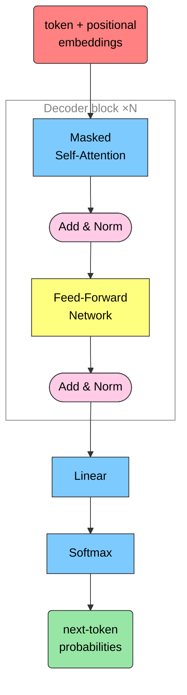

Figure 11: The anatomy of a decoder block. The stack repeats `N` times
before the final projection to vocabulary logits.

</div>

We’ll set some hyperparameters we’ll reuse throughout:

``` python
import torch
import torch.nn as nn
from torch.nn import functional as F

torch.manual_seed(1337)

# hyperparameters
batch_size = 16    # independent sequences processed in parallel
block_size = 32    # maximum context length
max_iters = 5000
eval_interval = 100
learning_rate = 1e-3
device = "cuda" if torch.cuda.is_available() else "cpu"
eval_iters = 200
n_embd = 64
n_head = 4         # -> head_size = 16
n_layer = 4
dropout = 0.0
```

### Attention: the core idea

Consider the sentence:

> “The animal didn’t cross the street because **it** was too tired.”

We intuitively know “it” refers to “animal.” **Self-attention** is how a
Transformer learns these relationships: as it processes each token, it
looks at *other* positions for context.

<div id="fig-attention-viz">


Figure 12: Self-attention relates each word to others in the sentence.
Image credit: [Jay
Alammar](https://jalammar.github.io/illustrated-transformer/).

</div>

Attention uses three learned projections of each token:

- **Query (Q)** — what this token is *looking for*
- **Key (K)** — what each token *offers* (matched against queries)
- **Value (V)** — the actual content to aggregate

Jay Alammar’s analogy: picking a file from a cabinet using a sticky
note. The note (query) matches a folder label (key); you then read that
folder’s contents (value), weighted by how well it matched.

<div id="fig-attention-flow">

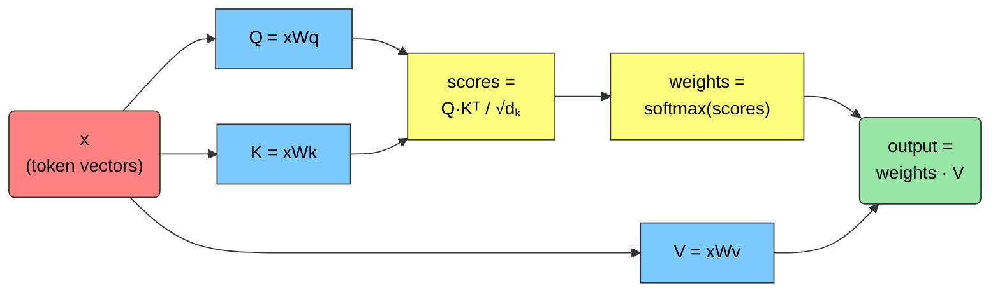

Figure 13: Scaled dot-product attention. The $\sqrt{d_k}$ divisor
stabilizes gradients before the softmax.

</div>

The algorithm in words:

1.  Compute Q, K, V for each token.
2.  Score every token against every other: $\text{scores} = QK^{\top}$.
3.  Scale by $\sqrt{d_k}$ and apply softmax → attention weights.
4.  Weight the value vectors by these weights and sum.

In code:

``` python
import torch
import torch.nn as nn
from torch.nn import functional as F

torch.manual_seed(1337)
B, T, C = 4, 8, 32  # batch, time, channels
x = torch.randn(B, T, C)

head_size = 16
key = nn.Linear(C, head_size, bias=False)
query = nn.Linear(C, head_size, bias=False)
value = nn.Linear(C, head_size, bias=False)

k = key(x)       # (B, T, 16)
q = query(x)     # (B, T, 16)
v = value(x)     # (B, T, 16)

wei = q @ k.transpose(-2, -1) * head_size**-0.5  # (B, T, T)
wei = F.softmax(wei, dim=-1)                      # normalize -> distribution
out = wei @ v                                     # (B, T, 16)
print(out[0])
```

<pre style="white-space:pre;overflow-x:auto;line-height:normal;font-family:Menlo,'DejaVu Sans Mono',consolas,'Courier New',monospace"><span style="color: #800080; text-decoration-color: #800080; font-weight: bold">tensor</span><span style="font-weight: bold">([[</span> <span style="color: #008080; text-decoration-color: #008080; font-weight: bold">0.0618</span>, <span style="color: #008080; text-decoration-color: #008080; font-weight: bold">-0.0091</span>, <span style="color: #008080; text-decoration-color: #008080; font-weight: bold">-0.3488</span>,  <span style="color: #008080; text-decoration-color: #008080; font-weight: bold">0.3208</span>,  <span style="color: #008080; text-decoration-color: #008080; font-weight: bold">0.2971</span>, <span style="color: #008080; text-decoration-color: #008080; font-weight: bold">-0.1573</span>, <span style="color: #008080; text-decoration-color: #008080; font-weight: bold">-0.0561</span>,  <span style="color: #008080; text-decoration-color: #008080; font-weight: bold">0.1068</span>,
          <span style="color: #008080; text-decoration-color: #008080; font-weight: bold">0.0368</span>,  <span style="color: #008080; text-decoration-color: #008080; font-weight: bold">0.0139</span>, <span style="color: #008080; text-decoration-color: #008080; font-weight: bold">-0.0017</span>,  <span style="color: #008080; text-decoration-color: #008080; font-weight: bold">0.3110</span>,  <span style="color: #008080; text-decoration-color: #008080; font-weight: bold">0.1404</span>, <span style="color: #008080; text-decoration-color: #008080; font-weight: bold">-0.0158</span>,  <span style="color: #008080; text-decoration-color: #008080; font-weight: bold">0.1853</span>,  <span style="color: #008080; text-decoration-color: #008080; font-weight: bold">0.4290</span><span style="font-weight: bold">]</span>,
        <span style="font-weight: bold">[</span> <span style="color: #008080; text-decoration-color: #008080; font-weight: bold">0.1578</span>, <span style="color: #008080; text-decoration-color: #008080; font-weight: bold">-0.0971</span>, <span style="color: #008080; text-decoration-color: #008080; font-weight: bold">-0.4256</span>,  <span style="color: #008080; text-decoration-color: #008080; font-weight: bold">0.3538</span>,  <span style="color: #008080; text-decoration-color: #008080; font-weight: bold">0.3621</span>, <span style="color: #008080; text-decoration-color: #008080; font-weight: bold">-0.2392</span>, <span style="color: #008080; text-decoration-color: #008080; font-weight: bold">-0.0536</span>,  <span style="color: #008080; text-decoration-color: #008080; font-weight: bold">0.1759</span>,
          <span style="color: #008080; text-decoration-color: #008080; font-weight: bold">0.1115</span>,  <span style="color: #008080; text-decoration-color: #008080; font-weight: bold">0.0282</span>, <span style="color: #008080; text-decoration-color: #008080; font-weight: bold">-0.0649</span>,  <span style="color: #008080; text-decoration-color: #008080; font-weight: bold">0.3641</span>,  <span style="color: #008080; text-decoration-color: #008080; font-weight: bold">0.1928</span>,  <span style="color: #008080; text-decoration-color: #008080; font-weight: bold">0.0261</span>,  <span style="color: #008080; text-decoration-color: #008080; font-weight: bold">0.2162</span>,  <span style="color: #008080; text-decoration-color: #008080; font-weight: bold">0.3758</span><span style="font-weight: bold">]</span>,
        <span style="font-weight: bold">[</span> <span style="color: #008080; text-decoration-color: #008080; font-weight: bold">0.1293</span>,  <span style="color: #008080; text-decoration-color: #008080; font-weight: bold">0.0759</span>, <span style="color: #008080; text-decoration-color: #008080; font-weight: bold">-0.2946</span>,  <span style="color: #008080; text-decoration-color: #008080; font-weight: bold">0.2292</span>,  <span style="color: #008080; text-decoration-color: #008080; font-weight: bold">0.2215</span>, <span style="color: #008080; text-decoration-color: #008080; font-weight: bold">-0.0710</span>, <span style="color: #008080; text-decoration-color: #008080; font-weight: bold">-0.0107</span>,  <span style="color: #008080; text-decoration-color: #008080; font-weight: bold">0.1616</span>,
         <span style="color: #008080; text-decoration-color: #008080; font-weight: bold">-0.0930</span>, <span style="color: #008080; text-decoration-color: #008080; font-weight: bold">-0.0877</span>,  <span style="color: #008080; text-decoration-color: #008080; font-weight: bold">0.0567</span>,  <span style="color: #008080; text-decoration-color: #008080; font-weight: bold">0.1899</span>,  <span style="color: #008080; text-decoration-color: #008080; font-weight: bold">0.0311</span>, <span style="color: #008080; text-decoration-color: #008080; font-weight: bold">-0.0894</span>,  <span style="color: #008080; text-decoration-color: #008080; font-weight: bold">0.0309</span>,  <span style="color: #008080; text-decoration-color: #008080; font-weight: bold">0.5471</span><span style="font-weight: bold">]</span>,
        <span style="font-weight: bold">[</span> <span style="color: #008080; text-decoration-color: #008080; font-weight: bold">0.1247</span>,  <span style="color: #008080; text-decoration-color: #008080; font-weight: bold">0.1400</span>, <span style="color: #008080; text-decoration-color: #008080; font-weight: bold">-0.2436</span>,  <span style="color: #008080; text-decoration-color: #008080; font-weight: bold">0.1819</span>,  <span style="color: #008080; text-decoration-color: #008080; font-weight: bold">0.1976</span>,  <span style="color: #008080; text-decoration-color: #008080; font-weight: bold">0.0338</span>, <span style="color: #008080; text-decoration-color: #008080; font-weight: bold">-0.0028</span>,  <span style="color: #008080; text-decoration-color: #008080; font-weight: bold">0.1124</span>,
         <span style="color: #008080; text-decoration-color: #008080; font-weight: bold">-0.1477</span>, <span style="color: #008080; text-decoration-color: #008080; font-weight: bold">-0.0748</span>,  <span style="color: #008080; text-decoration-color: #008080; font-weight: bold">0.0650</span>,  <span style="color: #008080; text-decoration-color: #008080; font-weight: bold">0.1392</span>, <span style="color: #008080; text-decoration-color: #008080; font-weight: bold">-0.0314</span>, <span style="color: #008080; text-decoration-color: #008080; font-weight: bold">-0.0989</span>,  <span style="color: #008080; text-decoration-color: #008080; font-weight: bold">0.0613</span>,  <span style="color: #008080; text-decoration-color: #008080; font-weight: bold">0.5433</span><span style="font-weight: bold">]</span>,
        <span style="font-weight: bold">[</span> <span style="color: #008080; text-decoration-color: #008080; font-weight: bold">0.0667</span>,  <span style="color: #008080; text-decoration-color: #008080; font-weight: bold">0.1845</span>, <span style="color: #008080; text-decoration-color: #008080; font-weight: bold">-0.2135</span>,  <span style="color: #008080; text-decoration-color: #008080; font-weight: bold">0.2813</span>,  <span style="color: #008080; text-decoration-color: #008080; font-weight: bold">0.2064</span>,  <span style="color: #008080; text-decoration-color: #008080; font-weight: bold">0.0873</span>,  <span style="color: #008080; text-decoration-color: #008080; font-weight: bold">0.0084</span>,  <span style="color: #008080; text-decoration-color: #008080; font-weight: bold">0.2055</span>,
         <span style="color: #008080; text-decoration-color: #008080; font-weight: bold">-0.1130</span>, <span style="color: #008080; text-decoration-color: #008080; font-weight: bold">-0.1466</span>,  <span style="color: #008080; text-decoration-color: #008080; font-weight: bold">0.0459</span>,  <span style="color: #008080; text-decoration-color: #008080; font-weight: bold">0.1923</span>, <span style="color: #008080; text-decoration-color: #008080; font-weight: bold">-0.0275</span>, <span style="color: #008080; text-decoration-color: #008080; font-weight: bold">-0.1107</span>,  <span style="color: #008080; text-decoration-color: #008080; font-weight: bold">0.0065</span>,  <span style="color: #008080; text-decoration-color: #008080; font-weight: bold">0.4674</span><span style="font-weight: bold">]</span>,
        <span style="font-weight: bold">[</span> <span style="color: #008080; text-decoration-color: #008080; font-weight: bold">0.1924</span>,  <span style="color: #008080; text-decoration-color: #008080; font-weight: bold">0.1693</span>, <span style="color: #008080; text-decoration-color: #008080; font-weight: bold">-0.1568</span>,  <span style="color: #008080; text-decoration-color: #008080; font-weight: bold">0.2284</span>,  <span style="color: #008080; text-decoration-color: #008080; font-weight: bold">0.1620</span>,  <span style="color: #008080; text-decoration-color: #008080; font-weight: bold">0.0737</span>,  <span style="color: #008080; text-decoration-color: #008080; font-weight: bold">0.0443</span>,  <span style="color: #008080; text-decoration-color: #008080; font-weight: bold">0.2519</span>,
         <span style="color: #008080; text-decoration-color: #008080; font-weight: bold">-0.1912</span>, <span style="color: #008080; text-decoration-color: #008080; font-weight: bold">-0.1979</span>,  <span style="color: #008080; text-decoration-color: #008080; font-weight: bold">0.0832</span>,  <span style="color: #008080; text-decoration-color: #008080; font-weight: bold">0.0713</span>, <span style="color: #008080; text-decoration-color: #008080; font-weight: bold">-0.0826</span>, <span style="color: #008080; text-decoration-color: #008080; font-weight: bold">-0.0848</span>, <span style="color: #008080; text-decoration-color: #008080; font-weight: bold">-0.1047</span>,  <span style="color: #008080; text-decoration-color: #008080; font-weight: bold">0.6089</span><span style="font-weight: bold">]</span>,
        <span style="font-weight: bold">[</span> <span style="color: #008080; text-decoration-color: #008080; font-weight: bold">0.1184</span>,  <span style="color: #008080; text-decoration-color: #008080; font-weight: bold">0.0884</span>, <span style="color: #008080; text-decoration-color: #008080; font-weight: bold">-0.2652</span>,  <span style="color: #008080; text-decoration-color: #008080; font-weight: bold">0.2560</span>,  <span style="color: #008080; text-decoration-color: #008080; font-weight: bold">0.1840</span>,  <span style="color: #008080; text-decoration-color: #008080; font-weight: bold">0.0284</span>, <span style="color: #008080; text-decoration-color: #008080; font-weight: bold">-0.0621</span>,  <span style="color: #008080; text-decoration-color: #008080; font-weight: bold">0.1181</span>,
         <span style="color: #008080; text-decoration-color: #008080; font-weight: bold">-0.0880</span>,  <span style="color: #008080; text-decoration-color: #008080; font-weight: bold">0.0104</span>,  <span style="color: #008080; text-decoration-color: #008080; font-weight: bold">0.1123</span>,  <span style="color: #008080; text-decoration-color: #008080; font-weight: bold">0.1850</span>,  <span style="color: #008080; text-decoration-color: #008080; font-weight: bold">0.0369</span>, <span style="color: #008080; text-decoration-color: #008080; font-weight: bold">-0.0730</span>,  <span style="color: #008080; text-decoration-color: #008080; font-weight: bold">0.0663</span>,  <span style="color: #008080; text-decoration-color: #008080; font-weight: bold">0.5242</span><span style="font-weight: bold">]</span>,
        <span style="font-weight: bold">[</span> <span style="color: #008080; text-decoration-color: #008080; font-weight: bold">0.1243</span>,  <span style="color: #008080; text-decoration-color: #008080; font-weight: bold">0.0453</span>, <span style="color: #008080; text-decoration-color: #008080; font-weight: bold">-0.3412</span>,  <span style="color: #008080; text-decoration-color: #008080; font-weight: bold">0.2709</span>,  <span style="color: #008080; text-decoration-color: #008080; font-weight: bold">0.2335</span>, <span style="color: #008080; text-decoration-color: #008080; font-weight: bold">-0.0948</span>, <span style="color: #008080; text-decoration-color: #008080; font-weight: bold">-0.0421</span>,  <span style="color: #008080; text-decoration-color: #008080; font-weight: bold">0.2143</span>,
         <span style="color: #008080; text-decoration-color: #008080; font-weight: bold">-0.0330</span>, <span style="color: #008080; text-decoration-color: #008080; font-weight: bold">-0.0313</span>,  <span style="color: #008080; text-decoration-color: #008080; font-weight: bold">0.0520</span>,  <span style="color: #008080; text-decoration-color: #008080; font-weight: bold">0.2378</span>,  <span style="color: #008080; text-decoration-color: #008080; font-weight: bold">0.1084</span>, <span style="color: #008080; text-decoration-color: #008080; font-weight: bold">-0.0959</span>,  <span style="color: #008080; text-decoration-color: #008080; font-weight: bold">0.0300</span>,  <span style="color: #008080; text-decoration-color: #008080; font-weight: bold">0.4707</span><span style="font-weight: bold">]]</span>,
       <span style="color: #808000; text-decoration-color: #808000">grad_fn</span>=<span style="font-weight: bold">&lt;</span><span style="color: #ff00ff; text-decoration-color: #ff00ff; font-weight: bold">SelectBackward0</span><span style="font-weight: bold">&gt;)</span>
</pre>

### Multi-head attention

In practice we run several attention “heads” in parallel. Each head can
focus on a different kind of relationship (syntax, coreference, …), and
their outputs are concatenated. This gives the model multiple
**representation subspaces**.

<div id="fig-multihead">


Figure 14: Multi-head attention. Image credit: [Jay
Alammar](https://jalammar.github.io/illustrated-transformer/).

</div>

### Attention, visualized interactively

[`bertviz`](https://github.com/jessevig/bertviz) lets us inspect real
attention weights. **Click the different colored blocks** to see which
tokens attend to which.

``` python
from bertviz import model_view
from transformers import AutoModelForCausalLM, AutoTokenizer, utils

utils.logging.set_verbosity_error()  # suppress standard warnings

model_name = "openai-community/gpt2"
input_text = "The animal didn't cross the street because it was too tired"
model = AutoModelForCausalLM.from_pretrained(model_name, output_attentions=True)
tokenizer = AutoTokenizer.from_pretrained(model_name)

inputs = tokenizer.encode(input_text, return_tensors="pt")
outputs = model(inputs)
attention = outputs[-1]
tokens = tokenizer.convert_ids_to_tokens(inputs[0])
model_view(attention, tokens)
```

<script src="https://cdnjs.cloudflare.com/ajax/libs/require.js/2.3.6/require.min.js"></script>

      
        <div id="bertviz-eb8efb0b81cc4e41aec5a16991d86820" style="font-family:'Helvetica Neue', Helvetica, Arial, sans-serif;">
            <span style="user-select:none">
                &#10;            </span>
            <div id='vis'></div>
        </div>
    &#10;

    <IPython.core.display.Javascript object>

### Positional encoding

Attention alone is **order-blind** — it sees a *set* of tokens, not a
sequence. But order matters enormously:

> “The man ate the sandwich.” vs. “The sandwich ate the man.”

Same words, very different meaning. Transformers restore order by
**adding a positional encoding** vector to each token embedding.

<div id="fig-positional-encoding">


Figure 15: Positional encodings are added to token embeddings. Image
credit:
[Chen](https://medium.com/@xuer.chen.human/llm-study-notes-positional-encoding-0639a1002ec0).

</div>

We can implement a (learned) positional embedding with `nn.Embedding`,
sized `(block_size, n_embd)` — one vector per position:

``` python
vocab_size = 65
n_embd = 64
block_size = 32

token_embedding_table = nn.Embedding(vocab_size, n_embd)
position_embedding_table = nn.Embedding(block_size, n_embd)
```

Token embedding alone:

``` python
x = torch.tensor([1, 3, 15, 4, 7, 1, 4, 9])
print(token_embedding_table(x)[0])
```

<pre style="white-space:pre;overflow-x:auto;line-height:normal;font-family:Menlo,'DejaVu Sans Mono',consolas,'Courier New',monospace"><span style="color: #800080; text-decoration-color: #800080; font-weight: bold">tensor</span><span style="font-weight: bold">([</span> <span style="color: #008080; text-decoration-color: #008080; font-weight: bold">0.7221</span>, <span style="color: #008080; text-decoration-color: #008080; font-weight: bold">-0.9629</span>, <span style="color: #008080; text-decoration-color: #008080; font-weight: bold">-2.0578</span>,  <span style="color: #008080; text-decoration-color: #008080; font-weight: bold">1.9740</span>,  <span style="color: #008080; text-decoration-color: #008080; font-weight: bold">0.7434</span>,  <span style="color: #008080; text-decoration-color: #008080; font-weight: bold">1.1139</span>,  <span style="color: #008080; text-decoration-color: #008080; font-weight: bold">0.6926</span>,  <span style="color: #008080; text-decoration-color: #008080; font-weight: bold">0.0296</span>,
         <span style="color: #008080; text-decoration-color: #008080; font-weight: bold">0.6405</span>, <span style="color: #008080; text-decoration-color: #008080; font-weight: bold">-1.6464</span>,  <span style="color: #008080; text-decoration-color: #008080; font-weight: bold">0.4935</span>,  <span style="color: #008080; text-decoration-color: #008080; font-weight: bold">0.7485</span>,  <span style="color: #008080; text-decoration-color: #008080; font-weight: bold">0.9238</span>, <span style="color: #008080; text-decoration-color: #008080; font-weight: bold">-0.4940</span>,  <span style="color: #008080; text-decoration-color: #008080; font-weight: bold">0.4814</span>, <span style="color: #008080; text-decoration-color: #008080; font-weight: bold">-0.3859</span>,
        <span style="color: #008080; text-decoration-color: #008080; font-weight: bold">-0.3094</span>,  <span style="color: #008080; text-decoration-color: #008080; font-weight: bold">1.1066</span>, <span style="color: #008080; text-decoration-color: #008080; font-weight: bold">-0.2891</span>,  <span style="color: #008080; text-decoration-color: #008080; font-weight: bold">0.1891</span>,  <span style="color: #008080; text-decoration-color: #008080; font-weight: bold">2.0440</span>, <span style="color: #008080; text-decoration-color: #008080; font-weight: bold">-0.7945</span>, <span style="color: #008080; text-decoration-color: #008080; font-weight: bold">-0.4331</span>,  <span style="color: #008080; text-decoration-color: #008080; font-weight: bold">0.3007</span>,
         <span style="color: #008080; text-decoration-color: #008080; font-weight: bold">1.4317</span>,  <span style="color: #008080; text-decoration-color: #008080; font-weight: bold">0.2881</span>, <span style="color: #008080; text-decoration-color: #008080; font-weight: bold">-0.4343</span>,  <span style="color: #008080; text-decoration-color: #008080; font-weight: bold">0.4280</span>,  <span style="color: #008080; text-decoration-color: #008080; font-weight: bold">1.2469</span>,  <span style="color: #008080; text-decoration-color: #008080; font-weight: bold">1.4047</span>, <span style="color: #008080; text-decoration-color: #008080; font-weight: bold">-0.3404</span>, <span style="color: #008080; text-decoration-color: #008080; font-weight: bold">-2.2190</span>,
         <span style="color: #008080; text-decoration-color: #008080; font-weight: bold">0.4893</span>,  <span style="color: #008080; text-decoration-color: #008080; font-weight: bold">0.0398</span>, <span style="color: #008080; text-decoration-color: #008080; font-weight: bold">-0.2717</span>, <span style="color: #008080; text-decoration-color: #008080; font-weight: bold">-2.2400</span>, <span style="color: #008080; text-decoration-color: #008080; font-weight: bold">-0.0029</span>, <span style="color: #008080; text-decoration-color: #008080; font-weight: bold">-1.4251</span>,  <span style="color: #008080; text-decoration-color: #008080; font-weight: bold">0.7330</span>,  <span style="color: #008080; text-decoration-color: #008080; font-weight: bold">0.3551</span>,
         <span style="color: #008080; text-decoration-color: #008080; font-weight: bold">0.1472</span>, <span style="color: #008080; text-decoration-color: #008080; font-weight: bold">-1.1895</span>, <span style="color: #008080; text-decoration-color: #008080; font-weight: bold">-0.8407</span>,  <span style="color: #008080; text-decoration-color: #008080; font-weight: bold">0.3134</span>, <span style="color: #008080; text-decoration-color: #008080; font-weight: bold">-0.6709</span>, <span style="color: #008080; text-decoration-color: #008080; font-weight: bold">-0.8176</span>,  <span style="color: #008080; text-decoration-color: #008080; font-weight: bold">0.6929</span>, <span style="color: #008080; text-decoration-color: #008080; font-weight: bold">-0.6374</span>,
         <span style="color: #008080; text-decoration-color: #008080; font-weight: bold">0.3174</span>,  <span style="color: #008080; text-decoration-color: #008080; font-weight: bold">0.4837</span>, <span style="color: #008080; text-decoration-color: #008080; font-weight: bold">-0.0073</span>, <span style="color: #008080; text-decoration-color: #008080; font-weight: bold">-1.5924</span>,  <span style="color: #008080; text-decoration-color: #008080; font-weight: bold">1.8606</span>, <span style="color: #008080; text-decoration-color: #008080; font-weight: bold">-1.2910</span>, <span style="color: #008080; text-decoration-color: #008080; font-weight: bold">-0.1594</span>,  <span style="color: #008080; text-decoration-color: #008080; font-weight: bold">0.3111</span>,
        <span style="color: #008080; text-decoration-color: #008080; font-weight: bold">-0.1536</span>, <span style="color: #008080; text-decoration-color: #008080; font-weight: bold">-0.3414</span>, <span style="color: #008080; text-decoration-color: #008080; font-weight: bold">-0.0170</span>, <span style="color: #008080; text-decoration-color: #008080; font-weight: bold">-0.1633</span>,  <span style="color: #008080; text-decoration-color: #008080; font-weight: bold">0.2794</span>,  <span style="color: #008080; text-decoration-color: #008080; font-weight: bold">0.6755</span>,  <span style="color: #008080; text-decoration-color: #008080; font-weight: bold">0.7066</span>, <span style="color: #008080; text-decoration-color: #008080; font-weight: bold">-1.6665</span><span style="font-weight: bold">]</span>,
       <span style="color: #808000; text-decoration-color: #808000">grad_fn</span>=<span style="font-weight: bold">&lt;</span><span style="color: #ff00ff; text-decoration-color: #ff00ff; font-weight: bold">SelectBackward0</span><span style="font-weight: bold">&gt;)</span>
</pre>

Token **+** positional embedding (note the offset):

``` python
x = torch.tensor([1, 3, 15, 4, 7, 1, 4, 9])
print((position_embedding_table(x) + token_embedding_table(x))[0])
```

<pre style="white-space:pre;overflow-x:auto;line-height:normal;font-family:Menlo,'DejaVu Sans Mono',consolas,'Courier New',monospace"><span style="color: #800080; text-decoration-color: #800080; font-weight: bold">tensor</span><span style="font-weight: bold">([</span> <span style="color: #008080; text-decoration-color: #008080; font-weight: bold">0.4326</span>, <span style="color: #008080; text-decoration-color: #008080; font-weight: bold">-1.6287</span>, <span style="color: #008080; text-decoration-color: #008080; font-weight: bold">-0.8684</span>,  <span style="color: #008080; text-decoration-color: #008080; font-weight: bold">3.0704</span>,  <span style="color: #008080; text-decoration-color: #008080; font-weight: bold">0.3646</span>,  <span style="color: #008080; text-decoration-color: #008080; font-weight: bold">1.9826</span>,  <span style="color: #008080; text-decoration-color: #008080; font-weight: bold">0.7582</span>, <span style="color: #008080; text-decoration-color: #008080; font-weight: bold">-0.1918</span>,
         <span style="color: #008080; text-decoration-color: #008080; font-weight: bold">1.0491</span>, <span style="color: #008080; text-decoration-color: #008080; font-weight: bold">-2.2562</span>, <span style="color: #008080; text-decoration-color: #008080; font-weight: bold">-0.4931</span>, <span style="color: #008080; text-decoration-color: #008080; font-weight: bold">-0.7808</span>,  <span style="color: #008080; text-decoration-color: #008080; font-weight: bold">1.7206</span>, <span style="color: #008080; text-decoration-color: #008080; font-weight: bold">-1.0297</span>,  <span style="color: #008080; text-decoration-color: #008080; font-weight: bold">2.0798</span>, <span style="color: #008080; text-decoration-color: #008080; font-weight: bold">-1.3427</span>,
        <span style="color: #008080; text-decoration-color: #008080; font-weight: bold">-0.7896</span>, <span style="color: #008080; text-decoration-color: #008080; font-weight: bold">-0.1746</span>,  <span style="color: #008080; text-decoration-color: #008080; font-weight: bold">0.0926</span>,  <span style="color: #008080; text-decoration-color: #008080; font-weight: bold">0.0543</span>,  <span style="color: #008080; text-decoration-color: #008080; font-weight: bold">2.3831</span>, <span style="color: #008080; text-decoration-color: #008080; font-weight: bold">-0.6208</span>,  <span style="color: #008080; text-decoration-color: #008080; font-weight: bold">0.3902</span>,  <span style="color: #008080; text-decoration-color: #008080; font-weight: bold">0.1097</span>,
         <span style="color: #008080; text-decoration-color: #008080; font-weight: bold">1.0455</span>, <span style="color: #008080; text-decoration-color: #008080; font-weight: bold">-1.4557</span>,  <span style="color: #008080; text-decoration-color: #008080; font-weight: bold">0.3402</span>,  <span style="color: #008080; text-decoration-color: #008080; font-weight: bold">2.6717</span>,  <span style="color: #008080; text-decoration-color: #008080; font-weight: bold">1.8380</span>,  <span style="color: #008080; text-decoration-color: #008080; font-weight: bold">1.2628</span>, <span style="color: #008080; text-decoration-color: #008080; font-weight: bold">-0.4831</span>, <span style="color: #008080; text-decoration-color: #008080; font-weight: bold">-4.6023</span>,
         <span style="color: #008080; text-decoration-color: #008080; font-weight: bold">0.6959</span>,  <span style="color: #008080; text-decoration-color: #008080; font-weight: bold">1.0347</span>,  <span style="color: #008080; text-decoration-color: #008080; font-weight: bold">0.5903</span>, <span style="color: #008080; text-decoration-color: #008080; font-weight: bold">-0.7541</span>,  <span style="color: #008080; text-decoration-color: #008080; font-weight: bold">0.4682</span>, <span style="color: #008080; text-decoration-color: #008080; font-weight: bold">-0.3895</span>,  <span style="color: #008080; text-decoration-color: #008080; font-weight: bold">2.1526</span>,  <span style="color: #008080; text-decoration-color: #008080; font-weight: bold">0.6272</span>,
        <span style="color: #008080; text-decoration-color: #008080; font-weight: bold">-0.8558</span>, <span style="color: #008080; text-decoration-color: #008080; font-weight: bold">-0.8434</span>,  <span style="color: #008080; text-decoration-color: #008080; font-weight: bold">0.1311</span>, <span style="color: #008080; text-decoration-color: #008080; font-weight: bold">-1.0272</span>, <span style="color: #008080; text-decoration-color: #008080; font-weight: bold">-2.0580</span>,  <span style="color: #008080; text-decoration-color: #008080; font-weight: bold">0.0584</span>,  <span style="color: #008080; text-decoration-color: #008080; font-weight: bold">0.3442</span>, <span style="color: #008080; text-decoration-color: #008080; font-weight: bold">-0.3464</span>,
        <span style="color: #008080; text-decoration-color: #008080; font-weight: bold">-0.3444</span>,  <span style="color: #008080; text-decoration-color: #008080; font-weight: bold">2.3134</span>, <span style="color: #008080; text-decoration-color: #008080; font-weight: bold">-1.1142</span>, <span style="color: #008080; text-decoration-color: #008080; font-weight: bold">-1.4629</span>,  <span style="color: #008080; text-decoration-color: #008080; font-weight: bold">3.3503</span>, <span style="color: #008080; text-decoration-color: #008080; font-weight: bold">-2.0594</span>,  <span style="color: #008080; text-decoration-color: #008080; font-weight: bold">1.4105</span>,  <span style="color: #008080; text-decoration-color: #008080; font-weight: bold">0.4558</span>,
        <span style="color: #008080; text-decoration-color: #008080; font-weight: bold">-1.3366</span>,  <span style="color: #008080; text-decoration-color: #008080; font-weight: bold">1.9283</span>,  <span style="color: #008080; text-decoration-color: #008080; font-weight: bold">1.5187</span>,  <span style="color: #008080; text-decoration-color: #008080; font-weight: bold">0.3906</span>,  <span style="color: #008080; text-decoration-color: #008080; font-weight: bold">1.1448</span>, <span style="color: #008080; text-decoration-color: #008080; font-weight: bold">-0.8422</span>,  <span style="color: #008080; text-decoration-color: #008080; font-weight: bold">2.2692</span>, <span style="color: #008080; text-decoration-color: #008080; font-weight: bold">-0.7949</span><span style="font-weight: bold">]</span>,
       <span style="color: #808000; text-decoration-color: #808000">grad_fn</span>=<span style="font-weight: bold">&lt;</span><span style="color: #ff00ff; text-decoration-color: #ff00ff; font-weight: bold">SelectBackward0</span><span style="font-weight: bold">&gt;)</span>
</pre>

Both are learned during training to best encode content *and* position.

### Output layer: from vectors back to words

After the decoder stack, each position holds a vector. A final
**Linear** layer projects it to a **logits** vector — one score per
vocabulary entry — and **softmax** turns those scores into
probabilities. The highest-probability token (or a sample from the
distribution) becomes the output.

<div id="fig-output-softmax">


Figure 16: Linear + softmax turn the final vector into a next-token
distribution. Image credit: [Jay
Alammar](https://jalammar.github.io/illustrated-transformer/).

</div>

## 🎯 Training a Language Model

How does the model improve? We compare its predicted next-token
distribution to the ground truth and minimize the difference.

<div id="fig-training-loop">

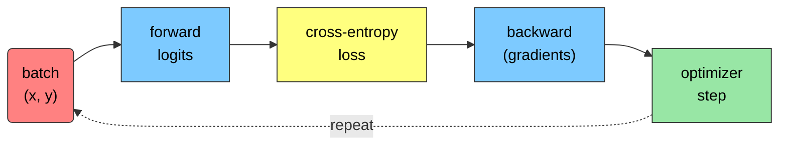

Figure 17: The training loop: predict → score → update, repeated over
many batches.

</div>

The standard loss is **cross-entropy** between the true distribution $p$
and the predicted distribution $q$:

$$\mathrm{CE} = -\sum_{x \in X} p(x)\, \log q(x)$$

``` python
from torch.nn import functional as F

logits = torch.tensor([0.5, 0.1, 0.3])
targets = torch.tensor([1.0, 0.0, 0.0])
loss = F.cross_entropy(logits, targets)
print(loss)
```

<pre style="white-space:pre;overflow-x:auto;line-height:normal;font-family:Menlo,'DejaVu Sans Mono',consolas,'Courier New',monospace"><span style="color: #800080; text-decoration-color: #800080; font-weight: bold">tensor</span><span style="font-weight: bold">(</span><span style="color: #008080; text-decoration-color: #008080; font-weight: bold">0.9119</span><span style="font-weight: bold">)</span>
</pre>

A closely related, more interpretable metric is **perplexity** —
intuitively, “how surprised” the model is by new data. Lower is better.
It’s just the exponential of the cross-entropy:

$$\text{perplexity} = \exp(\mathrm{CE})$$

``` python
print(torch.exp(loss))
```

<pre style="white-space:pre;overflow-x:auto;line-height:normal;font-family:Menlo,'DejaVu Sans Mono',consolas,'Courier New',monospace"><span style="color: #800080; text-decoration-color: #800080; font-weight: bold">tensor</span><span style="font-weight: bold">(</span><span style="color: #008080; text-decoration-color: #008080; font-weight: bold">2.4891</span><span style="font-weight: bold">)</span>
</pre>

## 🛠️ Build a Mini-LLM from Scratch

Time to assemble everything into a small, working GPT-style model,
trained on the tiny-Shakespeare dataset with a character-level
tokenizer.

### Hyperparameters

``` python
batch_size = 4     # independent sequences in parallel
block_size = 32    # maximum context length
max_iters = 500
eval_interval = 50
learning_rate = 1e-3
device = "cuda" if torch.cuda.is_available() else "cpu"
eval_iters = 200
n_embd = 64
n_head = 4         # head_size = 16
n_layer = 4
dropout = 0.0
```

### Data: tiny-Shakespeare

We use a simple **character-level** tokenizer and a 90/10 train/val
split.

``` python
! [ ! -f "input.txt" ] && wget https://raw.githubusercontent.com/argonne-lcf/ATPESC_MachineLearning/refs/heads/master/02_intro_to_LLMs/dataset/input.txt
```

    huggingface/tokenizers: The current process just got forked, after parallelism has already been used. Disabling parallelism to avoid deadlocks...
    To disable this warning, you can either:
        - Avoid using `tokenizers` before the fork if possible
        - Explicitly set the environment variable TOKENIZERS_PARALLELISM=(true | false)

``` python
with open("input.txt", "r", encoding="utf-8") as f:
    text = f.read()

# unique characters -> vocabulary
chars = sorted(list(set(text)))
vocab_size = len(chars)
stoi = {ch: i for i, ch in enumerate(chars)}
itos = {i: ch for i, ch in enumerate(chars)}
encode = lambda s: [stoi[c] for c in s]           # string -> list[int]
decode = lambda l: "".join([itos[i] for i in l])  # list[int] -> string

# train / val split
data = torch.tensor(encode(text), dtype=torch.long)
n = int(0.9 * len(data))
train_data = data[:n]
val_data = data[n:]


def get_batch(split):
    data = train_data if split == "train" else val_data
    ix = torch.randint(len(data) - block_size, (batch_size,))
    x = torch.stack([data[i : i + block_size] for i in ix])
    y = torch.stack([data[i + 1 : i + block_size + 1] for i in ix])
    return x.to(device), y.to(device)
```

``` python
print(text[:1000])
```

<pre style="white-space:pre;overflow-x:auto;line-height:normal;font-family:Menlo,'DejaVu Sans Mono',consolas,'Courier New',monospace">First Citizen:
Before we proceed any further, hear me speak.
&#10;All:
Speak, speak.
&#10;First Citizen:
You are all resolved rather to die than to famish?
&#10;All:
Resolved. resolved.
&#10;First Citizen:
First, you know Caius Marcius is chief enemy to the people.
&#10;All:
We know't, we know't.
&#10;First Citizen:
Let us kill him, and we'll have corn at our own price.
Is't a verdict?
&#10;All:
No more talking on't; let it be done: away, away!
&#10;Second Citizen:
One word, good citizens.
&#10;First Citizen:
We are accounted poor citizens, the patricians good.
What authority surfeits on would relieve us: if they
would yield us but the superfluity, while it were
wholesome, we might guess they relieved us humanely;
but they think we are too dear: the leanness that
afflicts us, the object of our misery, is as an
inventory to particularise their abundance; our
sufferance is a gain to them Let us revenge this with
our pikes, ere we become rakes: for the gods know I
speak this in hunger for bread, not in thirst for revenge.
&#10;
</pre>

### Components: attention head, multi-head, feed-forward

``` python
class Head(nn.Module):
    """One head of self-attention."""

    def __init__(self, head_size):
        super().__init__()
        self.key = nn.Linear(n_embd, head_size, bias=False)
        self.query = nn.Linear(n_embd, head_size, bias=False)
        self.value = nn.Linear(n_embd, head_size, bias=False)
        self.register_buffer("tril", torch.tril(torch.ones(block_size, block_size)))
        self.dropout = nn.Dropout(dropout)

    def forward(self, x):
        B, T, C = x.shape
        k = self.key(x)    # (B, T, C)
        q = self.query(x)  # (B, T, C)
        # attention scores ("affinities")
        wei = q @ k.transpose(-2, -1) * C**-0.5      # (B, T, T)
        wei = wei.masked_fill(self.tril[:T, :T] == 0, float("-inf"))  # causal mask
        wei = F.softmax(wei, dim=-1)
        wei = self.dropout(wei)
        v = self.value(x)  # (B, T, C)
        return wei @ v     # (B, T, C)


class MultiHeadAttention(nn.Module):
    """Multiple heads of self-attention in parallel."""

    def __init__(self, num_heads, head_size):
        super().__init__()
        self.heads = nn.ModuleList([Head(head_size) for _ in range(num_heads)])
        self.proj = nn.Linear(n_embd, n_embd)
        self.dropout = nn.Dropout(dropout)

    def forward(self, x):
        out = torch.cat([h(x) for h in self.heads], dim=-1)
        return self.dropout(self.proj(out))


class FeedFoward(nn.Module):
    """A linear layer followed by a non-linearity."""

    def __init__(self, n_embd):
        super().__init__()
        self.net = nn.Sequential(
            nn.Linear(n_embd, 4 * n_embd),
            nn.ReLU(),
            nn.Linear(4 * n_embd, n_embd),  # projection back to residual stream
            nn.Dropout(dropout),
        )

    def forward(self, x):
        return self.net(x)
```

### The Transformer block

Each block does **communication** (attention) followed by
**computation** (feed-forward), each with a residual connection and
pre-layer-norm:

``` python
class Block(nn.Module):
    """Transformer block: communication followed by computation."""

    def __init__(self, n_embd, n_head):
        super().__init__()
        head_size = n_embd // n_head
        self.sa = MultiHeadAttention(n_head, head_size)
        self.ffwd = FeedFoward(n_embd)
        self.ln1 = nn.LayerNorm(n_embd)
        self.ln2 = nn.LayerNorm(n_embd)

    def forward(self, x):
        x = x + self.sa(self.ln1(x))    # communication
        x = x + self.ffwd(self.ln2(x))  # computation
        return x
```

### The full model

Token embeddings + positional embeddings → a stack of blocks → final
layer-norm → linear head to vocabulary logits:

``` python
class LanguageModel(nn.Module):
    def __init__(self):
        super().__init__()
        self.token_embedding_table = nn.Embedding(vocab_size, n_embd)
        self.position_embedding_table = nn.Embedding(block_size, n_embd)
        self.blocks = nn.Sequential(
            *[Block(n_embd, n_head=n_head) for _ in range(n_layer)]
        )
        self.ln_f = nn.LayerNorm(n_embd)
        self.lm_head = nn.Linear(n_embd, vocab_size)

    def forward(self, idx, targets=None):
        B, T = idx.shape
        tok_emb = self.token_embedding_table(idx)                         # (B,T,C)
        pos_emb = self.position_embedding_table(torch.arange(T, device=device))  # (T,C)
        x = tok_emb + pos_emb          # (B,T,C)
        x = self.blocks(x)             # (B,T,C)
        x = self.ln_f(x)               # (B,T,C)
        logits = self.lm_head(x)       # (B,T,vocab_size)

        if targets is None:
            loss = None
        else:
            B, T, C = logits.shape
            logits = logits.view(B * T, C)
            targets = targets.view(B * T)
            loss = F.cross_entropy(logits, targets)
        return logits, loss

    def generate(self, idx, max_new_tokens):
        for _ in range(max_new_tokens):
            idx_cond = idx[:, -block_size:]        # crop to context window
            logits, _ = self(idx_cond)
            logits = logits[:, -1, :]              # last time step -> (B, C)
            probs = F.softmax(logits, dim=-1)      # (B, C)
            idx_next = torch.multinomial(probs, num_samples=1)  # sample
            idx = torch.cat((idx, idx_next), dim=1)             # append
        return idx
```

## 🤗 Using Pretrained Models with HuggingFace

Building from scratch teaches you *how* Transformers work. In practice,
you’ll usually start from a **pretrained** model and adapt it. The [🤗
`transformers`](https://huggingface.co/docs/transformers) library makes
this a few lines of code. Let’s walk a complete
**sentiment-classification** pipeline end-to-end.

<div id="fig-hf-pipeline">

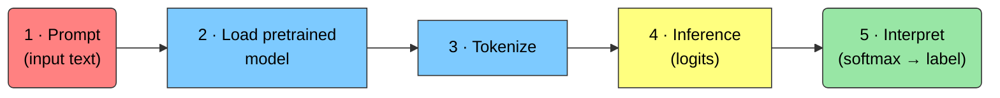

Figure 18: The five steps of a HuggingFace inference pipeline.

</div>

**Step 1 — Set up a prompt.** A *prompt* is the input provided to the
model; its structure guides the output.

``` python
input_text = "The panoramic view of the ocean was breathtaking."
```

**Step 2 — Load a pretrained model.** `from_pretrained()` downloads (and
caches) the model weights, config, and tokenizer from the HuggingFace
Model Hub. We use a DistilBERT model fine-tuned for sentiment (SST-2).
Heavy download, so display-only here:

``` python
import torch
import torch.nn.functional as F
from transformers import AutoConfig, AutoModelForSequenceClassification, AutoTokenizer

model_name = "distilbert-base-uncased-finetuned-sst-2-english"
model = AutoModelForSequenceClassification.from_pretrained(model_name)
config = AutoConfig.from_pretrained(model_name)
```

**Step 3 — Tokenize the input.** Load the tokenizer that matches the
model and convert text to input IDs:

``` python
tokenizer = AutoTokenizer.from_pretrained(model_name)
input_ids = tokenizer(input_text, return_tensors="pt")["input_ids"]
print(input_ids)
```

**Step 4 & 5 — Infer and interpret.** Run the model to get **logits**,
convert them to probabilities with softmax, and map the argmax to a
label:

``` python
outputs = model(input_ids)
logits = outputs.logits

probabilities = F.softmax(logits, dim=-1)
predicted_class = torch.argmax(probabilities, dim=-1).item()
labels = ["NEGATIVE", "POSITIVE"]
print(f"{labels[predicted_class]}  (score={probabilities[0][predicted_class]:.4f})")
```

> [!TIP]
>
> ### ⚡ The one-liner shortcut
>
> For quick use, `pipeline()` wraps all five steps into a single call:
>
> ``` python
> from transformers import pipeline
>
> classifier = pipeline("sentiment-analysis")
> classifier("The panoramic view of the ocean was breathtaking.")
> # -> [{'label': 'POSITIVE', 'score': 0.9998}]
> ```

### Saving & loading models

A model (pretrained or fine-tuned) can be saved to and loaded from a
local directory:

``` python
from transformers import AutoModel, AutoModelForCausalLM

model = AutoModelForCausalLM.from_pretrained("bert-base-uncased")
# ... train or fine-tune ...
model.save_pretrained("my_local_model")           # save
loaded = AutoModel.from_pretrained("my_local_model")  # load back
```

### The Model Hub

The [🤗 Model Hub](https://huggingface.co/docs/hub/en/models-the-hub)
hosts hundreds of thousands of community model checkpoints. You can:

- Download pretrained models with `transformers` (for inference or
  fine-tuning).
- Filter by task, framework, dataset, language, and more.
- Read each model’s **model card** — description, intended use,
  limitations, and often a live inference widget.

## 🎒 Homework

1.  **Train the mini-LLM.** Run a training loop for the model above and
    plot how training and validation **perplexity** evolve. This helper
    will be useful:

    ``` python
    @torch.no_grad()
    def estimate_loss():
        out = {}
        model.eval()
        for split in ["train", "val"]:
            losses = torch.zeros(eval_iters)
            for k in range(eval_iters):
                X, Y = get_batch(split)
                _, loss = model(X, Y)
                losses[k] = loss.item()
            out[split] = losses.mean()
        model.train()
        return out
    ```

2.  **Sweep a hyperparameter.** Pick one of `n_embd`, `n_head`, or
    `n_layer` and train with ≥4 different values. Plot perplexity
    vs. training step for each.

3.  **Generate text** from each trained variant. Did some
    hyperparameters produce more coherent output than others?

4.  **Explore attention.** Use `bertviz` on a larger model (e.g.
    `meta-llama/Llama-2-7b-chat-hf`) and compare its attention patterns
    to GPT-2’s.

## 🌗 The Transformer Family

Not every Transformer is a decoder. The architecture splits into three
families, depending on which halves are used and how attention is
masked:

<div id="fig-transformer-family">

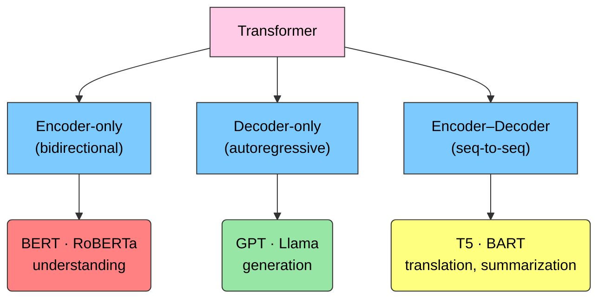

Figure 19: The three Transformer families and representative models.

</div>

### Encoder-only (BERT)

Encoder-only models use **bidirectional** attention — every token can
see the whole sentence. This makes them excellent for *understanding*
tasks (sentiment analysis, summarization inputs, disambiguation) but
poor at open-ended generation.

<div id="fig-bert">


Figure 20: BERT reads the entire sequence at once (bidirectional). Image
credit: [Towards Data
Science](https://towardsdatascience.com/bert-explained-state-of-the-art-language-model-for-nlp-f8b21a9b6270).

</div>

BERT is trained with two objectives: **masked language modeling**
(predict hidden words) and **next-sentence prediction**. Its input is
built with special tokens — `[CLS]` at the start and `[SEP]`
between/after sentences — plus segment and positional embeddings.

<div id="fig-bert-input">

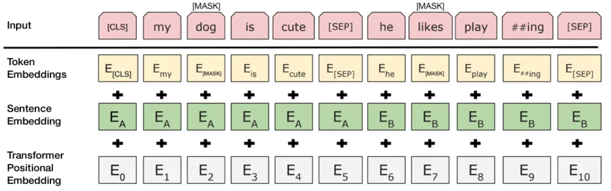

Figure 21: BERT input construction. Image credit: [Towards Data
Science](https://towardsdatascience.com/bert-explained-state-of-the-art-language-model-for-nlp-f8b21a9b6270).

</div>

|           | **Encoder-only (BERT)** | **Decoder-only (GPT)** |
|:----------|:------------------------|:-----------------------|
| Attention | Bidirectional           | Masked (causal)        |
| Best at   | Understanding           | Generation             |
| Training  | Masked LM + NSP         | Next-token prediction  |
| Examples  | BERT, RoBERTa, ALBERT   | GPT, Llama, CTRL       |

Encoder-only vs. decoder-only Transformers {.table-responsive
.table-striped .table-hover}

### Decoder-only (GPT)

As we saw, decoder-only models use **masked self-attention** so a token
attends only to earlier positions — essential for learning generation
without “peeking” at the answer.

<div id="fig-masked-attention">


Figure 22: Full (bidirectional) vs. masked self-attention. Image credit:
[Jay Alammar](https://jalammar.github.io/illustrated-gpt2/).

</div>

### Beyond text: Vision & Graph Transformers

The Transformer is modality-agnostic. **Vision Transformers (ViT)**
split an image into patches, embed each patch (plus a positional
encoding), and feed the sequence to a Transformer encoder.

<div id="fig-vit">

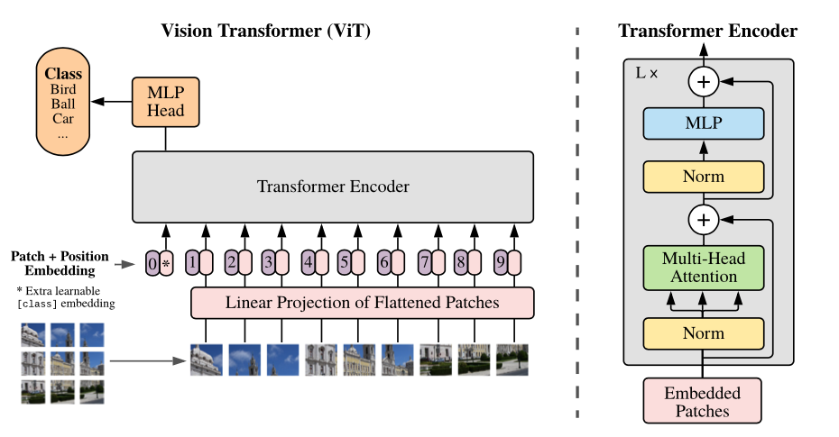

Figure 23: Vision Transformer. Image credit: Dosovitskiy et al., [*An
Image is Worth 16×16 Words*](https://arxiv.org/abs/2010.11929) (2020).

</div>

**Graph Transformers** extend attention to graph-structured data
(molecules, interaction networks).

<div id="fig-graphformer">

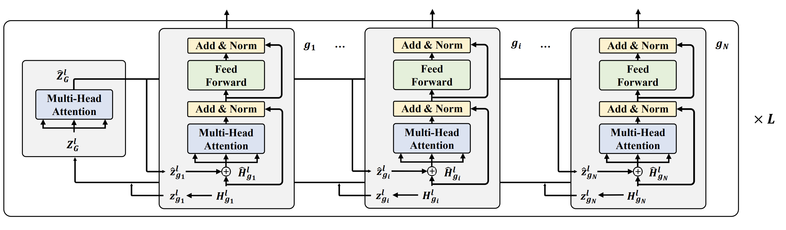

Figure 24: A Graph Transformer.

</div>

## ✅ Key Takeaways

> [!TIP]
>
> ### Recap
>
> - **Sequences are everywhere** — text, DNA, proteins, molecules, time
>   series.
> - **Attention replaced recurrence**, enabling parallel training and
>   long-range context — the breakthrough behind LLMs.
> - Text becomes numbers via **tokenization** → **embeddings** (learned
>   geometry).
> - A Transformer block = **masked self-attention** + **feed-forward**,
>   with residuals and layer-norm, repeated `N` times.
> - Models are trained to minimize **cross-entropy** (≈ minimize
>   **perplexity**).
> - Three families — **encoder-only** (understand), **decoder-only**
>   (generate), **encoder–decoder** (translate) — plus vision and graph
>   variants.

## 📚 References & Further Reading

- Vaswani et al., [*Attention Is All You
  Need*](https://arxiv.org/abs/1706.03762) (2017)
- Jay Alammar, [The Illustrated
  Transformer](https://jalammar.github.io/illustrated-transformer/)
- Jay Alammar, [The Illustrated
  GPT-2](https://jalammar.github.io/illustrated-gpt2/)
- Jay Alammar, [Visualizing Neural Machine Translation (seq2seq +
  attention)](https://jalammar.github.io/visualizing-neural-machine-translation-mechanics-of-seq2seq-models-with-attention/)
- 🤗 [HuggingFace LLM
  Course](https://huggingface.co/learn/llm-course/chapter1/1)
- [A Gentle Introduction to Positional
  Encoding](https://machinelearningmastery.com/a-gentle-introduction-to-positional-encoding-in-transformer-models-part-1/)
- Jay Mody, [GPT in 60 Lines of
  NumPy](https://jaykmody.com/blog/gpt-from-scratch/)
- Andrej Karpathy, [Let’s build GPT
  (nanoGPT)](https://www.youtube.com/watch?v=kCc8FmEb1nY) — the
  tiny-Shakespeare model above is based on this
