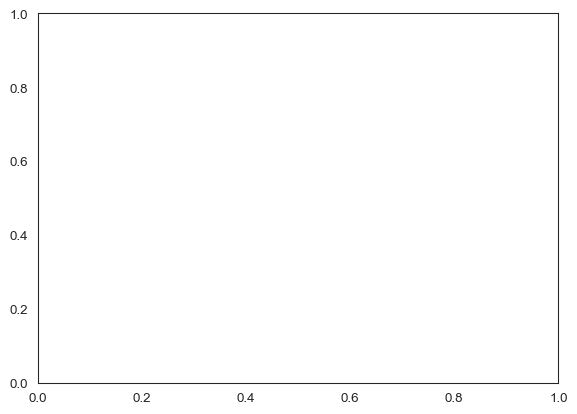

# 🪶 Shakespeare from Scratch (with `ezpz`)
Sam Foreman
2026-07-24

<link rel="preconnect" href="https://fonts.googleapis.com">

- [🎯 Setup](#dart-setup)
- [📖 The Data: tiny-Shakespeare](#open_book-the-data-tiny-shakespeare)
- [🧱 The Model: a small GPT](#bricks-the-model-a-small-gpt)
- [⚡ Going distributed with `ezpz`](#zap-going-distributed-with-ezpz)
- [🔁 The Training Loop + Metrics](#repeat-the-training-loop--metrics)
- [💬 Generating Text](#speech_balloon-generating-text)
- [📊 Plots & Report, for free](#bar_chart-plots--report-for-free)
- [🚀 Scaling Up](#rocket-scaling-up)
- [🎒 Homework](#school_satchel-homework)
- [📚 References](#books-references)

> [!NOTE]
>
> ### Authors
>
> Written by [Sam Foreman](https://samforeman.me) for the [Intro to HPC
> Bootcamp](https://intro-hpc-bootcamp.alcf.anl.gov/).

[](https://colab.research.google.com/github/saforem2/intro-hpc-bootcamp/blob/main/docs/02-llms/09-shakespeare-ezpz/index.ipynb)
[](https://github.com/saforem2/intro-hpc-bootcamp/blob/main/content/02-llms/09-shakespeare-ezpz/index.qmd)

The [Shakespeare example](../08-shakespeare-example-colab/index.ipynb)
trains a small GPT with the
[`wordplay`](https://github.com/saforem2/wordplay) package. Here we do
the **same thing from scratch** — the model, the data pipeline, the
training loop, and the text generation are all written inline — using
only [`ezpz`](https://github.com/saforem2/ezpz) +
[PyTorch](https://pytorch.org).

> [!TIP]
>
> ### 🎯 What you’ll learn
>
> - How [`ezpz`](https://github.com/saforem2/ezpz) turns a plain PyTorch
>   loop into a **distributed, instrumented** training run with almost
>   no boilerplate.
> - The pieces of a GPT training program: **config → model → data → loop
>   → metrics → generation**.
> - How to track metrics (`loss`, `dt`, `sps`, `mtps`, `mfu`) with
>   `ezpz.History` and launch at scale with `ezpz launch`.
>
> This page assumes you’ve seen the attention/transformer mechanics from
> [**\[02.0\] Intro to LLMs**](../00-intro-to-llms/index.qmd) — here we
> focus on the *training* side.

## 🎯 Setup

On any ALCF / NERSC system (or a laptop), install `ezpz` and set up the
environment with the one-liner:

``` bash
source <(curl -fsSL https://bit.ly/ezpz-utils) && ezpz_setup .venv
uv pip install "git+https://github.com/saforem2/ezpz"
```

The single most useful thing `ezpz` does is collapse all of PyTorch’s
distributed boilerplate into **one call**. On a real (multi-GPU) run
your script starts like this:

``` python
import ezpz

rank = ezpz.setup_torch(seed=1234)   # discovers rank/world/device/backend, inits process group
device = ezpz.get_torch_device()     # 'cuda' | 'xpu' | 'mps' | 'cpu'
logger = ezpz.get_logger(__name__)
logger.info(f"rank {rank} / {ezpz.get_world_size()} on {device}")
```

> [!NOTE]
>
> ### 🔍 …versus raw PyTorch
>
> That one `setup_torch()` replaces the usual dance:
>
> ``` python
> import os, torch.distributed as dist
> dist.init_process_group(backend="nccl")
> rank        = int(os.environ["RANK"])
> local_rank  = int(os.environ["LOCAL_RANK"])
> world_size  = int(os.environ["WORLD_SIZE"])
> torch.cuda.set_device(local_rank)
> # ...and you still have to detect cuda vs xpu vs cpu yourself
> ```

For this page we build a **tiny** version that actually runs here on
CPU, so we import the plumbing and pick a device directly (on a cluster
you’d use `ezpz.setup_torch()` above instead):

``` python
import os
os.environ["WANDB_DISABLED"] = "1"   # keep the tutorial offline
os.environ["WANDB_MODE"] = "disabled"

import math
import time
import numpy as np
import torch
import torch.nn as nn
from torch.nn import functional as F
import ezpz

torch.manual_seed(1234)
device = ezpz.get_torch_device()      # 'cpu' here; 'cuda'/'xpu' on a GPU node
logger = ezpz.get_logger(__name__)
logger.info(f"Using device: {device}")
```

    [2026-07-24 09:46:43,042623][I][ipykernel_16117/452727945:16:<module>] Using device: mps

## 📖 The Data: tiny-Shakespeare

We train a **character-level** model: the vocabulary is just the set of
unique characters in the text, and the model predicts the next
character.

``` python
import urllib.request
from pathlib import Path

url = "https://raw.githubusercontent.com/karpathy/char-rnn/master/data/tinyshakespeare/input.txt"
path = Path("input.txt")
if not path.exists():
    try:
        urllib.request.urlretrieve(url, path)
    except Exception:
        # offline fallback so this page always renders
        path.write_text(("To be, or not to be, that is the question:\n"
                         "Whether 'tis nobler in the mind to suffer\n"
                         "The slings and arrows of outrageous fortune,\n") * 200)

text = path.read_text()
chars = sorted(set(text))
vocab_size = len(chars)
logger.info(f"{len(text):,} characters, vocab size = {vocab_size}")
```

    [2026-07-24 09:46:43,052703][I][ipykernel_16117/2057450174:18:<module>] 1,115,394 characters, vocab size = 65

Build the char↔int mappings and encode the whole corpus, then split
90/10:

``` python
stoi = {c: i for i, c in enumerate(chars)}
itos = {i: c for i, c in enumerate(chars)}
encode = lambda s: [stoi[c] for c in s]              # str -> list[int]
decode = lambda ids: "".join(itos[i] for i in ids)   # list[int] -> str

data = torch.tensor(encode(text), dtype=torch.long)
n = int(0.9 * len(data))
train_data, val_data = data[:n], data[n:]

def get_batch(split, batch_size, block_size):
    d = train_data if split == "train" else val_data
    ix = torch.randint(len(d) - block_size, (batch_size,))
    x = torch.stack([d[i : i + block_size] for i in ix])
    y = torch.stack([d[i + 1 : i + block_size + 1] for i in ix])
    return x.to(device), y.to(device)
```

## 🧱 The Model: a small GPT

A compact decoder-only Transformer — the same architecture as the
`wordplay` model, written inline. (For the *why* behind attention, see
[Intro to LLMs](../00-intro-to-llms/index.qmd).)

``` python
from dataclasses import dataclass

@dataclass
class GPTConfig:
    vocab_size: int
    block_size: int = 256
    n_layer: int = 6
    n_head: int = 6
    n_embd: int = 384
    dropout: float = 0.2


class Block(nn.Module):
    """A single Transformer block: masked self-attention + MLP."""
    def __init__(self, cfg: GPTConfig):
        super().__init__()
        self.ln1 = nn.LayerNorm(cfg.n_embd)
        self.attn = nn.MultiheadAttention(
            cfg.n_embd, cfg.n_head, dropout=cfg.dropout, batch_first=True
        )
        self.ln2 = nn.LayerNorm(cfg.n_embd)
        self.mlp = nn.Sequential(
            nn.Linear(cfg.n_embd, 4 * cfg.n_embd),
            nn.GELU(),
            nn.Linear(4 * cfg.n_embd, cfg.n_embd),
            nn.Dropout(cfg.dropout),
        )
        self.register_buffer(
            "mask", torch.triu(torch.ones(cfg.block_size, cfg.block_size), 1).bool()
        )

    def forward(self, x):
        T = x.size(1)
        h = self.ln1(x)
        a, _ = self.attn(h, h, h, attn_mask=self.mask[:T, :T], need_weights=False)
        x = x + a
        x = x + self.mlp(self.ln2(x))
        return x


class GPT(nn.Module):
    def __init__(self, cfg: GPTConfig):
        super().__init__()
        self.cfg = cfg
        self.tok_emb = nn.Embedding(cfg.vocab_size, cfg.n_embd)
        self.pos_emb = nn.Embedding(cfg.block_size, cfg.n_embd)
        self.drop = nn.Dropout(cfg.dropout)
        self.blocks = nn.ModuleList([Block(cfg) for _ in range(cfg.n_layer)])
        self.ln_f = nn.LayerNorm(cfg.n_embd)
        self.head = nn.Linear(cfg.n_embd, cfg.vocab_size, bias=False)

    def forward(self, idx, targets=None):
        B, T = idx.shape
        pos = torch.arange(T, device=idx.device)
        x = self.drop(self.tok_emb(idx) + self.pos_emb(pos))
        for block in self.blocks:
            x = block(x)
        logits = self.head(self.ln_f(x))
        loss = None
        if targets is not None:
            loss = F.cross_entropy(logits.view(B * T, -1), targets.view(B * T))
        return logits, loss

    @torch.no_grad()
    def generate(self, idx, max_new_tokens, temperature=1.0, top_k=None):
        for _ in range(max_new_tokens):
            idx_cond = idx[:, -self.cfg.block_size :]
            logits, _ = self(idx_cond)
            logits = logits[:, -1, :] / temperature
            if top_k is not None:
                v, _ = torch.topk(logits, top_k)
                logits[logits < v[:, [-1]]] = -float("inf")
            probs = F.softmax(logits, dim=-1)
            idx = torch.cat([idx, torch.multinomial(probs, 1)], dim=1)
        return idx
```

## ⚡ Going distributed with `ezpz`

On multiple GPUs, wrapping the model for **Distributed Data Parallel**
is where `ezpz` shines — but the beauty is that the *training loop below
doesn’t change*. On a cluster you’d add:

``` python
# after `model = GPT(cfg).to(device)` on a real multi-GPU run:
from torch.nn.parallel import DistributedDataParallel as DDP

if ezpz.get_world_size() > 1:
    model = DDP(model, device_ids=[ezpz.get_local_rank()])
```

`ezpz` handles the process-group setup (from `setup_torch()`), device
placement, and the correct backend (NCCL / oneCCL / gloo) for you — so
the *same script* runs on 1 GPU, 8 GPUs, or 100 nodes.

## 🔁 The Training Loop + Metrics

Here’s the heart of it. We use a **tiny config so this page runs on
CPU** in a few seconds, and lean on `ezpz` for three things:

- `ezpz.synchronize()` — backend-agnostic device sync for **correct
  timing**,
- `ezpz.History` — accumulates per-step metrics and prints a compact
  summary,
- (later) `history.finalize()` — writes plots + a report automatically.

We report the same metrics as the `wordplay` example:

<div id="tbl-ezpz-legend">

Table 1: Training metrics legend

|  name  | description                 |
|:------:|:----------------------------|
| `step` | training iteration          |
| `loss` | cross-entropy loss          |
|  `dt`  | time per step (s)           |
| `sps`  | samples per second          |
| `mtps` | (million) tokens per second |
| `mfu`  | model FLOPs utilization (%) |

</div>

``` python
# --- tiny config: runs on CPU at build time ---
cfg = GPTConfig(vocab_size=vocab_size, block_size=64, n_layer=4, n_head=4,
                n_embd=128, dropout=0.0)
batch_size = 16
max_iters = 50            # bump to 1000+ on a GPU for real samples

model = GPT(cfg).to(device)
n_params = sum(p.numel() for p in model.parameters())
logger.info(f"model has {n_params/1e6:.2f}M parameters")

optimizer = torch.optim.AdamW(model.parameters(), lr=1e-3)

# Rough MFU: ~6*N FLOPs per token (fwd+bwd). Peak is device-dependent; we use a
# nominal value so the number is illustrative (compute_mfu ships in newer ezpz).
flops_per_token = 6 * n_params
PEAK_FLOPS = 1.0e12       # ~1 TFLOP/s nominal (CPU); set to your GPU's bf16 peak
```

    [2026-07-24 09:46:43,126212][I][ipykernel_16117/957739443:9:<module>] model has 0.82M parameters

``` python
history = ezpz.History()

model.train()
for step in range(max_iters):
    x, y = get_batch("train", batch_size, cfg.block_size)

    ezpz.synchronize(device)
    t0 = time.perf_counter()

    _, loss = model(x, y)
    optimizer.zero_grad(set_to_none=True)
    loss.backward()
    optimizer.step()

    ezpz.synchronize(device)
    dt = time.perf_counter() - t0

    tokens = batch_size * cfg.block_size
    metrics = {
        "step": step,
        "loss": loss.item(),
        "dt": dt,
        "sps": batch_size / dt,
        "mtps": tokens / dt / 1e6,
        "mfu": 100 * flops_per_token * tokens / dt / PEAK_FLOPS,
    }
    summary = history.update(metrics)
    if step % 10 == 0:
        logger.info(summary)
```

    [2026-07-24 09:46:43,762964][I][ipykernel_16117/2504529068:29:<module>] step=0 loss=4.372406 dt=0.630940 sps=25.358993 mtps=0.001623 mfu=0.796728
    [2026-07-24 09:46:43,934438][I][ipykernel_16117/2504529068:29:<module>] step=10 loss=3.202098 dt=0.014498 sps=1103.616330 mtps=0.070631 mfu=34.673372
    [2026-07-24 09:46:44,084510][I][ipykernel_16117/2504529068:29:<module>] step=20 loss=3.051642 dt=0.014171 sps=1129.043138 mtps=0.072259 mfu=35.472230
    [2026-07-24 09:46:44,230058][I][ipykernel_16117/2504529068:29:<module>] step=30 loss=2.762733 dt=0.013157 sps=1216.040364 mtps=0.077827 mfu=38.205506
    [2026-07-24 09:46:44,380488][I][ipykernel_16117/2504529068:29:<module>] step=40 loss=2.663434 dt=0.013475 sps=1187.391355 mtps=0.075993 mfu=37.305412

## 💬 Generating Text

The `generate()` method samples one character at a time. Let’s compare
**before** and **after** training — a few dozen CPU steps won’t produce
Shakespeare, but the shift from pure noise toward text-like structure is
already visible (train for 1000+ steps on a GPU for the real thing):

``` python
prompt = "\n"
ctx = torch.tensor([encode(prompt)], dtype=torch.long, device=device)
sample = decode(model.generate(ctx, max_new_tokens=200, temperature=0.8, top_k=16)[0].tolist())
logger.info("--- sample after tiny training run ---\n" + sample)
```

    [2026-07-24 09:47:06,145837][I][ipykernel_16117/204336923:4:<module>] --- sample after tiny training run ---

    Winad s teat t t on, limatofurise thare pind thag f hesome greseeme luremd
    S llou t mest mind
    The wo and ind t sy ter toforlllllin bers ss ages mine and hal mer,r to indis lecowan d of bsond ld t d th

## 📊 Plots & Report, for free

`ezpz.History` can turn the metrics you logged into plots and a report
with a single call — it writes loss curves (matplotlib **and** terminal
plots), an `xarray` dataset, and a `report.md`:

``` python
from pathlib import Path
outdir = Path("outputs")
_ = history.finalize(outdir=outdir)
logger.info("wrote: " + ", ".join(sorted(p.name for p in outdir.iterdir())))
```

    [2026-07-24 09:47:06,157771][I][ezpz/history:1722:finalize] Saving plots to /Users/samforeman/projects/saforem2/intro-hpc-bootcamp-2025/content/outputs/plots/mplot (matplotlib) and /Users/samforeman/projects/saforem2/intro-hpc-bootcamp-2025/content/outputs/plots/tplot (tplot)
                               dt vs iter                       
        ┌──────────────────────────────────────────────────────┐
    0.63┤▌                                                     │
        │▌                                                     │
    0.53┤▌                                                     │
        │▌                                                     │
        │▌                                                     │
    0.42┤▌                                                     │
        │▌                                                     │
    0.32┤▚                                                     │
        │▐                                                     │
    0.22┤▐                                                     │
        │▐                                                     │
        │▐                                                     │
    0.12┤▐                                                     │
        │▐                                                     │
    0.01┤▝▄▄▄▄▄▄▄▄▄▄▄▄▄▄▄▄▄▄▄▄▄▄▄▄▄▄▄▄▄▄▄▄▄▄▄▄▄▄▄▄▄▄▄▄▄▄▄▄▄▄▄▄▄│
        └┬─┬─┬─┬─┬──┬──┬──┬────┬──┬──┬───┬────┬────┬────┬────┬─┘
         1 3 5 7 8 11 14 17   21 24 27  31   35   40   44   49  
    dt                            iter                          
    text saved in /Users/samforeman/projects/saforem2/intro-hpc-bootcamp-2025/content/outputs/plots/tplot/dt.txt
                               freq vs dt                       
        ┌──────────────────────────────────────────────────────┐
    49.0┤█████                                                 │
        │█████                                                 │
    40.8┤█████                                                 │
        │█████                                                 │
        │█████                                                 │
    32.7┤█████                                                 │
        │█████                                                 │
    24.5┤█████                                                 │
        │█████                                                 │
    16.3┤█████                                                 │
        │█████                                                 │
        │█████                                                 │
     8.2┤█████                                                 │
        │█████                                                 │
     0.0┤█████                                            █████│
        └┬────────────┬─────────────┬────────────┬────────────┬┘
       -0.01        0.15          0.32         0.49        0.66 
    freq                           dt                           
    text saved in /Users/samforeman/projects/saforem2/intro-hpc-bootcamp-2025/content/outputs/plots/tplot/dt-hist.txt
                              loss vs iter                      
        ┌──────────────────────────────────────────────────────┐
    4.37┤▌                                                     │
        │▚                                                     │
    4.07┤▐                                                     │
        │ ▌                                                    │
        │ ▐                                                    │
    3.76┤  ▌                                                   │
        │  ▝▖▗                                                 │
    3.45┤   ▝▘▚                                                │
        │      ▚                                               │
    3.15┤       ▀▀▀▀▚▄▚                                        │
        │              ▀▀▖ ▗▄▄▄▖                               │
        │                ▝▀▘   ▝▖                              │
    2.84┤                       ▝▀▀▀▀▄ ▗  ▖    ▖               │
        │                             ▀▘▀▀▝▀▀▀▀▝▄▞▀▄▄▄▄▖ ▖ ▖ ▗▄│
    2.54┤                                              ▝▀▝▞▝▀▘ │
        └┬─┬─┬─┬─┬──┬──┬──┬────┬──┬──┬───┬────┬────┬────┬────┬─┘
         1 3 5 7 8 11 14 17   21 24 27  31   35   40   44   49  
    loss                          iter                          
    text saved in /Users/samforeman/projects/saforem2/intro-hpc-bootcamp-2025/content/outputs/plots/tplot/loss.txt
                               mfu vs iter                      
        ┌──────────────────────────────────────────────────────┐
    39.2┤          ▖   ▖  ▗         ▗▄▄▞▀▄▖   ▗▚▄   ▗    ▖     │
        │         ▞▝▄▄▀▝▀▀▘▚▄▄▄▄▄▚▄▀▘     ▝▖ ▄▌  ▀▄▞▘▚ ▖▐▝▀▚   │
    32.8┤   ▗  ▗▄▞                         ▝▞         ▀▝▌   ▀▀▀│
        │ ▗▀▘▚▄▘                                               │
        │ ▐                                                    │
    26.4┤ ▌                                                    │
        │▗▘                                                    │
    20.0┤▐                                                     │
        │▐                                                     │
    13.6┤▐                                                     │
        │▞                                                     │
        │▌                                                     │
     7.2┤▌                                                     │
        │▌                                                     │
     0.8┤▌                                                     │
        └┬─┬─┬─┬─┬──┬──┬──┬────┬──┬──┬───┬────┬────┬────┬────┬─┘
         1 3 5 7 8 11 14 17   21 24 27  31   35   40   44   49  
    mfu                           iter                          
    text saved in /Users/samforeman/projects/saforem2/intro-hpc-bootcamp-2025/content/outputs/plots/tplot/mfu.txt
                              mtps vs iter                      
         ┌─────────────────────────────────────────────────────┐
    0.080┤         ▗    ▖  ▖         ▄▄▄▀▚▖    ▞▄    ▖   ▖     │
         │        ▗▘▚▄▄▀▝▀▀▝▄▄▄▄▄▞▄▞▀     ▝▖ ▗▟  ▀▄▄▀▚ ▖▐▝▀▀▖  │
    0.067┤   ▖  ▗▄▞                        ▝▄▘        ▀▝▌   ▝▀▀│
         │ ▗▀▝▄▄▘                                              │
         │ ▐                                                   │
    0.054┤ ▌                                                   │
         │▗▘                                                   │
    0.041┤▐                                                    │
         │▐                                                    │
    0.028┤▐                                                    │
         │▞                                                    │
         │▌                                                    │
    0.015┤▌                                                    │
         │▌                                                    │
    0.002┤▌                                                    │
         └┬─┬─┬─┬─┬──┬──┬──┬───┬──┬───┬───┬───┬────┬────┬────┬─┘
          1 3 5 7 9 11 14 17  21 24  27  31  35   40   44   49  
    mtps                          iter                          
    text saved in /Users/samforeman/projects/saforem2/intro-hpc-bootcamp-2025/content/outputs/plots/tplot/mtps.txt
                                sps vs iter                     
          ┌────────────────────────────────────────────────────┐
    1249.0┤         ▗   ▗   ▖        ▗▄▄▞▀▄    ▗▚▖   ▖   ▖     │
          │        ▗▘▚▄▞▘▀▀▀▝▄▄▄▄▄▚▄▀▘     ▚ ▗▄▘ ▝▚▄▀▚ ▖▐▝▀▀▖  │
    1045.0┤   ▖  ▗▄▞                        ▚▘        ▀▝▌   ▝▀▀│
          │ ▗▀▝▄▄▘                                             │
          │ ▐                                                  │
     841.1┤ ▌                                                  │
          │▗▘                                                  │
     637.2┤▐                                                   │
          │▐                                                   │
     433.2┤▐                                                   │
          │▞                                                   │
          │▌                                                   │
     229.3┤▌                                                   │
          │▌                                                   │
      25.4┤▌                                                   │
          └┬─┬─┬──┬──┬───┬──┬───┬──┬──┬───┬───┬─────┬───┬────┬─┘
           1 3 5  8 11  14 17  21 24 27  31  35    40  44   49  
    sps                            iter                         
    text saved in /Users/samforeman/projects/saforem2/intro-hpc-bootcamp-2025/content/outputs/plots/tplot/sps.txt
                              step vs iter                      
        ┌──────────────────────────────────────────────────────┐
    49.0┤                                                   ▗▄▞│
        │                                                ▄▀▀▘  │
    40.8┤                                           ▗▄▄▀▀      │
        │                                        ▗▄▞▘          │
        │                                    ▄▄▀▀▘             │
    32.7┤                                 ▄▄▀                  │
        │                             ▗▞▀▀                     │
    24.5┤                         ▄▄▞▀▘                        │
        │                      ▄▄▀                             │
    16.3┤                  ▗▞▀▀                                │
        │              ▄▄▞▀▘                                   │
        │           ▄▀▀                                        │
     8.2┤      ▗▄▞▀▀                                           │
        │   ▗▄▞▘                                               │
     0.0┤▄▀▀▘                                                  │
        └┬─┬─┬─┬─┬──┬──┬──┬────┬──┬──┬───┬────┬────┬────┬────┬─┘
         1 3 5 7 8 11 14 17   21 24 27  31   35   40   44   49  
    step                          iter                          
    text saved in /Users/samforeman/projects/saforem2/intro-hpc-bootcamp-2025/content/outputs/plots/tplot/step.txt
    [2026-07-24 09:47:06,903295][W][ezpz/history:1757:finalize] h5py not found! Saving dataset as netCDF instead.
    [2026-07-24 09:47:06,903759][I][utils/__init__:401:save_dataset] Saving dataset to: /Users/samforeman/projects/saforem2/intro-hpc-bootcamp-2025/content/outputs/dataset_dataset.nc
    [2026-07-24 09:47:06,931540][I][ezpz/history:1768:finalize] Saving history report to /Users/samforeman/projects/saforem2/intro-hpc-bootcamp-2025/content/outputs/report.md
    [2026-07-24 09:47:06,932943][I][ipykernel_16117/539666593:4:<module>] wrote: assets, dataset_dataset.nc, history, plots, report.md



> [!TIP]
>
> ### 🔬 On a real run
>
> Point `ezpz.History(backends="wandb")` at [Weights &
> Biases](https://wandb.ai) (or `"mlflow"`) and every metric streams to
> your dashboard live — no code changes beyond that one argument.

## 🚀 Scaling Up

To train the **full ~10M-parameter model** (like the `wordplay` example)
across multiple GPUs, drop the loop above into a `train.py` that starts
with `ezpz.setup_torch()` + DDP, bump the config to the real size, and
launch with `ezpz launch` — which auto-detects PBS (`mpiexec`) / SLURM
(`srun`):

``` bash
# full config: block_size=256, n_layer=6, n_head=6, n_embd=384, max_iters=1000
ezpz launch python3 train.py
```

That’s the whole point: **the training code you wrote above doesn’t
change** — `ezpz` handles going from your laptop’s CPU to a rack of
GPUs.

## 🎒 Homework

1.  **Train it for real.** Bump `max_iters` to 1000+ and the config to
    the full size (`block_size=256, n_embd=384, n_layer=6`), run on a
    GPU node, and paste a generated sample. Does it start sounding like
    Shakespeare?
2.  **Compare to `wordplay`.** Run the [wordplay
    version](../08-shakespeare-example-colab/index.ipynb) with the same
    config. Do the loss curves and samples match? What does `wordplay`
    add on top of what you wrote here?
3.  **Scale out.** Launch across 2+ GPUs with `ezpz launch`, add the DDP
    wrap, and report the `sps`/`mtps` speedup vs. a single GPU.

## 📚 References

- [`saforem2/ezpz`](https://github.com/saforem2/ezpz) ·
  [ezpz.cool](https://ezpz.cool)
- [`saforem2/wordplay`](https://github.com/saforem2/wordplay) — the
  packaged version of this example
- [Andrej Karpathy, “Let’s build GPT”
  (nanoGPT)](https://www.youtube.com/watch?v=kCc8FmEb1nY)
- [Vaswani et al., *Attention Is All You
  Need*](https://arxiv.org/abs/1706.03762)
